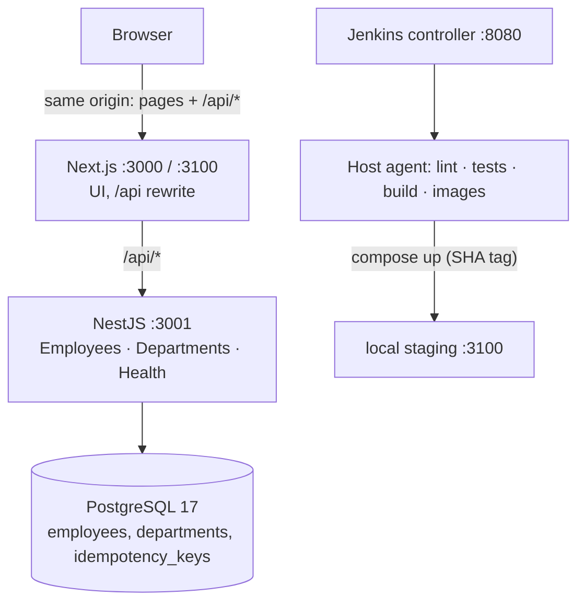

# Architecture

## Service boundaries

- เบราว์เซอร์คุยกับ origin เดียว (Next.js) — Next.js ไม่เชื่อม DB และไม่มี Server Actions ทำ CRUD ซ้ำ
- staging ไม่ publish พอร์ต API ออก host — เบราว์เซอร์เข้าถึง API ผ่าน Next.js เท่านั้น
- ไม่มีระบบ login: ทุกคนที่เข้าถึงเว็บได้ใช้งานเต็มสิทธิ์ (ตัดออกจากขอบเขตโดยตั้งใจ, D-46); API ตรวจ input/concurrency ทุก request

## API modules (Controller → Service → Prisma)

| Module | หน้าที่ |
| --- | --- |
| `config` | โหลด + ตรวจ env (zod), ค่าคงที่ตาม PRD |
| `rate-limit` | global guard: fixed window ในหน่วยความจำต่อ IP (read 300 / write 60 ต่อนาที) |
| `employees` | list/search/filter/sort/pagination (SQL whitelist + LIKE escape), CRUD, version/If-Match, idempotency |
| `departments` | master list 4 ค่า |
| `health` | `live` (process), `ready` (DB + migration ล่าสุด) |
| `common` | request ID, JSON logger (redact), error envelope, success envelope, Clock |

## Request lifecycle

1. `requestContextMiddleware` สร้าง UUID request ID (ไม่เชื่อ header จาก caller) และเขียน access log JSON ตอนจบ
2. security headers → ตรวจ `Content-Type: application/json` → body parser (32 KB)
3. Rate limit ต่อ IP (read 300 / write 60 ต่อนาที)
4. `ValidationPipe` (whitelist + forbid unknown, ไม่แปลงชนิดอัตโนมัติ) + `@Rule()` → error code ระดับ field
5. Service ทำงานใน transaction ที่จำเป็น → `EnvelopeInterceptor` ใส่ `meta.requestId` และ `Cache-Control: no-store`
6. `HttpExceptionFilter` แปลงทุก error เป็น `{ error: { code, message, details?, requestId } }` ไม่มี stack/SQL/ค่าที่ส่งมา

## Data model

ดู `apps/api/prisma/schema.prisma` และ `apps/api/prisma/migrations/*/migration.sql` (identity column, CHECK constraints, partial unique indexes)

| Table | จุดสำคัญ |
| --- | --- |
| `employees` | `id` identity (seed 101–105, sequence ต่อที่ 106), `salary numeric(12,2)`, `join_date`/`last_updated_date` เป็น `date`, `version` |
| `departments` | 4 ค่าคงที่, FK RESTRICT |
| `idempotency_keys` | unique (scope, key), เก็บ response 24 ชั่วโมง |
| `app_meta` | `database_purpose` = demo/test |

## Security summary

- CORS ไม่เปิด (same-origin เท่านั้น); API port ของ staging ไม่ publish ออก host
- SQL parameterized ทั้งหมด, sort whitelist, LIKE escape; ชื่อ render เป็น text
- Logs redact cookie/authorization/salary/body/token
