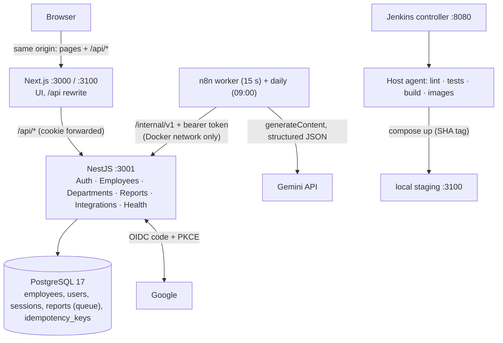
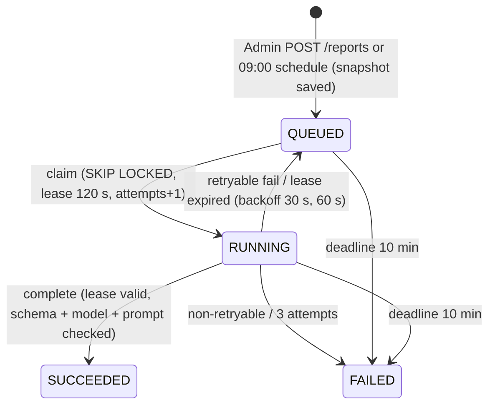

# Architecture

## Service boundaries

- เบราว์เซอร์คุยกับ origin เดียว (Next.js) — Next.js ไม่เชื่อม DB และไม่มี Server Actions ทำ CRUD ซ้ำ
- `/internal/v1/*` ไม่อยู่ใน rewrite ของ Next.js และ staging ไม่ publish พอร์ต API ออก host — n8n เข้าทาง Docker network `employee-console-shared` (alias `api-staging`)
- API ตรวจ auth/role/input/concurrency ทุก request; การซ่อนปุ่มใน UI ไม่ใช่สิทธิ์

## API modules (Controller → Service → Prisma)

| Module | หน้าที่ |
| --- | --- |
| `config` | โหลด + ตรวจ env (zod), ค่าคงที่ตาม PRD |
| `auth` | Google OIDC (`openid-client`), session (`express-session` + `connect-pg-simple`), guards: Authentication → Roles → CSRF → RateLimit, AccessPolicy (allowlist → role ทุก request) |
| `employees` | list/search/filter/sort/pagination (SQL whitelist + LIKE escape), CRUD, version/If-Match, idempotency |
| `departments` | master list 4 ค่า |
| `reports` | snapshot, คิว (QUEUED → RUNNING → SUCCEEDED/FAILED), lease/retry/deadline, maintenance loop, internal worker endpoints |
| `integrations` | สถานะ configuration (ไม่มีค่า secret) |
| `health` | `live` (process), `ready` (DB + migration ล่าสุด) |
| `common` | request ID, JSON logger (redact), error envelope, success envelope, Clock |

## Request lifecycle

1. `requestContextMiddleware` สร้าง UUID request ID (ไม่เชื่อ header จาก caller) และเขียน access log JSON ตอนจบ
2. security headers → ตรวจ `Content-Type: application/json` → body parser (32 KB, `/internal` 8 KB)
3. `express-session` เฉพาะ `/api` (`/internal` ไม่อ่าน cookie)
4. Guards: session/allowlist หรือ bearer ของ scope ที่ route ต้องการ → role → CSRF + Origin → rate limit
5. `ValidationPipe` (whitelist + forbid unknown, ไม่แปลงชนิดอัตโนมัติ) + `@Rule()` → error code ระดับ field
6. Service ทำงานใน transaction ที่จำเป็น → `EnvelopeInterceptor` ใส่ `meta.requestId` และ `Cache-Control: no-store`
7. `HttpExceptionFilter` แปลงทุก error เป็น `{ error: { code, message, details?, requestId } }` ไม่มี stack/SQL/ค่าที่ส่งมา

## Data model

ดู `apps/api/prisma/schema.prisma` และ `apps/api/prisma/migrations/*/migration.sql` (identity column, CHECK constraints, partial unique indexes)

| Table | จุดสำคัญ |
| --- | --- |
| `employees` | `id` identity (seed 101–105, sequence ต่อที่ 106), `salary numeric(12,2)`, `join_date`/`last_updated_date` เป็น `date`, `version` |
| `departments` | 4 ค่าคงที่, FK RESTRICT |
| `users` | ผูกด้วย `google_sub`, email unique (lowercase), role/is_enabled reconcile กับ allowlist ตอน start |
| `sessions` | layout ของ connect-pg-simple, index `expire` |
| `reports` | snapshot JSONB (immutable), queue fields, `reports_one_active_idx` (มี QUEUED/RUNNING ได้งานเดียว), `reports_scheduled_day_idx` (scheduled วันละงาน) |
| `idempotency_keys` | unique (scope, actor, key), เก็บ response 24 ชั่วโมง |
| `integration_state` | heartbeat ของ worker |
| `app_meta` | `database_purpose` = demo/test/performance |

## Report queue

Worker (n8n) ไม่เข้าถึง DB ของแอปโดยตรง; ส่งเฉพาะ snapshot ตัวเลขรวมให้ Gemini; ตรวจโครงสร้างและตัวเลขก่อน complete; ตัวเลขในหน้ารายงานมาจาก snapshot ใน DB เสมอ

## Security summary

- Session cookie `HttpOnly`, `SameSite=Lax`, ไม่มี Domain, `Secure` เมื่อ origin เป็น HTTPS; regenerate ID หลัง login; idle 30 นาที / absolute 8 ชั่วโมง
- CSRF token ผูก session + ตรวจ Origin; CORS ไม่เปิด (same-origin เท่านั้น)
- Viewer ไม่ได้รับ `salary` (ไม่ select), sort by salary → 403
- Service token แยก scope (worker/scheduler) และไม่ใช้กับ endpoint ของพนักงาน
- SQL parameterized ทั้งหมด, sort whitelist, LIKE escape; ชื่อและข้อความ AI render เป็น text
- Logs redact cookie/authorization/salary/body/token; ไม่เก็บ Google tokens หลังตรวจ
