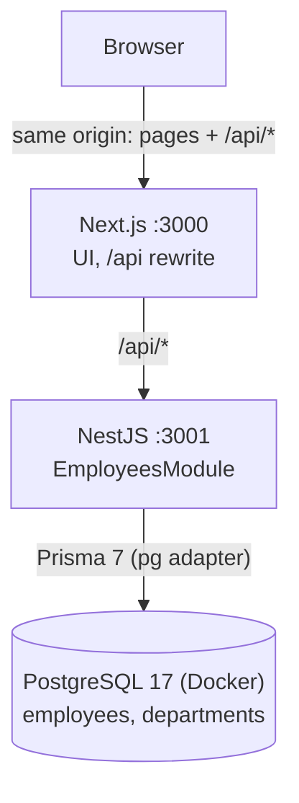

# Architecture

## Service boundaries

- เบราว์เซอร์คุยกับ origin เดียว (Next.js) — Next.js ไม่เชื่อม DB และไม่มี Server Actions ทำ CRUD ซ้ำ
- API ฟังที่ `127.0.0.1` และ PostgreSQL publish พอร์ตเฉพาะ `127.0.0.1` เท่านั้น
- ไม่มีระบบ login: ทุกคนที่เข้าถึงเว็บได้ใช้งานเต็มสิทธิ์ (ตัดออกโดยตั้งใจ, D-46) — ความเรียบง่ายเหนือ hardening ระดับ production (D-56)

## API (Controller → Service → Prisma)

| ไฟล์ | หน้าที่ |
| --- | --- |
| `app.ts` | `createApp()`: prefix `/api`, global `ValidationPipe`, Swagger `/api/docs` |
| `prisma/` | `PrismaModule` (global) ให้ `PrismaService` กับทุก feature |
| `employees/employees.controller.ts` | HTTP: list, get, create, update, delete; อ่าน `If-Match` |
| `employees/employees.service.ts` | query (search/filter/sort/page), กฎ version, แปลง Decimal/DATE ↔ string |
| `employees/employee.dto.ts` | กฎของ input ทุกช่อง (class-validator) + คำอธิบาย Swagger |

| Endpoint | ผล |
| --- | --- |
| `GET /api/employees?q=&departmentId=&status=&page=&pageSize=&sortBy=&sortOrder=` | `{ items, page, pageSize, total, totalPages }` |
| `GET /api/employees/:id` | employee หรือ 404 |
| `POST /api/employees` | 201 + employee (ID และ Last Updated Date มาจากระบบ, version 1) |
| `PATCH /api/employees/:id` + `If-Match: "<version>"` | employee ที่ version +1; ไม่มี header → 428, version ไม่ตรง → 409 |
| `DELETE /api/employees/:id` + `If-Match: "<version>"` | 204; 428/409/404 เหมือน PATCH |

Employee: `{ id, name, departmentId, departmentName, salary: "65000.00", joinDate: "2023-01-15", isActive, lastUpdatedDate, version }`

## Request lifecycle

1. Next.js rewrite `/api/*` → NestJS (`API_INTERNAL_URL`, ฝังตอน build)
2. `ValidationPipe` แปลง body/query เป็น DTO: field ที่ไม่รู้จักหรือเป็นของระบบ (`id`, `version`, `lastUpdatedDate`) → 400, query ได้ค่า default (page 1, pageSize 20, sort id asc)
3. Service เรียก Prisma — list ใช้ `count` + `findMany` ใน `$transaction` เดียว; update/delete ใช้ `updateMany`/`deleteMany` ที่ `where: { id, version }` ถ้าไม่โดนแถวไหนจึงตรวจว่า 404 หรือ 409
4. Error เป็น exception ของ NestJS → `{ statusCode, message, error }` (validation: `message` เป็น array) ไม่มี stack/SQL

## Data model

ดู `apps/api/prisma/schema.prisma` และ `apps/api/prisma/migrations/*/migration.sql` (identity column, CHECK constraints, trigram index)

| Table | จุดสำคัญ |
| --- | --- |
| `employees` | `id` identity (seed 101–105, ID ใหม่เริ่ม 106 และไม่ย้อนใช้), `salary numeric(12,2)`, `join_date`/`last_updated_date` เป็น `date`, `version` |
| `departments` | 4 ค่าคงที่ (Engineering, Marketing, Sales, HR), FK RESTRICT |

## จุดที่ตั้งใจให้ถูกต้อง

- **เงิน**: `numeric(12,2)` → Prisma Decimal → `toFixed(2)` → JSON string → form ไม่มี float ตรงไหนเลย
- **วันที่**: DATE ↔ `YYYY-MM-DD` แปลงที่ service จุดเดียว (UTC midnight) จึงไม่เลื่อนตาม time zone ของ server หรือ browser; Last Updated Date = วันที่ปัจจุบันในเขต Asia/Bangkok
- **แก้ทับกัน**: optimistic locking ด้วย `version` + `If-Match`
- **ค้นหา**: SQL parameterized ผ่าน Prisma, `%`/`_` ถูก escape ให้เป็นตัวอักษรธรรมดา, sort รับเฉพาะชื่อคอลัมน์ที่กำหนด
