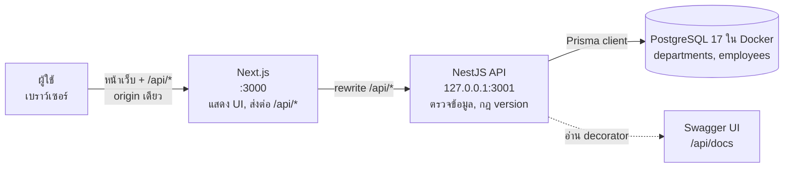
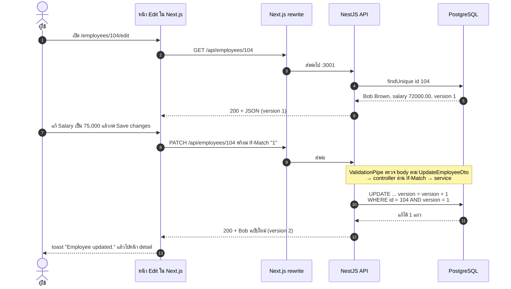
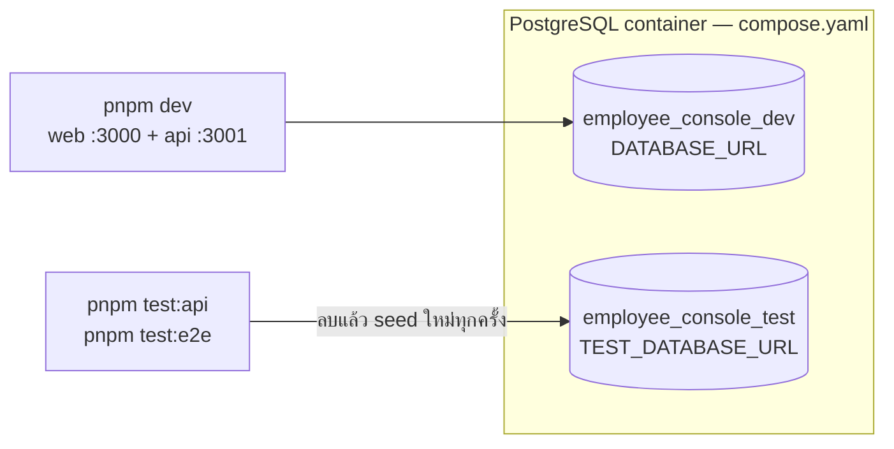

# บท 1 — ภาพรวมทั้งระบบ

## โปรเจกต์นี้คืออะไร

Employee Console เป็นเว็บทะเบียนพนักงาน ข้อมูลตั้งต้นมาจากไฟล์ Excel ของโจทย์ ([test-exam-data.xlsx](../../apps/api/prisma/seed-data/test-exam-data.xlsx)) มีพนักงาน 5 คน รหัส 101–105 แต่ละคนมี 7 ฟิลด์ ได้แก่ ID, Name, Department, Salary, Join Date, Status และ Last Updated Date

สิ่งที่ผู้ใช้ทำได้คือ ดูรายการ, ค้นหาชื่อ, กรองตามแผนกหรือสถานะ, เรียงลำดับ, แบ่งหน้า และ เพิ่ม/แก้/ลบ พนักงาน (CRUD) ไม่มีระบบ login ใครเข้าเว็บได้ก็ใช้งานได้ทุกอย่าง ซึ่งเป็นการตัดสินใจโดยตั้งใจ (D-46) และโปรเจกต์ถูกทำให้เล็กลงอีกรอบใน D-56 เหลือแค่สิ่งที่โจทย์ขอ

## เปรียบเทียบกับร้านอาหาร

ถ้ายังนึกภาพไม่ออกว่าแต่ละชิ้นทำอะไร ลองนึกถึงร้านอาหาร

| ในร้านอาหาร | ในโปรเจกต์ | อยู่ที่ |
| --- | --- | --- |
| ลูกค้า | เบราว์เซอร์ของผู้ใช้ | — |
| หน้าร้านกับพนักงานเสิร์ฟ: จัดโต๊ะ รับออร์เดอร์ แล้วเดินไปส่งครัว | **Next.js** — แสดงหน้าเว็บ และส่งต่อคำขอ `/api/*` ไปให้ API | [apps/web](../../apps/web) |
| ครัว: รู้สูตร ตรวจวัตถุดิบ ตัดสินว่าทำได้หรือไม่ | **NestJS** — ตรวจข้อมูล ตัดสินว่าบันทึกได้หรือไม่ แล้วคุยกับฐานข้อมูล | [apps/api](../../apps/api) |
| ห้องเก็บของกับสมุดบัญชี | **PostgreSQL** — เก็บข้อมูลจริง | Docker container ([compose.yaml](../../compose.yaml)) |
| เมนูที่เขียนชัดว่าสั่งอะไรได้ | **Swagger UI** — หน้าเอกสาร API ที่ `/api/docs` | สร้างจากโค้ดของ API (บท 4) |

ประเด็นสำคัญคือ **พนักงานเสิร์ฟไม่ทำอาหารเอง** Next.js ไม่ต่อฐานข้อมูลและไม่มีกฎธุรกิจ ทุกอย่างที่เป็น "การตัดสินใจ" อยู่ใน NestJS ที่เดียว

## ภาพรวม



- เส้นทึบ = คำขอที่วิ่งตอนใช้งานจริง
- เส้นประ = หน้าเอกสารที่ API สร้างให้จากโค้ดของตัวเอง

ทั้งเว็บและ API รันบนเครื่องเราด้วย `pnpm dev` ส่วน Docker มีหน้าที่เดียวคือรัน PostgreSQL (บท 5)

### ทำไมเบราว์เซอร์ไม่คุยกับ API ตรง ๆ

เบราว์เซอร์รู้จักแค่ `http://localhost:3000` เมื่อหน้าเว็บเรียก `fetch('/api/employees')` Next.js จะส่งต่อคำขอนั้นไปที่ NestJS ให้เอง ตามกฎใน [next.config.ts](../../apps/web/next.config.ts)

```ts
const apiUrl = process.env.API_INTERNAL_URL ?? 'http://127.0.0.1:3001';
// ...
async rewrites() {
  return [{ source: '/api/:path*', destination: `${apiUrl}/api/:path*` }];
}
```

ผลที่ได้คือ

1. ไม่ต้องเปิด CORS เพราะเบราว์เซอร์คุยกับ origin เดียว
2. API ฟังเฉพาะ `127.0.0.1` ([main.ts](../../apps/api/src/main.ts)) เครื่องอื่นในเครือข่ายเรียกตรงไม่ได้

## พื้นฐานที่ควรรู้ก่อนอ่านบทต่อไป

### HTTP request และ response

ทุกครั้งที่หน้าเว็บขอข้อมูล จะส่ง **request** ไปหนึ่งก้อน แล้วได้ **response** กลับมาหนึ่งก้อน

```text
PATCH /api/employees/104               ← method + path
If-Match: "1"                          ← header (ข้อมูลประกอบ)
Content-Type: application/json
                                       ← บรรทัดว่างคั่น
{ "salary": "75000.00" }               ← body (เนื้อหา JSON)
```

```text
HTTP/1.1 200 OK                        ← status code
Content-Type: application/json

{ "id": 104, "name": "Bob Brown", "salary": "75000.00", ..., "version": 2 }
```

### Method ที่โปรเจกต์ใช้

API นี้ออกแบบแบบ REST คือมองข้อมูลเป็น "resource" ที่มี URL ของตัวเอง แล้วใช้ method บอกว่าจะทำอะไรกับมัน

| Method | ความหมาย | ตัวอย่างในโปรเจกต์ |
| --- | --- | --- |
| `GET` | อ่าน | `GET /api/employees?q=john` = ค้นหา, `GET /api/employees/104` = ดูคนเดียว |
| `POST` | สร้างใหม่ | `POST /api/employees` |
| `PATCH` | แก้บางฟิลด์ | `PATCH /api/employees/104` + header `If-Match` |
| `DELETE` | ลบ | `DELETE /api/employees/104` + header `If-Match` |

### Status code ที่จะเจอ

| Code | ความหมาย | เกิดเมื่อไรในโปรเจกต์ |
| --- | --- | --- |
| 200 | สำเร็จ | อ่านหรือแก้สำเร็จ |
| 201 | สร้างสำเร็จ | `POST` สำเร็จ |
| 204 | สำเร็จแต่ไม่มีเนื้อหา | ลบสำเร็จ |
| 400 | ข้อมูลที่ส่งมาผิด | ชื่อว่าง, salary มีทศนิยม 3 ตำแหน่ง, ส่งฟิลด์ที่ไม่รู้จัก, id ใน path ไม่ใช่ตัวเลข |
| 404 | ไม่พบ | ไม่มีพนักงาน ID นี้ |
| 409 | ชนกัน | มีคนแก้ record นี้ไปก่อน (version ไม่ตรง) |
| 428 | ขาดเงื่อนไขที่บังคับ | แก้หรือลบโดยไม่ส่ง `If-Match` |

### คำอื่นที่จะเจอ

- **JSON** — รูปแบบข้อมูลที่ส่งไปมา หน้าตาเหมือน object ของ JavaScript
- **TypeScript** — JavaScript ที่มีชนิดข้อมูล (type) ทั้งเว็บและ API เขียนด้วยภาษานี้
- **Decorator** — ป้ายที่แปะไว้บน class หรือ method เช่น `@Get()` เพื่อบอก framework ว่าโค้ดนี้คืออะไร (อธิบายละเอียดในบท 2)
- **Monorepo** — repo เดียวที่มีหลายโปรเจกต์ย่อย (`apps/api`, `apps/web`, `tests/e2e`) จัดการด้วย pnpm workspace ([pnpm-workspace.yaml](../../pnpm-workspace.yaml))

## ตามรอย: แก้เงินเดือน Bob Brown จาก 72,000 เป็น 75,000

ตัวอย่างนี้ร้อยทุกชิ้นเข้าด้วยกัน อ่านคู่กับโค้ดจะเห็นภาพชัดที่สุด



| ขั้น | เกิดอะไรขึ้น | ไฟล์ |
| --- | --- | --- |
| 1–2 | หน้า Edit โหลดข้อมูลด้วย hook `useEmployee(104)` | [edit-employee-view.tsx](../../apps/web/src/app/(console)/employees/[id]/edit/edit-employee-view.tsx), [queries.ts](../../apps/web/src/lib/queries.ts) |
| 3 | Next.js ส่งต่อ `/api/*` ไปที่ `API_INTERNAL_URL` | [next.config.ts](../../apps/web/next.config.ts) |
| 4–6 | Controller แปลง `"104"` เป็นตัวเลขด้วย `ParseIntPipe` แล้ว service อ่านแถวพร้อมชื่อแผนก และแปลงเงิน/วันที่เป็น string | [employees.controller.ts](../../apps/api/src/employees/employees.controller.ts), [employees.service.ts](../../apps/api/src/employees/employees.service.ts) |
| 7 | ฟอร์มเปลี่ยน `75,000` เป็น `"75000.00"` แล้ว `changedFields()` เทียบกับค่าเดิม ส่งเฉพาะฟิลด์ที่เปลี่ยน คือ `{ salary }` | edit-employee-view.tsx, [salary.ts](../../apps/web/src/lib/salary.ts) |
| 8 | `useUpdateEmployee` เรียก `api()` พร้อม header `If-Match: "1"` (version ของข้อมูลที่แสดงอยู่ในฟอร์ม) | [queries.ts](../../apps/web/src/lib/queries.ts), [api.ts](../../apps/web/src/lib/api.ts) |
| 9 | `ValidationPipe` ตรวจว่า salary เป็นทศนิยมแบบ string ที่ถูกต้อง แล้ว controller อ่าน `If-Match` เป็นเลข 1 | [app.ts](../../apps/api/src/app.ts), [employee.dto.ts](../../apps/api/src/employees/employee.dto.ts) |
| 10–11 | Service สั่ง `updateMany` ที่มีเงื่อนไข `{ id: 104, version: 1 }` พร้อมเพิ่ม version และตั้ง Last Updated Date เป็น "วันนี้" ตามเวลากรุงเทพ | [employees.service.ts](../../apps/api/src/employees/employees.service.ts) |
| 12–13 | API อ่านแถวใหม่ส่งกลับ เว็บเก็บลง cache ของ TanStack Query แสดง toast แล้วเปลี่ยนหน้า | edit-employee-view.tsx |

ถ้าระหว่างนั้นมีอีกแท็บแก้ Bob ไปก่อน version ในฐานข้อมูลจะกลายเป็น 2 แล้ว ขั้นที่ 10 จะแก้ได้ 0 แถว service ตรวจต่อว่ายังมี ID นี้อยู่ จึงตอบ **409** แทน (ถ้าไม่มีแล้วจะเป็น 404) หน้าเว็บจะขึ้นแถบเตือน "This employee was changed by another user. Reload the latest version." พร้อมปุ่ม **Reload latest** (รายละเอียดในบท 6)

## โครงสร้าง folder แบบ "อยากแก้อะไร ไปที่ไหน"

| อยากแก้ | ไปที่ |
| --- | --- |
| หน้าตา ปุ่ม ตาราง ฟอร์ม | [apps/web/src/components](../../apps/web/src/components) |
| route ของหน้าเว็บ (`/employees`, `/employees/new` ฯลฯ) | [apps/web/src/app](../../apps/web/src/app) |
| สถานะของหน้า list ใน URL (ค้นหา, กรอง, หน้า) | [list-params.ts](../../apps/web/src/lib/list-params.ts) |
| ชนิดข้อมูลที่เว็บรับจาก API และตัวเรียก `fetch` | [api.ts](../../apps/web/src/lib/api.ts) |
| endpoint ของ API | [employees.controller.ts](../../apps/api/src/employees/employees.controller.ts) |
| กฎของแต่ละฟิลด์ และของ query (ค้นหา, เรียง, แบ่งหน้า) | [employee.dto.ts](../../apps/api/src/employees/employee.dto.ts) |
| การอ่าน/เขียนพนักงานในฐานข้อมูล | [employees.service.ts](../../apps/api/src/employees/employees.service.ts) |
| ตารางในฐานข้อมูล | [schema.prisma](../../apps/api/prisma/schema.prisma) + migration ใหม่ |
| environment variable | [.env.example](../../.env.example) + [configuration.md](../configuration.md) |
| test ผ่านเบราว์เซอร์ | [tests/e2e/specs](../../tests/e2e/specs) |

## ฐานข้อมูลสองฐาน: dev กับ test

PostgreSQL container ตัวเดียวมีสองฐานข้อมูล แยกกันด้วย URL ใน `.env` ข้อมูลที่ใช้พัฒนาจึงไม่โดน test ลบ



## คำสั่งที่ใช้ทุกวัน

ติดตั้ง dependency ครั้งแรก

```bash
pnpm install
```

สร้างไฟล์ตั้งค่า `.env` จากตัวอย่าง (ครั้งเดียว)

```bash
cp .env.example .env
```

เปิดฐานข้อมูล รอจนพร้อม แล้ว migrate + seed

```bash
pnpm dev:up
```

รันเว็บกับ API แบบ hot reload แล้วเปิด <http://localhost:3000>

```bash
pnpm dev
```

ปิด container (ข้อมูลยังอยู่ใน volume)

```bash
pnpm down
```

> **กับดัก**: `pnpm dev:up` seed ก็ต่อเมื่อตาราง employees ว่างเท่านั้น ถ้าเคยแก้หรือลบข้อมูลไปแล้วและอยากได้ 5 records เดิมคืน ให้ใช้ `pnpm db:reset` (ลบพนักงานทั้งหมดแล้ว seed ใหม่)

> **กับดัก**: `.env` ไม่อยู่ใน git (ดู [.gitignore](../../.gitignore)) อย่า commit และถ้าลืม `cp .env.example .env` คำสั่ง migrate และ test จะหา `DATABASE_URL`/`TEST_DATABASE_URL` ไม่เจอ

ต่อไป: [บท 2 — NestJS สำหรับมือใหม่](02-nestjs.md)
