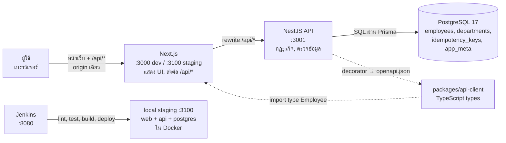
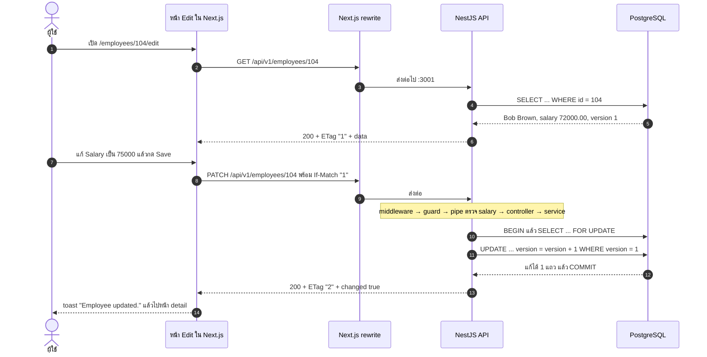
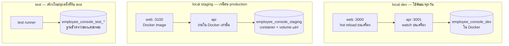

# บท 1 — ภาพรวมทั้งระบบ

## โปรเจกต์นี้คืออะไร

Employee Console เป็นเว็บทะเบียนพนักงาน ข้อมูลตั้งต้นมาจากไฟล์ Excel ของโจทย์ ([test-exam-data.xlsx](../../apps/api/prisma/seed-data/test-exam-data.xlsx)) มีพนักงาน 5 คน รหัส 101–105 แต่ละคนมี 7 ฟิลด์ ได้แก่ ID, Name, Department, Salary, Join Date, Status และ Last Updated Date

สิ่งที่ผู้ใช้ทำได้คือ ดูรายการ, ค้นหาชื่อ, กรองตามแผนกหรือสถานะ, เรียงลำดับ, แบ่งหน้า และ เพิ่ม/แก้/ลบ พนักงาน (CRUD) ไม่มีระบบ login ใครเข้าเว็บได้ก็ใช้งานได้ทุกอย่าง ซึ่งเป็นการตัดสินใจโดยตั้งใจ (D-46)

## เปรียบเทียบกับร้านอาหาร

ถ้ายังนึกภาพไม่ออกว่าแต่ละชิ้นทำอะไร ลองนึกถึงร้านอาหาร

| ในร้านอาหาร | ในโปรเจกต์ | อยู่ที่ |
| --- | --- | --- |
| ลูกค้า | เบราว์เซอร์ของผู้ใช้ | — |
| หน้าร้านกับพนักงานเสิร์ฟ: จัดโต๊ะ รับออร์เดอร์ แล้วเดินไปส่งครัว | **Next.js** — แสดงหน้าเว็บ และส่งต่อคำขอ `/api/*` ไปให้ API | [apps/web](../../apps/web) |
| ครัว: รู้สูตร ตรวจวัตถุดิบ ตัดสินว่าทำได้หรือไม่ | **NestJS** — กฎธุรกิจทั้งหมด ตรวจข้อมูล ตัดสินว่าบันทึกได้หรือไม่ | [apps/api](../../apps/api) |
| ห้องเก็บของกับสมุดบัญชี | **PostgreSQL** — เก็บข้อมูลจริง | Docker container |
| เมนูที่เขียนชัดว่าสั่งอะไรได้และจะได้อะไรกลับ | **OpenAPI** — เอกสารสัญญาของ API ที่เว็บใช้อ้างอิง | [packages/api-client](../../packages/api-client) |
| ผู้ตรวจคุณภาพกับรถส่งของ: ตรวจทุกจานก่อนออกจากครัวแล้วส่งไปสาขา | **Jenkins** — ตรวจโค้ดทุกครั้ง แล้ว deploy ไป staging | [Jenkinsfile](../../Jenkinsfile) |
| กล่องข้าวสำเร็จรูปที่อุ่นแล้วกินได้เหมือนกันทุกที่ | **Docker image** — แอปที่แพ็กพร้อมรัน | [infra/docker](../../infra/docker) |

ประเด็นสำคัญคือ **พนักงานเสิร์ฟไม่ทำอาหารเอง** Next.js ไม่ต่อฐานข้อมูลและไม่มีกฎธุรกิจ ทุกอย่างที่เป็น "การตัดสินใจ" อยู่ใน NestJS ที่เดียว

## ภาพรวม



- เส้นทึบ = คำขอที่วิ่งตอนใช้งานจริง
- เส้นประ = ความสัมพันธ์ตอนพัฒนา (types ถูก generate จาก API แล้วเว็บ import ไปใช้)

### ทำไมเบราว์เซอร์ไม่คุยกับ API ตรง ๆ

เบราว์เซอร์รู้จักแค่ `http://localhost:3000` (dev) หรือ `http://localhost:3100` (staging) เมื่อหน้าเว็บเรียก `fetch('/api/v1/employees')` Next.js จะส่งต่อคำขอนั้นไปที่ NestJS ให้เอง ตามกฎใน [next.config.ts](../../apps/web/next.config.ts)

```ts
async rewrites() {
  return [{ source: '/api/:path*', destination: `${apiInternalUrl}/api/:path*` }];
}
```

ผลที่ได้คือ

1. ไม่ต้องเปิด CORS เพราะเบราว์เซอร์คุยกับ origin เดียว
2. บน staging พอร์ตของ API ไม่ต้องเปิดออกนอก Docker เลย ([compose.staging.yaml](../../compose.staging.yaml) publish แค่พอร์ตของ web)

## พื้นฐานที่ควรรู้ก่อนอ่านบทต่อไป

### HTTP request และ response

ทุกครั้งที่หน้าเว็บขอข้อมูล จะส่ง **request** ไปหนึ่งก้อน แล้วได้ **response** กลับมาหนึ่งก้อน

```text
PATCH /api/v1/employees/104            ← method + path
If-Match: "1"                          ← header (ข้อมูลประกอบ)
Content-Type: application/json
                                       ← บรรทัดว่างคั่น
{ "salary": "75000.00" }               ← body (เนื้อหา JSON)
```

```text
HTTP/1.1 200 OK                        ← status code
ETag: "2"                              ← header ที่ server ส่งกลับ
X-Request-Id: 3f1c...

{ "data": { "id": 104, ... "version": 2 }, "meta": { "requestId": "3f1c...", "changed": true } }
```

### Method ที่โปรเจกต์ใช้

API นี้ออกแบบแบบ REST คือมองข้อมูลเป็น "resource" ที่มี URL ของตัวเอง แล้วใช้ method บอกว่าจะทำอะไรกับมัน

| Method | ความหมาย | ตัวอย่างในโปรเจกต์ |
| --- | --- | --- |
| `GET` | อ่าน | `GET /api/v1/employees?q=john` = ค้นหา, `GET /api/v1/employees/104` = ดูคนเดียว |
| `POST` | สร้างใหม่ | `POST /api/v1/employees` + header `Idempotency-Key` |
| `PATCH` | แก้บางฟิลด์ | `PATCH /api/v1/employees/104` + header `If-Match` |
| `DELETE` | ลบ | `DELETE /api/v1/employees/104` + header `If-Match` |

### Status code ที่จะเจอบ่อย

| Code | ความหมาย | เกิดเมื่อไรในโปรเจกต์ |
| --- | --- | --- |
| 200 | สำเร็จ | อ่านหรือแก้สำเร็จ |
| 201 | สร้างสำเร็จ | `POST` สำเร็จ |
| 204 | สำเร็จแต่ไม่มีเนื้อหา | ลบสำเร็จ |
| 400 | ข้อมูลที่ส่งมาผิด | ชื่อว่าง, salary มีทศนิยม 3 ตำแหน่ง |
| 404 | ไม่พบ | ไม่มีพนักงาน ID นี้ |
| 409 | ชนกัน | มีคนแก้ record นี้ไปก่อน (version ไม่ตรง) |
| 415 | ส่ง body ผิดชนิด | ไม่ได้ส่งเป็น `application/json` |
| 428 | ขาดเงื่อนไขที่บังคับ | แก้หรือลบโดยไม่ส่ง `If-Match` |
| 429 | ขอถี่เกินไป | เกิน rate limit ต่อ IP |
| 503 | ระบบยังไม่พร้อม | ฐานข้อมูลล่ม |

### คำอื่นที่จะเจอ

- **JSON** — รูปแบบข้อมูลที่ส่งไปมา หน้าตาเหมือน object ของ JavaScript
- **TypeScript** — JavaScript ที่มีชนิดข้อมูล (type) ทั้งเว็บและ API เขียนด้วยภาษานี้
- **Decorator** — ป้ายที่แปะไว้บน class หรือ method เช่น `@Get()` เพื่อบอก framework ว่าโค้ดนี้คืออะไร (อธิบายละเอียดในบท 2)
- **Monorepo** — repo เดียวที่มีหลายโปรเจกต์ย่อย (`apps/api`, `apps/web`, `packages/api-client`, `tests/e2e`) จัดการด้วย pnpm workspace ([pnpm-workspace.yaml](../../pnpm-workspace.yaml))

## ตามรอย: แก้เงินเดือน Bob Brown จาก 72,000 เป็น 75,000

ตัวอย่างนี้ร้อยทุกชิ้นเข้าด้วยกัน อ่านคู่กับโค้ดจะเห็นภาพชัดที่สุด



| ขั้น | เกิดอะไรขึ้น | ไฟล์ |
| --- | --- | --- |
| 1–2 | หน้า Edit โหลดข้อมูลด้วย hook `useEmployee(104, { editing: true })` | [edit-employee-view.tsx](../../apps/web/src/app/(console)/employees/[id]/edit/edit-employee-view.tsx), [queries.ts](../../apps/web/src/lib/queries.ts) |
| 3 | Next.js ส่งต่อ `/api/*` ไปที่ `API_INTERNAL_URL` | [next.config.ts](../../apps/web/next.config.ts) |
| 4–6 | Controller เรียก service ให้อ่านแถวนั้น แล้วใส่ header `ETag: "1"` (เลข version) | [employees.controller.ts](../../apps/api/src/employees/employees.controller.ts) |
| 7 | ฟังก์ชัน `diff()` เทียบค่าในฟอร์มกับค่าเดิม แล้วส่งเฉพาะฟิลด์ที่เปลี่ยน คือ `{ salary }` | edit-employee-view.tsx |
| 8 | `useUpdateEmployee` เรียก `api()` พร้อม header `If-Match: "1"` | [queries.ts](../../apps/web/src/lib/queries.ts), [api.ts](../../apps/web/src/lib/api.ts) |
| 10 | NestJS ตรวจ rate limit, ตรวจว่า salary เป็นเลขทศนิยมแบบ string ที่ถูกต้อง แล้วเรียก `update()` | [rate-limit.ts](../../apps/api/src/rate-limit/rate-limit.ts), [employee-rules.ts](../../apps/api/src/employees/employee-rules.ts) |
| 11–13 | Service ล็อกแถว ตรวจ version แล้ว UPDATE พร้อมเพิ่ม version และตั้ง Last Updated Date เป็น "วันนี้" ตามเวลากรุงเทพ | [employees.service.ts](../../apps/api/src/employees/employees.service.ts) |
| 14 | `EnvelopeInterceptor` ห่อผลลัพธ์เป็น `{ data, meta }` | [envelope.interceptor.ts](../../apps/api/src/common/envelope.interceptor.ts) |
| 15 | เว็บอัปเดต cache ของ TanStack Query แสดง toast แล้วเปลี่ยนหน้า | edit-employee-view.tsx |

ถ้าระหว่างนั้นมีอีกแท็บแก้ Bob ไปก่อน version ในฐานข้อมูลจะกลายเป็น 2 แล้ว ขั้นที่ 11 จะพบว่า version ไม่ตรง และตอบ **409 VERSION_CONFLICT** แทน หน้าเว็บจะขึ้นข้อความ "This employee was changed by another user. Reload the latest version." (รายละเอียดในบท 7)

## โครงสร้าง folder แบบ "อยากแก้อะไร ไปที่ไหน"

| อยากแก้ | ไปที่ |
| --- | --- |
| หน้าตา ปุ่ม ตาราง ฟอร์ม | [apps/web/src/components](../../apps/web/src/components) |
| route ของหน้าเว็บ (`/employees`, `/employees/new` ฯลฯ) | [apps/web/src/app](../../apps/web/src/app) |
| สถานะของหน้า list ใน URL (ค้นหา, กรอง, หน้า) | [list-params.ts](../../apps/web/src/lib/list-params.ts) |
| endpoint ของ API | `apps/api/src/<feature>/*.controller.ts` |
| กฎของแต่ละฟิลด์ (ชื่อยาวได้เท่าไร, salary รับรูปแบบไหน) | [employee-rules.ts](../../apps/api/src/employees/employee-rules.ts) |
| กฎของการค้นหา เรียง และแบ่งหน้า | [employee-query.ts](../../apps/api/src/employees/employee-query.ts) |
| SQL ที่อ่านหรือเขียนพนักงาน | [employees.service.ts](../../apps/api/src/employees/employees.service.ts) |
| ตารางในฐานข้อมูล | [schema.prisma](../../apps/api/prisma/schema.prisma) + migration ใหม่ |
| environment variable | [app-config.ts](../../apps/api/src/config/app-config.ts) + [.env.example](../../.env.example) + [configuration.md](../configuration.md) |
| ขั้นตอน CI/CD | [Jenkinsfile](../../Jenkinsfile) |
| วิธี deploy staging | [scripts/staging.mjs](../../scripts/staging.mjs) |
| test ผ่านเบราว์เซอร์ | [tests/e2e/specs](../../tests/e2e/specs) |

## Environment ทั้ง 3 แบบ

ระบบเดียวกันรันได้หลาย "สภาพแวดล้อม" แยกกันด้วยตัวแปร `APP_ENV` และแต่ละแบบมีฐานข้อมูลของตัวเอง ข้อมูลจึงไม่ปนกัน



## คำสั่งที่ใช้ทุกวัน

ติดตั้งครั้งแรก

```bash
pnpm install
```

```bash
pnpm run setup
```

เปิดฐานข้อมูล (และ migrate + seed ในครั้งแรก)

```bash
pnpm dev:up
```

รันเว็บกับ API แบบ hot reload แล้วเปิด <http://localhost:3000>

```bash
pnpm dev
```

ปิด container ทั้งหมด (ข้อมูลยังอยู่)

```bash
pnpm down
```

> **กับดัก**: ต้องพิมพ์ `pnpm run setup` และ `pnpm run doctor` (มีคำว่า `run`) เพราะ pnpm มีคำสั่งในตัวชื่อเดียวกัน (D-34)

ต่อไป: [บท 2 — NestJS สำหรับมือใหม่](02-nestjs.md)
