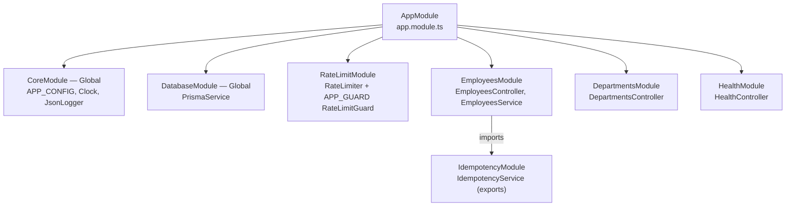
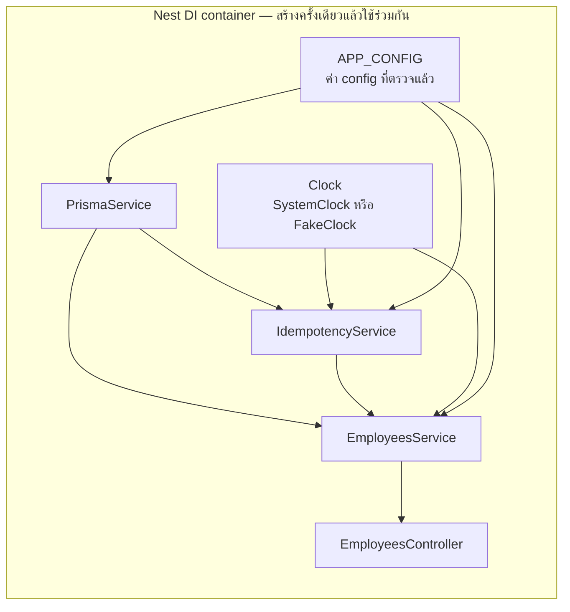
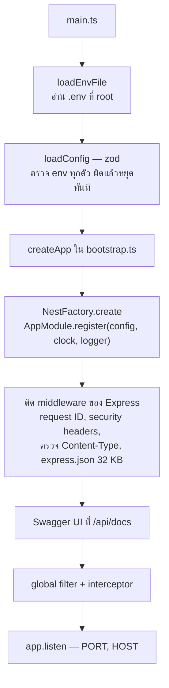
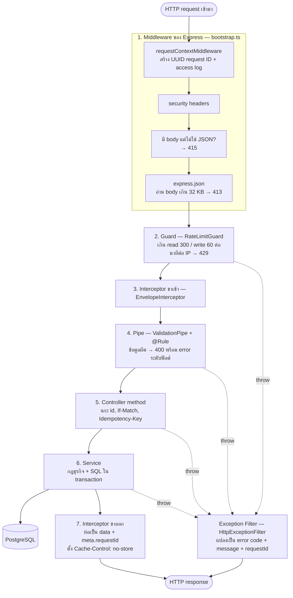
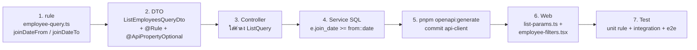

# บท 2 — NestJS สำหรับมือใหม่

บทนี้สอน NestJS ผ่านโค้ดจริงของโปรเจกต์ เริ่มจาก controller ที่เล็กที่สุดก่อน แล้วค่อยไล่ไปจนเห็นการทำงานของคำขอหนึ่งคำขอตั้งแต่เข้าจนออก

## NestJS คืออะไร

NestJS เป็น framework สำหรับเขียน backend ด้วย TypeScript ข้างในยังใช้ **Express** (ตัวรับ HTTP ที่นิยมที่สุดของ Node.js) แต่ Nest เพิ่ม "โครง" ให้ว่าโค้ดแต่ละประเภทต้องอยู่ที่ไหน

ถ้าเขียน Express เปล่า ๆ ทุกอย่างมักไปกองรวมในฟังก์ชันเดียว ทั้งรับ request, ตรวจข้อมูล, คุยฐานข้อมูล และจัดการ error พอโปรเจกต์โตก็หาอะไรไม่เจอ Nest จึงแยกงานเป็นชั้น ๆ และให้แต่ละชั้นมีหน้าที่เดียว

## คำศัพท์ที่ต้องรู้

| คำ | เปรียบเทียบ | ในโปรเจกต์นี้ |
| --- | --- | --- |
| **Module** | แผนกในบริษัท รวมคนที่ทำงานเรื่องเดียวกัน | `EmployeesModule`, `DepartmentsModule`, `HealthModule` |
| **Controller** | พนักงานต้อนรับ รับเรื่อง แล้วส่งต่อให้คนที่ทำจริง | `EmployeesController` รับ `GET/POST/PATCH/DELETE` |
| **Service** (Provider ชนิดหนึ่ง) | ผู้เชี่ยวชาญที่ลงมือทำงานจริง | `EmployeesService` เขียน SQL และกฎทางธุรกิจ |
| **Dependency Injection (DI)** | ฝ่ายบุคคลจัดคนมาให้ ไม่ต้องไปจ้างเอง | Nest สร้าง `PrismaService` แล้วส่งให้ `EmployeesService` อัตโนมัติ |
| **Middleware** | รปภ. หน้าตึก ทำกับทุกคนที่เดินเข้ามา | ใส่ request ID, security headers, ตรวจ `Content-Type` |
| **Guard** | คนเฝ้าประตูห้อง ตัดสินว่าให้เข้าหรือไม่ | `RateLimitGuard` ปฏิเสธเมื่อขอถี่เกิน |
| **Pipe** | ด่านตรวจเอกสาร ตรวจและแปลงข้อมูลก่อนถึงมือคนทำงาน | `bodyValidationPipe` ตรวจ body ตาม DTO |
| **Interceptor** | คนห่อของขวัญ ห่อผลลัพธ์ก่อนส่งออก | `EnvelopeInterceptor` ห่อเป็น `{ data, meta }` |
| **Exception Filter** | ฝ่ายรับเรื่องร้องเรียน แปลงทุกปัญหาเป็นคำตอบมาตรฐาน | `HttpExceptionFilter` แปลง error เป็น `{ error: {...} }` |

**Provider** คือของทุกอย่างที่ Nest สร้างแล้วแจกจ่ายผ่าน DI ได้ Service เป็น provider ที่พบบ่อยที่สุด แต่ค่า config, `Clock` และ guard ก็เป็น provider เหมือนกัน

## Decorator คืออะไร

Decorator คือ **ป้ายที่ขึ้นต้นด้วย `@`** แปะไว้บน class, method, parameter หรือ property เพื่อบอก Nest ว่าโค้ดนั้นมีหน้าที่อะไร ตัว decorator เองไม่ได้ทำงาน แต่ Nest จะอ่านป้ายเหล่านี้ตอนเริ่มโปรแกรม แล้วต่อสายทุกอย่างให้

ดูตัวอย่างที่เล็กที่สุดในโปรเจกต์ [departments.controller.ts](../../apps/api/src/departments/departments.controller.ts)

```ts
@ApiTags('departments')                       // ① ป้ายสำหรับ OpenAPI: จัดกลุ่มว่า "departments"
@Controller('api/v1/departments')             // ② class นี้เป็น controller ของ path /api/v1/departments
export class DepartmentsController {
  constructor(private readonly prisma: PrismaService) {}   // ③ ขอ PrismaService ผ่าน DI

  @Get()                                      // ④ method นี้ตอบ GET /api/v1/departments
  @ApiEnvelope(DepartmentDto, { isArray: true })  // ⑤ ป้าย OpenAPI: ตอบเป็น { data: DepartmentDto[], meta }
  @ApiErrors(429)                             // ⑥ ป้าย OpenAPI: อาจตอบ 429
  async list() {
    const rows = await this.prisma.department.findMany({ orderBy: { sortOrder: 'asc' } });
    return respond(rows.map((d) => ({ id: d.id, name: d.name, sortOrder: d.sortOrder })));
  }
}
```

ทั้งไฟล์มีแค่นี้ แต่ได้ endpoint ที่ใช้งานได้จริงหนึ่งตัว

- ② + ④ รวมกันเป็น route `GET /api/v1/departments`
- ③ คือ DI: เราไม่ได้เขียน `new PrismaService()` เอง Nest ส่งมาให้
- `respond(...)` สร้าง `ApiResponse` แล้ว interceptor จะห่อเป็น `{ data, meta }` ให้ภายหลัง
- ① ⑤ ⑥ ไม่มีผลกับการทำงาน มีไว้ให้ `pnpm openapi:generate` อ่านไปสร้างเอกสาร (บท 4)

Decorator ที่จะเจอใน controller ของ employees

| Decorator | อ่านอะไรจาก request | ตัวอย่าง |
| --- | --- | --- |
| `@Param('id')` | ค่าใน path | `/api/v1/employees/104` → `"104"` |
| `@Query()` | query string ทั้งหมด | `?q=john&page=2` → `{ q: 'john', page: '2' }` |
| `@Body()` | JSON body | `{ "salary": "75000.00" }` |
| `@Headers('if-match')` | header หนึ่งตัว | `"1"` |
| `@Res({ passthrough: true })` | object response ของ Express | ใช้ตั้ง header เช่น `ETag` แล้วยังให้ Nest ส่งค่าที่ return ตามปกติ |

> **กับดัก**: ค่าจาก `@Param` และ `@Query` เป็น **string เสมอ** โปรเจกต์นี้ตั้งใจปิดการแปลงชนิดอัตโนมัติ (`transform: false`) เพื่อไม่ให้ `"false"` กลายเป็น boolean โดยไม่ตั้งใจ จึงต้องแปลงเองผ่าน rule เช่น `pageRule`

## Module — กล่องที่รวมของที่เกี่ยวข้องกัน

ทุก controller และ service ต้องอยู่ใน module ใด module หนึ่ง และ module ทั้งหมดถูกรวมไว้ที่ `AppModule` ซึ่งเป็นรากของต้นไม้



ดูโค้ดของ [employees.module.ts](../../apps/api/src/employees/employees.module.ts)

```ts
@Module({
  imports: [IdempotencyModule],          // ขอใช้ของที่ IdempotencyModule export ไว้
  controllers: [EmployeesController],    // controller ของ module นี้
  providers: [EmployeesService],         // service ที่ Nest จะสร้างและแจกจ่าย
})
export class EmployeesModule {}
```

- **`imports`** — ขอยืมของจาก module อื่น ได้เฉพาะของที่ module นั้นใส่ไว้ใน `exports`
- **`@Global()`** — `CoreModule` และ `DatabaseModule` ประกาศเป็น global ทุก module จึงใช้ `PrismaService`, `Clock` และ config ได้โดยไม่ต้อง import (เพราะแทบทุกที่ต้องใช้)
- **`AppModule.register(config, clock, logger)`** ใน [app.module.ts](../../apps/api/src/app.module.ts) เป็น "dynamic module" คือ module ที่รับค่าตอนสร้าง ทำแบบนี้เพื่อให้ตอน test ส่ง `FakeClock` เข้าไปแทนนาฬิกาจริงได้

> กฎของโปรเจกต์ (จาก [apps/api/AGENTS.md](../../apps/api/AGENTS.md)): feature ใหม่ = folder ของตัวเองที่มี `<name>.module.ts` + controller + service แล้วเพิ่มเข้า `AppModule` และไฟล์ module ต้องแยกจากไฟล์ controller เสมอ

## Dependency Injection — ไม่ต้อง `new` เอง

ดู constructor ของ `EmployeesService` ใน [employees.service.ts](../../apps/api/src/employees/employees.service.ts)

```ts
@Injectable()                                   // บอก Nest ว่า class นี้ให้ DI สร้างได้
export class EmployeesService {
  constructor(
    private readonly prisma: PrismaService,      // ขอด้วย "ชนิด" ของ class
    private readonly idempotency: IdempotencyService,
    private readonly clock: Clock,
    @Inject(APP_CONFIG) private readonly config: AppConfig,  // ขอด้วย "token" เพราะ AppConfig เป็นแค่ interface
  ) {}
}
```

Service ไม่รู้เลยว่าของพวกนี้ถูกสร้างอย่างไร แค่ประกาศว่า "ต้องใช้" ตอนแอปเริ่ม Nest จะไล่ดูว่าใครต้องใช้อะไร แล้วสร้างให้ตามลำดับ



ลูกศร A → B หมายถึง "B ต้องใช้ A"

### ทำไมต้องลำบากขนาดนี้

ประโยชน์ที่เห็นชัดที่สุดในโปรเจกต์นี้คือ **การทดสอบ** Last Updated Date ต้องเป็น "วันนี้" ถ้าใช้นาฬิกาจริง test จะได้ผลต่างกันทุกวัน แต่เพราะ service ขอ `Clock` ผ่าน DI ตอน test จึงส่ง `FakeClock` ที่ตรึงเวลาไว้ที่ 2026-10-01 10:00 (เวลากรุงเทพ) เข้าไปแทนได้ ([harness.ts](../../apps/api/test/support/harness.ts))

```ts
const clock = new FakeClock(new Date(now));
const app = await createApp(config, { clock, logger: ... });
```

`Clock` ใน [clock.ts](../../apps/api/src/common/clock.ts) เป็น abstract class ใช้เป็นทั้ง "ชนิด" และ "token" ของ DI ส่วน `AppConfig` เป็น interface ซึ่งหายไปหลัง compile จึงต้องใช้ token `APP_CONFIG` กับ `@Inject(...)` แทน

## แอปเริ่มทำงานอย่างไร



- [main.ts](../../apps/api/src/main.ts) เป็นจุดเริ่ม
- [bootstrap.ts](../../apps/api/src/bootstrap.ts) มีฟังก์ชัน `createApp()` ที่ประกอบแอปทั้งหมด ใช้ร่วมกันสามที่: ตอนรันจริง, ตอน test (`startApp` ใน harness) และตอนสร้าง OpenAPI ทำให้ทั้งสามที่ได้แอปหน้าตาเดียวกัน
- ถ้า env ผิด เช่น `DATABASE_URL` หาย process จะหยุดพร้อมรายการปัญหา (ไม่พิมพ์ค่า secret ออกมา)

## ทางเดินของ request หนึ่งคำขอ

นี่คือภาพที่สำคัญที่สุดของบทนี้ ทุก request ผ่านด่านตามลำดับนี้เสมอ



| ด่าน | ไฟล์ | ประกาศไว้ที่ไหน |
| --- | --- | --- |
| Middleware | [request-id.middleware.ts](../../apps/api/src/common/request-id.middleware.ts), [bootstrap.ts](../../apps/api/src/bootstrap.ts) | `app.use(...)` ใน `createApp` |
| Guard | [rate-limit.ts](../../apps/api/src/rate-limit/rate-limit.ts) | `{ provide: APP_GUARD, useClass: RateLimitGuard }` ใน [rate-limit.module.ts](../../apps/api/src/rate-limit/rate-limit.module.ts) = ใช้กับทุก route |
| Interceptor | [envelope.interceptor.ts](../../apps/api/src/common/envelope.interceptor.ts) | `app.useGlobalInterceptors(...)` |
| Pipe | [validation.pipe.ts](../../apps/api/src/validation/validation.pipe.ts), [field-rule.decorator.ts](../../apps/api/src/validation/field-rule.decorator.ts) | `@UsePipes(bodyValidationPipe)` บนแต่ละ method |
| Exception Filter | [http-exception.filter.ts](../../apps/api/src/common/http-exception.filter.ts) | `app.useGlobalFilters(...)` |

route ที่ไม่ต้องการ rate limit (เช่น health) ปิดได้ด้วย `@RateLimit('none')` — guard อ่านป้ายนี้ผ่าน `Reflector`

## Validation: DTO + `@Rule()`

**DTO (Data Transfer Object)** คือ class ที่บอกว่า body หรือ query ต้องมีหน้าตาแบบไหน ดู [employee.dto.ts](../../apps/api/src/employees/employee.dto.ts)

```ts
export class UpdateEmployeeDto {
  @ApiPropertyOptional({ type: String, example: '63000.00' })   // สำหรับ OpenAPI
  @Rule(salaryRule, { optional: true })                         // สำหรับตรวจจริง
  salary?: string;
  // ... name, departmentId, joinDate, isActive
}
```

โปรเจกต์นี้ไม่ใช้ decorator สำเร็จรูปอย่าง `@IsString()` แต่เขียนกฎเป็น **ฟังก์ชันธรรมดา** ใน [employee-rules.ts](../../apps/api/src/employees/employee-rules.ts) แล้วผูกกับฟิลด์ด้วย `@Rule(...)` (D-19)

```ts
export function salaryRule(value: unknown): RuleResult<string> {
  if (typeof value !== 'string') {
    return fail('SALARY_TYPE_INVALID', 'Salary must be sent as a decimal string, for example "65000.00".');
  }
  // ... ตรวจรูปแบบ แล้วคืนค่าที่ normalize เป็นทศนิยม 2 ตำแหน่ง เช่น "65000" → "65000.00"
}
```

กฎชุดเดียวกันถูกใช้ซ้ำ 4 ที่ ได้แก่ ตรวจ DTO, normalize ใน service, ตอน seed และใน unit test error code จึงตรงกันทุกชั้น

ValidationPipe ตั้งค่าให้เข้มไว้

- `whitelist` + `forbidNonWhitelisted` — ส่งฟิลด์ที่ไม่รู้จักมาจะโดน `UNKNOWN_FIELD` ส่วนฟิลด์ที่ระบบกำหนดเอง (`id`, `version`, `lastUpdatedDate`) จะโดน `READ_ONLY_FIELD`
- `transform: false` — ไม่แปลงชนิดให้อัตโนมัติ

## เดินผ่านโค้ด: `PATCH /api/v1/employees/:id`

### Controller — แกะข้อมูลจาก request แล้วส่งต่อ

จาก [employees.controller.ts](../../apps/api/src/employees/employees.controller.ts)

```ts
@Patch(':id')                                       // PATCH /api/v1/employees/:id
@UsePipes(bodyValidationPipe)                       // ตรวจ body ด้วย UpdateEmployeeDto
@ApiHeader({ name: 'If-Match', required: true, ... })   // ป้าย OpenAPI
@ApiErrors(400, 404, 409, 413, 415, 428, 429)       // ป้าย OpenAPI: error ที่เป็นไปได้
async update(
  @Param('id') id: string,
  @Body() body: UpdateEmployeeDto,
  @Headers('if-match') ifMatch: string | undefined,
  @Res({ passthrough: true }) res: Response,
) {
  const employeeId = parseId(id);                   // "104" → 104 ถ้าไม่ใช่ตัวเลขที่ถูกต้อง → 404
  if (Object.keys(body ?? {}).length === 0) {       // body ว่าง → 400 EMPTY_PATCH
    throw Errors.validation([{ field: 'body', code: 'EMPTY_PATCH', ... }]);
  }
  const version = parseIfMatch(ifMatch);            // ไม่มี If-Match → 428, รูปแบบผิด → 400
  const { employee, changed } = await this.employees.update(employeeId, body, version);
  res.setHeader('ETag', `"${employee.version}"`);   // version ใหม่ให้ client ใช้ครั้งถัดไป
  return respond(employee, { changed });            // interceptor จะห่อเป็น { data, meta }
}
```

สังเกตว่า controller **ไม่มีกฎธุรกิจ** ทำแค่แปลง HTTP ให้เป็นค่าที่ใช้ได้ แล้วโยนให้ service

### Service — กฎธุรกิจกับฐานข้อมูล

จาก [employees.service.ts](../../apps/api/src/employees/employees.service.ts) (ตัดให้สั้นลง)

```ts
async update(id, patch, expectedVersion) {
  const normalized = normalizePartial(patch);           // ใช้ rule ชุดเดิม normalize ค่า
  return this.prisma.$transaction(async (tx) => {       // ทุกอย่างข้างในสำเร็จหรือล้มพร้อมกัน
    const current = await this.findOne(tx, id, true);   // SELECT ... FOR UPDATE = ล็อกแถวนี้
    if (!current) throw Errors.employeeNotFound();       // 404
    if (current.version !== expectedVersion) throw Errors.versionConflict(current.version);  // 409

    const next = { ...ค่าเดิม, ...ค่าใหม่ };
    if (ค่าไม่เปลี่ยนเลย) return { employee: current, changed: false };   // no-op: ไม่เขียน, version เท่าเดิม

    await tx.$executeRaw`
      UPDATE employees SET ..., last_updated_date = ${this.today()}::date, version = version + 1
      WHERE id = ${id} AND version = ${expectedVersion}`;
    return { employee: await this.findOne(tx, id), changed: true };
  });
}
```

สามจุดที่ควรจำ

1. **Transaction + row lock** — กันไม่ให้สองคำขอแก้แถวเดียวกันพร้อมกันจนข้อมูลเพี้ยน
2. **ตรวจ version สองชั้น** — ทั้ง `if` และ `WHERE version = ...` ใน SQL
3. **No-op** — กด Save โดยไม่ได้แก้อะไร จะไม่เขียนฐานข้อมูล และ Last Updated Date ไม่เปลี่ยน (PRD §9.4)

### Error — โยน `Errors.*` แล้ว filter จัดการต่อ

ทุก error ของแอปสร้างจาก [api-exception.ts](../../apps/api/src/common/api-exception.ts) ซึ่งมี code คงที่

```ts
versionConflict: (currentVersion?: number) =>
  new ApiException(409, 'VERSION_CONFLICT', 'This employee was changed by another user. Reload the latest version.', ...),
```

`HttpExceptionFilter` จะแปลงเป็น JSON แบบนี้เสมอ และไม่มี stack trace หรือข้อความ SQL หลุดออกไป

```json
{
  "error": {
    "code": "VERSION_CONFLICT",
    "message": "This employee was changed by another user. Reload the latest version.",
    "requestId": "3f1c2a9e-...",
    "currentVersion": 2
  }
}
```

> **กับดัก**: ห้าม `throw new HttpException(...)` ตรง ๆ ให้ใช้ `Errors.*` เสมอ เพราะ UI กับ Postman test อ่าน `code` เพื่อตัดสินว่าจะทำอะไรต่อ

## ลองเอง

รัน `pnpm dev` ไว้ก่อน แล้วเปิด terminal อีกหน้าต่าง คำสั่งด้านล่างยิงตรงไปที่ API พอร์ต 3001 (ถ้าเปลี่ยน `PORT` ใน `.env` ให้เปลี่ยนตาม)

**1. ค้นหาชื่อ** — ต้องใส่ URL ในเครื่องหมายคำพูด เพราะ zsh ตีความ `?` เป็น wildcard

```bash
curl -s 'http://localhost:3001/api/v1/employees?q=john'
```

**2. ดูพนักงานคนเดียวพร้อม header** — สังเกต `ETag` และ `X-Request-Id`

```bash
curl -i http://localhost:3001/api/v1/employees/104
```

**3. แก้โดยไม่ส่ง `If-Match`** — ได้ 428 `PRECONDITION_REQUIRED` และข้อมูลไม่เปลี่ยน

```bash
curl -i -X PATCH http://localhost:3001/api/v1/employees/104 -H 'Content-Type: application/json' -d '{"salary":"75000.00"}'
```

**4. แก้โดยส่ง version ผิด** — ได้ 409 `VERSION_CONFLICT` พร้อม `currentVersion` และข้อมูลไม่เปลี่ยน

```bash
curl -i -X PATCH http://localhost:3001/api/v1/employees/104 -H 'Content-Type: application/json' -H 'If-Match: "99"' -d '{"salary":"75000.00"}'
```

**5. ส่ง salary เป็นตัวเลขแทน string** — ได้ 400 `VALIDATION_ERROR` พร้อม `SALARY_TYPE_INVALID` ในรายละเอียด

```bash
curl -i -X PATCH http://localhost:3001/api/v1/employees/104 -H 'Content-Type: application/json' -H 'If-Match: "1"' -d '{"salary":75000}'
```

ทุกคำสั่งข้างบนไม่เปลี่ยนข้อมูล ถ้าลองแก้จริงด้วย version ที่ถูกต้องแล้วอยากคืนข้อมูลเป็น 5 records เดิม

```bash
pnpm demo:reset --confirm-reset
```

ระหว่างนั้นลองดู log ใน terminal ที่รัน `pnpm dev` จะเห็นบรรทัด JSON `"request"` ของแต่ละคำขอ พร้อม `requestId`, `status` และ `durationMs`

## สูตร: เพิ่มของใหม่ทีละชั้น

### เพิ่มตัวกรอง Join Date ช่วงเริ่ม–จบ (โจทย์ซ้อม Live Coding)

ลำดับนี้มาจาก [demo-script.md](../demo-script.md) ทำจากชั้นในสุดออกมา



### เพิ่ม feature module ใหม่

1. สร้าง folder `apps/api/src/<name>/` มี `<name>.module.ts`, `<name>.controller.ts`, `<name>.service.ts`
2. ใส่ `@Controller('api/v1/<name>')` และ `@Injectable()` ให้ service
3. ลงทะเบียน controller และ provider ใน module แล้วเพิ่ม module เข้า `imports` ของ `AppModule`
4. ตอบด้วย `respond(...)` และโยน error ด้วย `Errors.*`
5. ใส่ป้าย `@ApiEnvelope` / `@ApiErrors` แล้วรัน `pnpm openapi:generate`
6. เขียน integration test ใน `apps/api/test/integration`

## กับดักที่เจอบ่อยในโปรเจกต์นี้

| กับดัก | ทำไม | ที่มา |
| --- | --- | --- |
| import ต้องลงท้าย `.js` แม้ไฟล์จริงเป็น `.ts` เช่น `'../common/clock.js'` | โปรเจกต์เป็น ESM แบบ `nodenext` | [apps/api/AGENTS.md](../../apps/api/AGENTS.md) |
| ห้ามรัน Nest ด้วย `tsx`/esbuild ใน test หรือ script ที่ต้องใช้ DI | esbuild ไม่สร้าง "decorator metadata" ที่ DI ใช้อ่านชนิดของ constructor ผลคือ DI พังแบบเงียบ ๆ | D-13, [ai-usage.md](../ai-usage.md) ข้อ 2 |
| ห้ามอ่าน `process.env` กระจายในโค้ด | ค่าทุกตัวต้องผ่านการตรวจใน [app-config.ts](../../apps/api/src/config/app-config.ts) | apps/api/AGENTS.md |
| ห้ามเปลี่ยน query ของ employees เป็น `findMany` | Prisma คืนวันที่เป็น `Date` ซึ่งอาจเลื่อนวันตาม timezone | D-20, บท 3 |
| แก้ controller/DTO แล้วลืม `pnpm openapi:generate` | Jenkins จะล้มที่ stage Static checks | บท 4 |

ต่อไป: [บท 3 — ฐานข้อมูลและ Prisma](03-database-prisma.md)
