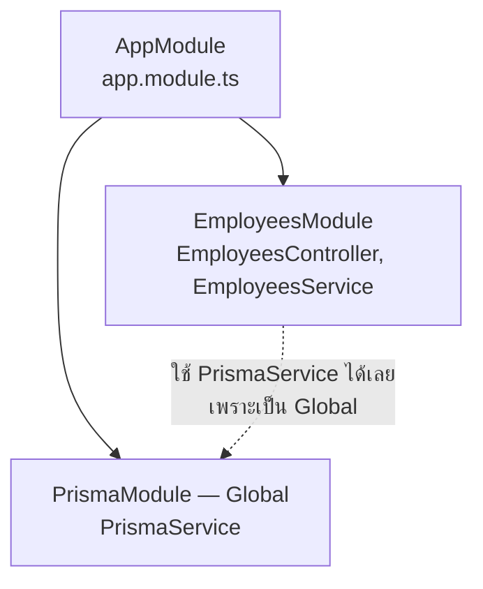
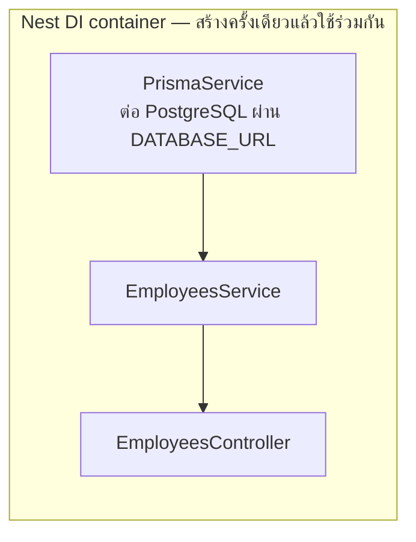
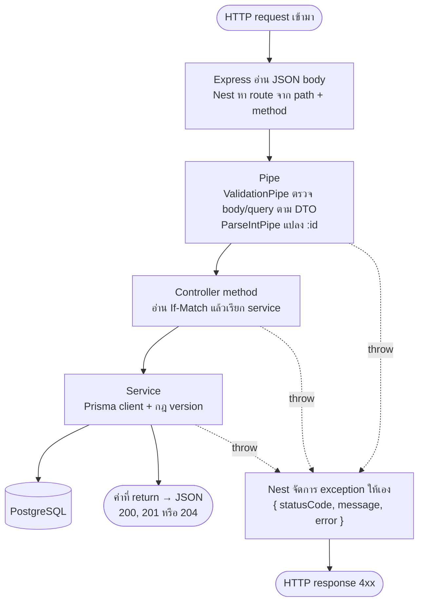

# บท 2 — NestJS สำหรับมือใหม่

บทนี้สอน NestJS ผ่านโค้ดจริงของโปรเจกต์ ทั้ง API มีราวสิบไฟล์ใน [apps/api/src](../../apps/api/src) (ไม่นับ `generated/` ที่ Prisma สร้างให้) อ่านจบบทนี้แล้วเปิดอ่านได้ครบทุกไฟล์

## NestJS คืออะไร

NestJS เป็น framework สำหรับเขียน backend ด้วย TypeScript ข้างในยังใช้ **Express** (ตัวรับ HTTP ที่นิยมที่สุดของ Node.js) แต่ Nest เพิ่ม "โครง" ให้ว่าโค้ดแต่ละประเภทต้องอยู่ที่ไหน

ถ้าเขียน Express เปล่า ๆ ทุกอย่างมักไปกองรวมในฟังก์ชันเดียว ทั้งรับ request, ตรวจข้อมูล, คุยฐานข้อมูล และจัดการ error พอโปรเจกต์โตก็หาอะไรไม่เจอ Nest จึงแยกงานเป็นชั้น ๆ และให้แต่ละชั้นมีหน้าที่เดียว

## คำศัพท์ที่ต้องรู้

| คำ | เปรียบเทียบ | ในโปรเจกต์นี้ |
| --- | --- | --- |
| **Module** | แผนกในบริษัท รวมคนที่ทำงานเรื่องเดียวกัน | `AppModule`, `PrismaModule`, `EmployeesModule` |
| **Controller** | พนักงานต้อนรับ รับเรื่อง แล้วส่งต่อให้คนที่ทำจริง | `EmployeesController` รับ `GET/POST/PATCH/DELETE` |
| **Service** (Provider ชนิดหนึ่ง) | ผู้เชี่ยวชาญที่ลงมือทำงานจริง | `EmployeesService` คุยกับฐานข้อมูลและถือกฎเรื่อง version |
| **Dependency Injection (DI)** | ฝ่ายบุคคลจัดคนมาให้ ไม่ต้องไปจ้างเอง | Nest สร้าง `PrismaService` แล้วส่งให้ `EmployeesService` อัตโนมัติ |
| **Pipe** | ด่านตรวจเอกสาร ตรวจและแปลงข้อมูลก่อนถึงมือคนทำงาน | `ValidationPipe` ตรวจ body/query ตาม DTO, `ParseIntPipe` แปลง `:id` เป็นตัวเลข |
| **DTO** | แบบฟอร์มที่บอกว่าต้องกรอกช่องไหน แบบไหน | `CreateEmployeeDto`, `UpdateEmployeeDto`, `ListEmployeesQuery` |
| **Exception** | ใบแจ้งว่าทำไม่ได้ พร้อมเหตุผล | `NotFoundException` (404), `ConflictException` (409) |

**Provider** คือของทุกอย่างที่ Nest สร้างแล้วแจกจ่ายผ่าน DI ได้ Service เป็น provider ที่พบบ่อยที่สุด

Nest ยังมีจุดเสียบอื่นอีก เช่น Middleware, Guard, Interceptor และ Exception Filter แต่โปรเจกต์นี้ไม่ได้ใช้ เพราะไม่มี login, ไม่ห่อ response และใช้รูปแบบ error มาตรฐานของ Nest ตรง ๆ (D-56)

## Decorator คืออะไร

Decorator คือ **ป้ายที่ขึ้นต้นด้วย `@`** แปะไว้บน class, method, parameter หรือ property เพื่อบอก Nest ว่าโค้ดนั้นมีหน้าที่อะไร ตัว decorator เองไม่ได้ทำงาน แต่ Nest จะอ่านป้ายเหล่านี้ตอนเริ่มโปรแกรม แล้วต่อสายทุกอย่างให้

ดูส่วนที่สั้นที่สุดของ [employees.controller.ts](../../apps/api/src/employees/employees.controller.ts)

```ts
@ApiTags('employees')                              // ① ป้ายสำหรับ Swagger: จัดกลุ่มว่า "employees"
@Controller('employees')                           // ② class นี้ดูแล path /employees
export class EmployeesController {
  constructor(private readonly employees: EmployeesService) {}   // ③ ขอ EmployeesService ผ่าน DI

  @Get(':id')                                      // ④ method นี้ตอบ GET /employees/:id
  get(@Param('id', ParseIntPipe) id: number) {     // ⑤ อ่าน :id แล้วแปลง "104" → 104
    return this.employees.get(id);                 // ⑥ ค่าที่ return กลายเป็น JSON ให้เอง
  }
}
```

- ② + ④ รวมกันเป็น `/employees/:id` และเพราะ [app.ts](../../apps/api/src/app.ts) ตั้ง `app.setGlobalPrefix('api')` path จริงจึงเป็น `GET /api/employees/:id`
- ③ คือ DI: เราไม่ได้เขียน `new EmployeesService()` เอง Nest ส่งมาให้
- ⑤ ถ้า id ไม่ใช่ตัวเลข เช่น `/api/employees/abc` `ParseIntPipe` จะตอบ 400 ก่อนถึง method
- ① ไม่มีผลกับการทำงาน มีไว้ให้หน้า Swagger UI (บท 4)

Decorator ที่จะเจอใน controller นี้

| Decorator | อ่านอะไรจาก request | ตัวอย่าง |
| --- | --- | --- |
| `@Param('id', ParseIntPipe)` | ค่าใน path แล้วแปลงเป็นตัวเลข | `/api/employees/104` → `104` |
| `@Query()` | query string ทั้งหมด → `ListEmployeesQuery` | `?q=john&page=2` → `{ q: 'john', page: 2, ... }` |
| `@Body()` | JSON body → DTO | `{ "salary": "75000.00" }` |
| `@Headers('if-match')` | header หนึ่งตัว | `"1"` |
| `@HttpCode(204)` | (ไม่ได้อ่าน) ตั้ง status ของคำตอบ | `DELETE` ตอบ 204 แทน 200 |

> **กับดัก**: ค่าจาก URL เป็น string เสมอ ที่ `page` กลายเป็นตัวเลขได้เพราะ `ValidationPipe` ตั้ง `transform: true` และ DTO ใส่ `@Type(() => Number)` ไว้ ถ้าเพิ่ม query ที่เป็นตัวเลขแล้วลืม `@Type` จะได้ 400 เพราะ `@IsInt()` เจอ string

## Module — กล่องที่รวมของที่เกี่ยวข้องกัน

ทุก controller และ service ต้องอยู่ใน module ใด module หนึ่ง และ module ทั้งหมดถูกรวมไว้ที่ `AppModule` ซึ่งเป็นรากของต้นไม้ โปรเจกต์นี้มีแค่สามกล่อง



[app.module.ts](../../apps/api/src/app.module.ts) กับ [employees.module.ts](../../apps/api/src/employees/employees.module.ts)

```ts
@Module({
  imports: [PrismaModule, EmployeesModule],   // รวม module ทั้งหมดของแอป
})
export class AppModule {}

@Module({
  controllers: [EmployeesController],         // controller ของ module นี้
  providers: [EmployeesService],              // service ที่ Nest จะสร้างและแจกจ่าย
})
export class EmployeesModule {}
```

- **`providers`** — ของที่ Nest สร้างให้ module นี้ใช้
- **`exports`** — ของที่ยอมให้ module อื่นใช้ [prisma.module.ts](../../apps/api/src/prisma/prisma.module.ts) export `PrismaService`
- **`@Global()`** — `PrismaModule` ประกาศเป็น global ทุก module จึงใช้ `PrismaService` ได้โดยไม่ต้องใส่ใน `imports` (เพราะ feature ไหนก็ต้องคุยกับฐานข้อมูล)

> กฎของโปรเจกต์ (จาก [apps/api/AGENTS.md](../../apps/api/AGENTS.md)): feature ใหม่ = folder ของตัวเองที่มี `<name>.module.ts` + controller + service + dto แล้วเพิ่มเข้า `imports` ของ `AppModule`

## Dependency Injection — ไม่ต้อง `new` เอง

ดู constructor ใน [employees.service.ts](../../apps/api/src/employees/employees.service.ts)

```ts
@Injectable()                                        // บอก Nest ว่า class นี้ให้ DI สร้างได้
export class EmployeesService {
  constructor(private readonly prisma: PrismaService) {}   // ขอด้วย "ชนิด" ของ class
}
```

Service ไม่รู้เลยว่า `PrismaService` ถูกสร้างอย่างไร แค่ประกาศว่า "ต้องใช้" ตอนแอปเริ่ม Nest จะไล่ดูว่าใครต้องใช้อะไร แล้วสร้างให้ตามลำดับ



ลูกศร A → B หมายถึง "B ต้องใช้ A"

ประโยชน์ที่เห็นในโปรเจกต์นี้

- `PrismaService` มีตัวเดียวทั้งแอป ทุกคำขอใช้ connection pool ชุดเดียวกัน
- Nest เรียก `onModuleDestroy()` ของ [prisma.service.ts](../../apps/api/src/prisma/prisma.service.ts) ให้ตอนแอปหยุด (เปิดไว้ด้วย `app.enableShutdownHooks()`) การเชื่อมต่อจึงถูกปิดเรียบร้อย
- โค้ดที่อยู่นอก Nest เช่น script seed และ test ใช้ `createPrismaClient()` จากไฟล์เดียวกัน จึงต่อฐานข้อมูลแบบเดียวกัน

> **กับดัก**: Nest รู้ว่า constructor ต้องการ `PrismaService` จาก "decorator metadata" ที่ TypeScript compiler ฝังไว้ esbuild (ซึ่ง `tsx` ใช้) ไม่สร้างข้อมูลนี้ โค้ดที่สร้างแอป Nest จึงต้อง compile ด้วย `tsc` (`nest start`, `pnpm build`) หรือ SWC (Vitest ใช้ `unplugin-swc`) ถ้าใช้ esbuild DI จะพังแบบเงียบ ๆ (D-13) ส่วน `pnpm db:seed` รันด้วย `tsx` ได้เพราะไม่ได้สร้างแอป Nest

## แอปเริ่มทำงานอย่างไร

[main.ts](../../apps/api/src/main.ts) มีแค่สามบรรทัด

```ts
loadEnv();                                                   // อ่าน .env ที่ root ของ repo
const app = await createApp();                               // ประกอบแอป
await app.listen(Number(process.env.PORT ?? 3001), '127.0.0.1');
```

- [env.ts](../../apps/api/src/env.ts) ใช้ `process.loadEnvFile` ของ Node 24 อ่าน `.env` ตัวแปรที่ตั้งไว้ก่อนแล้ว (เช่นจาก test) จะไม่ถูกทับ
- [app.ts](../../apps/api/src/app.ts) มี `createApp()` ที่ใช้ร่วมกันสองที่ คือตอนรันจริงกับตอน integration test แอปจึงหน้าตาเดียวกัน

```ts
app.setGlobalPrefix('api');                                   // ทุก route ขึ้นต้นด้วย /api
app.useGlobalPipes(new ValidationPipe({ whitelist: true, forbidNonWhitelisted: true, transform: true }));
SwaggerModule.setup('api/docs', app, SwaggerModule.createDocument(app, openApi));   // หน้า /api/docs
app.enableShutdownHooks();                                    // ปิด Prisma ให้ตอนแอปหยุด
```

## ทางเดินของ request หนึ่งคำขอ

นี่คือภาพที่สำคัญที่สุดของบทนี้



ถ้าด่านไหน throw exception คำขอจะหยุดตรงนั้น และ Nest แปลง exception เป็น JSON ให้เอง ไม่มีข้อความ SQL หรือ stack trace หลุดออกไป

## Validation: DTO + ValidationPipe

**DTO (Data Transfer Object)** คือ class ที่บอกว่า body หรือ query ต้องมีหน้าตาแบบไหน กฎเขียนด้วย decorator ของ library `class-validator` ดู [employee.dto.ts](../../apps/api/src/employees/employee.dto.ts)

```ts
/** A decimal string, never a JSON number, so no floating-point rounding can happen on the way. */
@ApiProperty({ example: '62000.00', description: 'Decimal string, at most 2 decimal places' })   // สำหรับ Swagger
@IsString({ message: 'Salary must be sent as a string, e.g. "65000.00".' })                     // ต้องเป็น string
@Matches(/^\d{1,10}(\.\d{1,2})?$/, { message: 'Salary must be a positive number with at most 2 decimal places.' })
salary: string;
```

DTO สามตัวในไฟล์นี้

| DTO | ใช้กับ | จุดที่ควรรู้ |
| --- | --- | --- |
| `CreateEmployeeDto` | body ของ `POST` | 5 ฟิลด์ที่ผู้ใช้กรอกได้ ชื่อถูก trim และ normalize ด้วย `@Transform` ก่อนตรวจ |
| `UpdateEmployeeDto` | body ของ `PATCH` | `PartialType(CreateEmployeeDto, { skipNullProperties: false })` = ทุกฟิลด์ไม่บังคับ แต่ถ้าส่ง `null` มาจะยังถูกตรวจ (และถูกปฏิเสธ) |
| `ListEmployeesQuery` | query ของ `GET /api/employees` | ค่า default: `page` 1, `pageSize` 20, `sortBy` id, `sortOrder` asc, `status` all |

ValidationPipe ตั้งค่าไว้สามอย่างใน [app.ts](../../apps/api/src/app.ts)

- `whitelist` + `forbidNonWhitelisted` — ส่งฟิลด์ที่ DTO ไม่มีมา เช่น `id`, `version`, `lastUpdatedDate` หรือ `nickname` จะได้ 400 พร้อมข้อความ `property id should not exist` ผู้ใช้จึงกำหนด ID หรือ version เองไม่ได้
- `transform` — แปลง JSON/query ให้เป็น instance ของ DTO พร้อมค่า default ส่วน body ไม่ได้แปลงชนิดให้ ส่ง `"true"` (string) มาที่ `isActive` จึงได้ 400

## เดินผ่านโค้ด: `PATCH /api/employees/:id`

### Controller — แกะข้อมูลจาก request แล้วส่งต่อ

จาก [employees.controller.ts](../../apps/api/src/employees/employees.controller.ts)

```ts
/** `If-Match: "3"` → 3. Edits and deletes must say which version of the record they are based on. */
function parseIfMatch(header: string | undefined): number {
  if (!header) throw new HttpException('Send If-Match with the employee version you edited.', HttpStatus.PRECONDITION_REQUIRED);  // 428
  const version = Number(header.replaceAll('"', ''));          // "3" หรือ 3 ก็ได้ผลเดียวกัน
  if (!Number.isInteger(version)) throw new BadRequestException('If-Match must be the employee version, e.g. "3".');  // 400
  return version;
}

@Patch(':id')
@ifMatchHeader                                                 // ป้าย Swagger: บังคับ header If-Match
update(@Param('id', ParseIntPipe) id: number, @Body() dto: UpdateEmployeeDto, @Headers('if-match') ifMatch?: string) {
  return this.employees.update(id, dto, parseIfMatch(ifMatch));
}
```

สังเกตว่า controller **ไม่แตะฐานข้อมูล** ทำแค่แปลง HTTP ให้เป็นค่าที่ใช้ได้ แล้วโยนให้ service

### Service — ฐานข้อมูลกับกฎ version

จาก [employees.service.ts](../../apps/api/src/employees/employees.service.ts)

```ts
async update(id: number, dto: UpdateEmployeeDto, version: number): Promise<Employee> {
  const { count } = await this.prisma.employee.updateMany({
    where: { id, version },                        // แก้เฉพาะเมื่อ version ในฐานยังตรงกับที่ client เห็น
    data: {
      ...dto,
      joinDate: dto.joinDate ? fromDateOnly(dto.joinDate) : undefined,
      lastUpdatedDate: todayInBangkok(),           // วันนี้ตามเวลากรุงเทพ
      version: { increment: 1 },                   // version + 1
    },
  });
  if (count === 0) await this.throwNotFoundOrConflict(id);   // ไม่โดนสักแถว → 404 หรือ 409
  return this.get(id);                             // อ่านแถวใหม่ส่งกลับ
}

private async throwNotFoundOrConflict(id: number): Promise<never> {
  const exists = await this.prisma.employee.count({ where: { id } });
  if (!exists) throw new NotFoundException('This employee does not exist or was deleted.');
  throw new ConflictException('This employee was changed by another user. Reload the latest version.');
}
```

สามจุดที่ควรจำ

1. **ตรวจ version กับเขียนในคำสั่งเดียว** — `updateMany` ที่มี `where: { id, version }` กลายเป็น `UPDATE ... WHERE id = $1 AND version = $2` ถ้ามีสองคำขอพร้อมกัน PostgreSQL ให้ผ่านได้แค่คำขอเดียว อีกคำขอได้ 0 แถว (มี integration test ยิงพร้อมกัน 3 คำขอ ได้ 200 หนึ่งครั้ง 409 สองครั้ง)
2. **count 0 แยกได้สองกรณี** — ไม่มี ID นี้แล้ว (404) หรือมีแต่ version เปลี่ยนไปแล้ว (409)
3. **ทุกการแก้เพิ่ม version เสมอ** — API ไม่ได้เทียบว่าค่าเปลี่ยนจริงไหม หน้าเว็บเป็นฝ่ายกันไว้ ถ้าไม่ได้แก้อะไรจะไม่ส่ง PATCH เลย (บท 6)

`remove()` ใช้หลักเดียวกันด้วย `deleteMany({ where: { id, version } })`

### Error — ใช้ exception ที่ Nest มีให้

| โยนอะไร | Status | body ที่ได้ |
| --- | --- | --- |
| `NotFoundException('…')` | 404 | `{ "message": "This employee does not exist or was deleted.", "error": "Not Found", "statusCode": 404 }` |
| `ConflictException('…')` | 409 | `{ "message": "This employee was changed by another user. Reload the latest version.", "error": "Conflict", "statusCode": 409 }` |
| `HttpException('…', 428)` | 428 | `{ "statusCode": 428, "message": "Send If-Match with the employee version you edited." }` (ไม่มี `error` เพราะสร้างจาก `HttpException` ตรง ๆ) |
| ValidationPipe | 400 | `{ "message": ["…", "…"], "error": "Bad Request", "statusCode": 400 }` (`message` เป็น array) |

## ลองเอง

รัน `pnpm dev` ไว้ก่อน แล้วเปิด terminal อีกหน้าต่าง คำสั่งด้านล่างยิงตรงไปที่ API ใช้ `127.0.0.1` เพราะ API ฟังเฉพาะที่อยู่นี้ ทุกคำสั่ง **ไม่เปลี่ยนข้อมูล**

**1. ค้นหาชื่อ** — ต้องใส่ URL ในเครื่องหมายคำพูด เพราะ zsh ตีความ `?` เป็น wildcard

```bash
curl -s 'http://127.0.0.1:3001/api/employees?q=john'
```

**2. ดูพนักงานคนเดียว** — สังเกต `"version":1` ใน body

```bash
curl -i http://127.0.0.1:3001/api/employees/104
```

**3. แก้โดยไม่ส่ง `If-Match`** — ได้ 428

```bash
curl -i -X PATCH http://127.0.0.1:3001/api/employees/104 -H 'Content-Type: application/json' -d '{"salary":"75000.00"}'
```

**4. แก้โดยส่ง version ผิด** — ได้ 409

```bash
curl -i -X PATCH http://127.0.0.1:3001/api/employees/104 -H 'Content-Type: application/json' -H 'If-Match: "99"' -d '{"salary":"75000.00"}'
```

**5. ส่ง salary เป็นตัวเลขแทน string** — ได้ 400 พร้อมข้อความสองข้อใน `message`

```bash
curl -s -X PATCH http://127.0.0.1:3001/api/employees/104 -H 'Content-Type: application/json' -H 'If-Match: "1"' -d '{"salary":75000}'
```

**6. id ที่ไม่ใช่ตัวเลข** — ได้ 400 จาก `ParseIntPipe` (ไม่ใช่ 404)

```bash
curl -s http://127.0.0.1:3001/api/employees/abc
```

> **กับดัก**: ใน `curl -i` จะเห็น header `ETag: W/"c1-..."` อันนี้ Express สร้างให้อัตโนมัติจากเนื้อหา response **ไม่ใช่เลข version** ของโปรเจกต์ ถ้าเอาไปใส่ `If-Match` จะได้ 400 ให้ใช้ค่า `version` ใน body เสมอ

ถ้าลองแก้จริงด้วย version ที่ถูกต้องแล้วอยากคืนข้อมูลเป็น 5 records เดิม

```bash
pnpm db:reset
```

## สูตร: เพิ่มของใหม่ทีละชั้น

### เพิ่มตัวกรอง Join Date ช่วงเริ่ม–จบ (โจทย์ซ้อม Live Coding)

ทำจากชั้นในสุดออกมา

1. **DTO** — เพิ่ม `joinDateFrom?` / `joinDateTo?` ใน `ListEmployeesQuery` พร้อม `@IsOptional()`, `@Matches(/^\d{4}-\d{2}-\d{2}$/)` และ `@ApiPropertyOptional()`
2. **Service** — เพิ่มเงื่อนไขใน `where` ของ `list()` เช่น `joinDate: { gte: fromDateOnly(from), lte: fromDateOnly(to) }` (ใช้ `fromDateOnly` เพื่อไม่ให้วันเลื่อน)
3. **Web** — เพิ่มฟิลด์ใน `ListParams`, `DEFAULT_PARAMS` และ `readListParams()` ของ [list-params.ts](../../apps/web/src/lib/list-params.ts) แล้วเพิ่มช่องใน [employee-filters.tsx](../../apps/web/src/components/employees/employee-filters.tsx) — `toSearch()` จะส่งค่าไปทั้ง URL และ API ให้เอง
4. **Test** — integration test ใน [employees.test.ts](../../apps/api/test/integration/employees.test.ts) และถ้าแก้หน้าจอก็เพิ่ม E2E

### เพิ่ม feature module ใหม่

1. สร้าง folder `apps/api/src/<name>/` มี `<name>.module.ts`, `<name>.controller.ts`, `<name>.service.ts`, `<name>.dto.ts`
2. ใส่ `@Controller('<name>')` (prefix `api` จะต่อให้เอง) และ `@Injectable()` ให้ service
3. ลงทะเบียน controller และ provider ใน module แล้วเพิ่ม module เข้า `imports` ของ `AppModule`
4. โยน error ด้วย exception ของ Nest เช่น `NotFoundException`
5. ฝั่งเว็บเพิ่ม type ใน `lib/api.ts` และ hook ใน `lib/queries.ts`
6. เขียน integration test ใน `apps/api/test/integration`

## กับดักที่เจอบ่อยในโปรเจกต์นี้

| กับดัก | ทำไม | ที่มา |
| --- | --- | --- |
| import ต้องลงท้าย `.js` แม้ไฟล์จริงเป็น `.ts` เช่น `'./employees.service.js'` | โปรเจกต์เป็น ESM แบบ `nodenext` | [apps/api/AGENTS.md](../../apps/api/AGENTS.md) |
| ห้ามรันโค้ดที่สร้างแอป Nest ด้วย `tsx`/esbuild | esbuild ไม่สร้าง decorator metadata ผลคือ DI พังแบบเงียบ ๆ | D-13, [ai-usage.md](../ai-usage.md) |
| อย่าเปลี่ยน `updateMany`/`deleteMany` เป็น "อ่านก่อนแล้วค่อยเขียน" | ระหว่างอ่านกับเขียนอาจมีคนแก้แทรก ทำให้กันการเขียนทับไม่ได้ | apps/api/AGENTS.md |
| อย่าลบบรรทัด escape `%` กับ `_` ใน `list()` | Prisma `contains` ไม่ escape ให้ ค้น `%` แล้วจะได้ทุกแถว | บท 3 |
| เพิ่ม env ใหม่ต้องแก้ `.env.example` และ [configuration.md](../configuration.md) | โค้ดอ่าน `process.env` ตรง ๆ ไม่มีจุดตรวจกลาง | apps/api/AGENTS.md |

ต่อไป: [บท 3 — ฐานข้อมูลและ Prisma](03-database-prisma.md)
