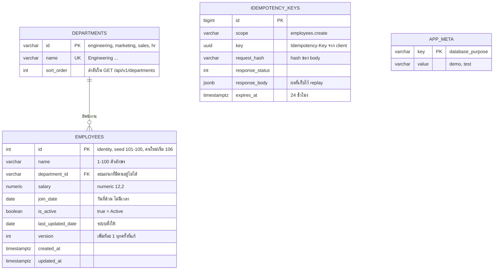
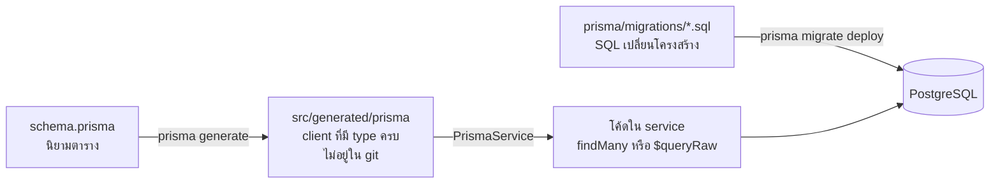
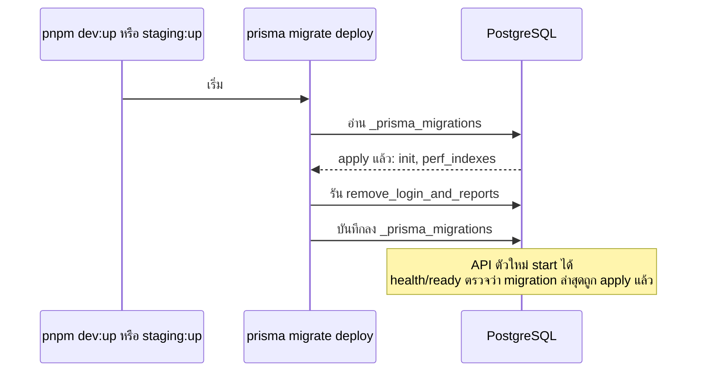

# บท 3 — ฐานข้อมูลและ Prisma

## PostgreSQL อยู่ที่ไหน

PostgreSQL 17 รันอยู่ใน Docker container (ดูบท 5) ตอน dev เปิดด้วย `pnpm dev:up` แล้วรับการเชื่อมต่อที่ `127.0.0.1:5432` เท่านั้น เครื่องอื่นใน LAN ต่อไม่ได้

ใน container เดียวมีหลายฐานข้อมูล แยกตาม environment

| ฐานข้อมูล | ใช้กับ | เครื่องหมาย (`app_meta.database_purpose`) |
| --- | --- | --- |
| `employee_console_dev` | local dev | `demo` |
| `employee_console_staging` | staging (คนละ container และ volume) | `demo` |
| `employee_console_test_*` | test แต่ละรอบ สร้างใหม่ทุกครั้ง | `test` |

"เครื่องหมาย" ในตาราง `app_meta` คือป้ายบอกว่าฐานนี้เอาไว้ทำอะไร คำสั่งที่ลบข้อมูล (`demo:reset`, `test:reset`) จะตรวจป้ายนี้ก่อนเสมอ และปฏิเสธถ้าไม่ตรง ป้องกันการลบฐานผิดตัว (D-22)

## ตารางมีอะไรบ้าง



นอกจากนี้ยังมีตาราง `_prisma_migrations` ที่ Prisma ใช้จดว่า migration ไหนถูก apply แล้ว

ตาราง `users`, `sessions`, `reports`, `integration_state` เคยมี แต่ถูกลบโดย migration `20261003000000_remove_login_and_reports` ตอนตัดระบบ Login และ AI reports ออก (D-46) ถ้าเห็นชื่อพวกนี้ในเอกสารเก่าให้ถือว่าเป็นประวัติ

## Prisma คืออะไร

Prisma เป็น **ORM** (Object-Relational Mapping) คือเครื่องมือที่ให้เขียนโค้ด TypeScript แทน SQL ได้ และรู้ชนิดของข้อมูลทุกคอลัมน์ ในโปรเจกต์นี้ Prisma มีสามบทบาท



1. **Schema** — [schema.prisma](../../apps/api/prisma/schema.prisma) บอกว่ามีตารางอะไร คอลัมน์ชนิดไหน ฝั่ง SQL ใช้ชื่อแบบ `snake_case` (เช่น `join_date`) ฝั่งโค้ดใช้ `camelCase` (เช่น `joinDate`) โดยผูกกันด้วย `@map`
2. **Client** — คำสั่ง `prisma generate` อ่าน schema แล้วสร้างโค้ดไว้ใน `apps/api/src/generated/prisma` ซึ่ง `pnpm dev`, `build` และ `typecheck` ทำให้อัตโนมัติ **ห้ามแก้ไฟล์ในนั้นด้วยมือ**
3. **Migration** — ไฟล์ SQL ที่บอกวิธีเปลี่ยนฐานข้อมูลจากเวอร์ชันหนึ่งไปอีกเวอร์ชัน

`PrismaService` ใน [prisma.service.ts](../../apps/api/src/database/prisma.service.ts) คือ Prisma client ที่ห่อเป็น Nest provider เพื่อให้ inject ได้ (บท 2) จุดที่ควรรู้คือมันบังคับ timezone ของการเชื่อมต่อเป็น UTC (`-c TimeZone=UTC`) และปิดการเชื่อมต่อหลังจาก HTTP server หยุดรับคำขอแล้ว

## Migration ทำงานอย่างไร

ลองนึกถึง migration เป็น "บันทึกการต่อเติมบ้าน" แต่ละไฟล์เป็นการต่อเติมหนึ่งครั้ง เรียงตามเวลา ฐานข้อมูลจดไว้ว่าต่อเติมถึงครั้งไหนแล้ว เวลา deploy ระบบจะทำเฉพาะครั้งที่ยังไม่ได้ทำ

| Migration | ทำอะไร |
| --- | --- |
| [20261001000000_init](../../apps/api/prisma/migrations/20261001000000_init/migration.sql) | สร้างตารางทั้งหมด พร้อม identity column, CHECK constraint (เช่น `salary >= 0`, ชื่อต้อง trim แล้ว) |
| [20261002000000_perf_indexes](../../apps/api/prisma/migrations/20261002000000_perf_indexes/migration.sql) | เพิ่ม index สำหรับกรองแผนก+สถานะ และ trigram index สำหรับค้นหาชื่อ (D-32) |
| [20261003000000_remove_login_and_reports](../../apps/api/prisma/migrations/20261003000000_remove_login_and_reports/migration.sql) | ลบตารางของ Login และ AI reports (D-46) |



กติกาของโปรเจกต์ (จาก [prisma/AGENTS.md](../../apps/api/prisma/AGENTS.md))

- **append-only** — ห้ามแก้ไฟล์ migration ที่ apply ไปแล้ว ถ้าต้องการเปลี่ยนให้เพิ่มไฟล์ใหม่
- สิ่งที่ `schema.prisma` เขียนไม่ได้ (identity, CHECK, partial unique index, trigram index) ต้องเขียน SQL เองใน migration แล้วใส่คอมเมนต์ใน schema ชี้ไป
- `/api/health/ready` ตอบ 503 จนกว่า migration ล่าสุดที่มากับ build จะถูก apply (D-33) staging จึงไม่ปล่อย API ที่ schema ไม่ตรงขึ้นมารับงาน

## ทำไมบางที่ใช้ `findMany` แต่บางที่ใช้ SQL ตรง ๆ

โปรเจกต์นี้ query ฐานข้อมูลสองแบบ

**แบบที่ 1: Prisma API** — ใช้กับของง่าย ๆ เช่นรายการแผนกใน [departments.controller.ts](../../apps/api/src/departments/departments.controller.ts)

```ts
const rows = await this.prisma.department.findMany({ orderBy: { sortOrder: 'asc' } });
```

**แบบที่ 2: `$queryRaw`** — ใช้กับ employees ทั้งหมดใน [employees.service.ts](../../apps/api/src/employees/employees.service.ts)

```ts
const COLUMNS = Prisma.sql`e.id, e.name, e.department_id AS "departmentId", d.name AS "departmentName",
  e.salary::text AS salary, e.join_date::text AS "joinDate", e.is_active AS "isActive",
  e.last_updated_date::text AS "lastUpdatedDate", e.version`;
```

เหตุผลที่เลือก SQL ตรง ๆ สำหรับ employees (D-20)

| ปัญหาถ้าใช้ `findMany` | วิธีแก้ด้วย SQL |
| --- | --- |
| คอลัมน์ `date` กลายเป็น JavaScript `Date` (เวลาเที่ยงคืน UTC) พอแสดงในเขตเวลาอื่นวันอาจเลื่อน | cast เป็น `::text` ได้ `"2023-01-15"` ตรง ๆ |
| `numeric` กลายเป็น object `Decimal` ที่ต้องแปลงอีกที | cast เป็น `::text` ได้ `"65000.00"` ตรง ๆ |
| ค้นหาชื่อด้วย `LIKE` ต้อง escape `%` และ `_` ที่ผู้ใช้พิมพ์มา | `escapeLike()` + `ESCAPE '\\'` |
| เรียงชื่อแบบ case-insensitive ด้วย collation ที่กำหนดเอง | `lower(e.name) COLLATE "C"` |

### แล้วปลอดภัยจาก SQL injection ไหม

ปลอดภัย เพราะ `` $queryRaw`...${value}...` `` เป็น **tagged template** ค่าใน `${}` ถูกส่งเป็น parameter แยกจากตัว SQL ไม่ได้เอาไปต่อ string ส่วนชื่อคอลัมน์ที่ใช้เรียงลำดับ (ซึ่งส่งเป็น parameter ไม่ได้) จะเลือกจาก whitelist `SORT_SQL` เท่านั้น ค่าที่ผู้ใช้ส่งมาไม่มีทางกลายเป็นข้อความ SQL

```ts
const SORT_SQL: Record<SortField, string> = {
  id: 'e.id',
  name: 'lower(e.name) COLLATE "C"',
  // ...
};
```

## Transaction และการล็อก

**Transaction** คือการรวมหลายคำสั่งให้ "สำเร็จทั้งหมด หรือไม่เกิดอะไรเลย" โปรเจกต์ใช้ในสามที่สำคัญ

| ที่ | ทำไม |
| --- | --- |
| `list()` นับจำนวนแล้วดึงหน้า | ใช้ `RepeatableRead` ให้ `meta.total` ตรงกับข้อมูลที่ได้ แม้มีคนเพิ่มหรือลบระหว่างนั้น |
| `update()` | `SELECT ... FOR UPDATE` ล็อกแถว แล้วตรวจ version ก่อน UPDATE |
| `create()` ผ่าน `IdempotencyService` | บันทึก key กับสร้างพนักงานใน transaction เดียว ถ้าสร้างล้ม key ก็ไม่ค้าง |

## Seed และ reset

| คำสั่ง | ทำอะไร | ข้อจำกัด |
| --- | --- | --- |
| `pnpm db:migrate` | apply migration ที่ยังไม่ได้ทำ | — |
| `pnpm db:seed` | เติมพนักงานจาก Excel **เฉพาะ ID ที่ยังไม่มี** ไม่ทับข้อมูลเดิม (D-02) | — |
| `pnpm demo:reset --confirm-reset` | ลบพนักงานทั้งหมดแล้วใส่ 5 records ใหม่ ID ถัดไปกลับเป็น 106 | เฉพาะ `APP_ENV` local/staging และฐานที่มีป้าย `demo` |

seed อ่านจาก [test-exam-data.json](../../apps/api/prisma/seed-data/test-exam-data.json) ซึ่งเป็นสำเนาของไฟล์ Excel และ **คง Last Updated Date เดิมจาก Excel ไว้** ไม่ได้เปลี่ยนเป็นวันนี้ (PRD §4.3) reset ทั้งหมดทำใน transaction เดียวพร้อม `LOCK TABLE` (D-37)

## สิทธิ์ของผู้ใช้ฐานข้อมูล

มีผู้ใช้ (role) แยกกันตามหลัก "ให้สิทธิ์เท่าที่จำเป็น" (D-43)

- **app role** — แอปใช้ตัวนี้ อ่านเขียนข้อมูลได้แต่ **สร้างฐานข้อมูลไม่ได้** (`NOCREATEDB`)
- **test role** — test runner ใช้ตัวนี้ สร้างและลบได้เฉพาะฐาน `employee_console_test_*`

สคริปต์ที่สร้าง role คือ [init-databases.sh](../../infra/postgres/init-databases.sh) ซึ่งรันซ้ำได้ไม่พัง (idempotent) และรันทุกครั้งที่ `pnpm dev:up` หรือ deploy staging

## ลองเอง

ดูข้อมูลพนักงานใน dev โดยตรง (อ่านอย่างเดียว ไม่ต้องใส่รหัสผ่าน เพราะต่อจากข้างใน container)

```bash
docker compose exec postgres psql -U postgres -d employee_console_dev -c 'SELECT id, name, salary, join_date, is_active, version FROM employees ORDER BY id'
```

ดูว่า migration ไหน apply แล้วบ้าง

```bash
docker compose exec postgres psql -U postgres -d employee_console_dev -c 'SELECT migration_name, finished_at FROM _prisma_migrations ORDER BY migration_name'
```

ดูป้ายของฐานข้อมูล

```bash
docker compose exec postgres psql -U postgres -d employee_console_dev -c 'SELECT * FROM app_meta'
```

ต่อไป: [บท 4 — OpenAPI](04-openapi.md)
