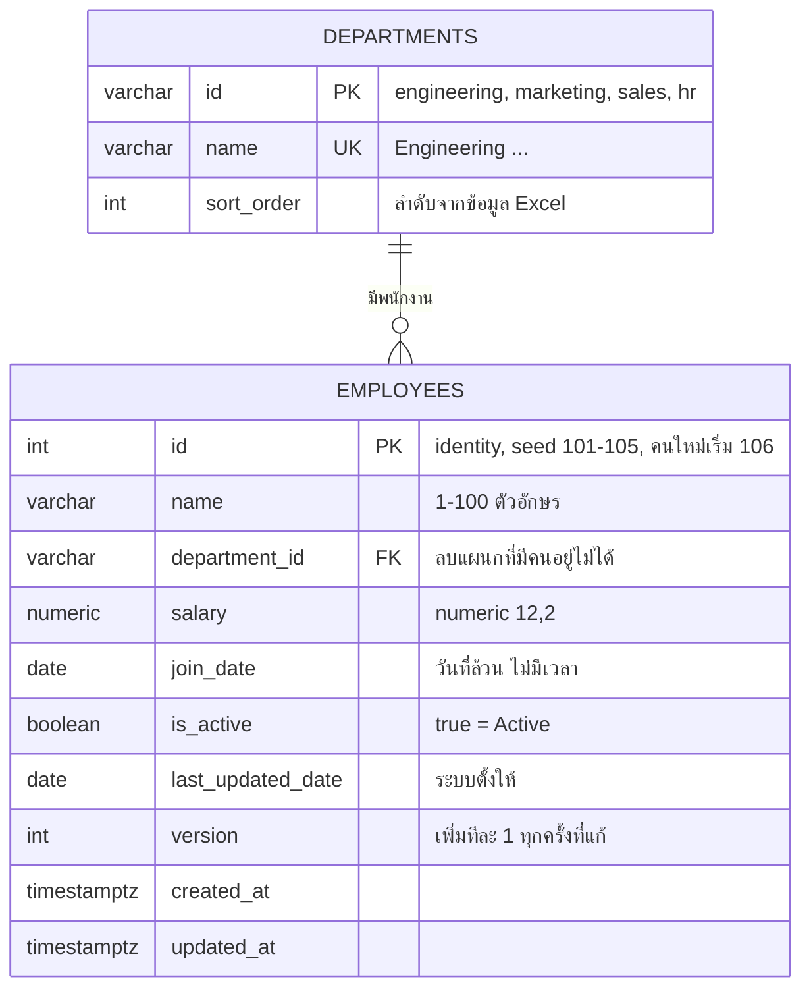
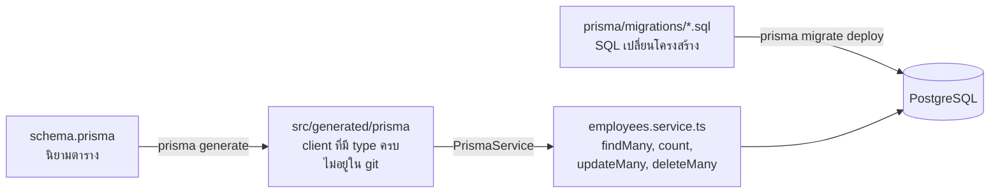
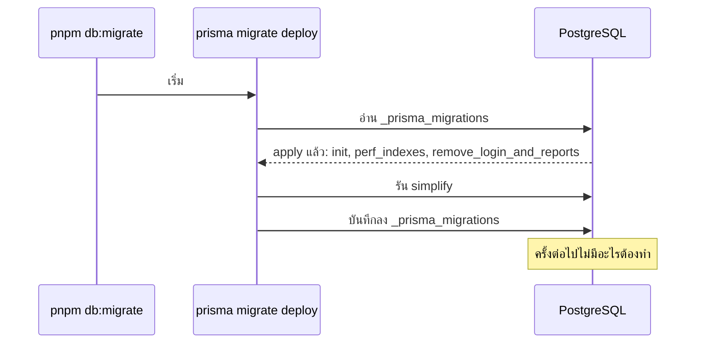

# บท 3 — ฐานข้อมูลและ Prisma

## PostgreSQL อยู่ที่ไหน

PostgreSQL 17 รันอยู่ใน Docker container (บท 5) เปิดด้วย `pnpm dev:up` แล้วรับการเชื่อมต่อที่ `127.0.0.1:5432` เท่านั้น เครื่องอื่นใน LAN ต่อไม่ได้

ใน container เดียวมีสองฐานข้อมูล

| ฐานข้อมูล | ใช้กับ | ถูกสร้างเมื่อ |
| --- | --- | --- |
| `employee_console_dev` | `pnpm dev` (ตัวแปร `DATABASE_URL`) | container เปิดครั้งแรก (`POSTGRES_DB` ใน [compose.yaml](../../compose.yaml)) |
| `employee_console_test` | `pnpm test:api` และ `pnpm test:e2e` (ตัวแปร `TEST_DATABASE_URL`) | test รัน `prisma migrate deploy` ครั้งแรก Prisma สร้างฐานให้ถ้ายังไม่มี |

ฐาน test ถูกลบข้อมูลแล้ว seed ใหม่ทุกครั้งที่รัน test ห้ามตั้ง `TEST_DATABASE_URL` ให้ชี้ฐานเดียวกับ `DATABASE_URL` ซึ่ง [setup.ts](../../apps/api/test/integration/setup.ts) ตรวจและปฏิเสธให้

## ตารางมีอะไรบ้าง



นอกจากนี้ยังมีตาราง `_prisma_migrations` ที่ Prisma ใช้จดว่า migration ไหนถูก apply แล้ว

ตารางอื่นที่เคยมี (`users`, `sessions`, `reports`, `integration_state`, `idempotency_keys`, `app_meta`) ถูกลบไปแล้วด้วย migration สองตัวตอนตัดขอบเขต (D-46 และ D-56) ถ้าเห็นชื่อพวกนี้ในเอกสารเก่าให้ถือว่าเป็นประวัติ

## Prisma คืออะไร

Prisma เป็น **ORM** (Object-Relational Mapping) คือเครื่องมือที่ให้เขียนโค้ด TypeScript แทน SQL ได้ และรู้ชนิดของข้อมูลทุกคอลัมน์ ในโปรเจกต์นี้ Prisma มีสามบทบาท



1. **Schema** — [schema.prisma](../../apps/api/prisma/schema.prisma) บอกว่ามีตารางอะไร คอลัมน์ชนิดไหน ฝั่ง SQL ใช้ชื่อแบบ `snake_case` (เช่น `join_date`) ฝั่งโค้ดใช้ `camelCase` (เช่น `joinDate`) โดยผูกกันด้วย `@map`
2. **Client** — คำสั่ง `prisma generate` อ่าน schema แล้วสร้างโค้ดไว้ใน `apps/api/src/generated/prisma` ซึ่ง `pnpm dev`, `build` และ `typecheck` ทำให้อัตโนมัติ **ห้ามแก้ไฟล์ในนั้นด้วยมือ**
3. **Migration** — ไฟล์ SQL ที่บอกวิธีเปลี่ยนฐานข้อมูลจากเวอร์ชันหนึ่งไปอีกเวอร์ชัน

`PrismaService` ใน [prisma.service.ts](../../apps/api/src/prisma/prisma.service.ts) คือ Prisma client ที่ห่อเป็น Nest provider เพื่อให้ inject ได้ (บท 2) Prisma 7 ต่อ PostgreSQL ผ่าน driver adapter (`PrismaPg`) ด้วย `DATABASE_URL` ส่วนคำสั่ง CLI อย่าง `migrate deploy` อ่าน URL จาก [prisma.config.ts](../../apps/api/prisma.config.ts) ซึ่งโหลด `.env` ที่ root เอง

## Migration ทำงานอย่างไร

ลองนึกถึง migration เป็น "บันทึกการต่อเติมบ้าน" แต่ละไฟล์เป็นการต่อเติมหนึ่งครั้ง เรียงตามเวลา ฐานข้อมูลจดไว้ว่าต่อเติมถึงครั้งไหนแล้ว เวลารัน `pnpm db:migrate` ระบบจะทำเฉพาะครั้งที่ยังไม่ได้ทำ

| Migration | ทำอะไร |
| --- | --- |
| [20261001000000_init](../../apps/api/prisma/migrations/20261001000000_init/migration.sql) | สร้างตารางทั้งหมด พร้อม identity column และ CHECK constraint (เช่น `salary >= 0`, ชื่อต้อง trim แล้ว, `join_date` อยู่ระหว่างปี 1900–2100) |
| [20261002000000_perf_indexes](../../apps/api/prisma/migrations/20261002000000_perf_indexes/migration.sql) | เพิ่ม index สำหรับกรองแผนก+สถานะ และ trigram index บน `lower(name)` (D-32) |
| [20261003000000_remove_login_and_reports](../../apps/api/prisma/migrations/20261003000000_remove_login_and_reports/migration.sql) | ลบตารางของ Login และ AI reports (D-46) |
| [20261005000000_simplify](../../apps/api/prisma/migrations/20261005000000_simplify/migration.sql) | ลบ `idempotency_keys` และ `app_meta` (D-56) |



กติกาของโปรเจกต์ (จาก [prisma/AGENTS.md](../../apps/api/prisma/AGENTS.md))

- **append-only** — ห้ามแก้ไฟล์ migration ที่ apply ไปแล้ว ถ้าต้องการเปลี่ยนให้เพิ่มไฟล์ใหม่ (`YYYYMMDDHHMMSS_<ชื่อ>`)
- สิ่งที่ `schema.prisma` เขียนไม่ได้ (identity, CHECK, trigram index) ต้องเขียน SQL เองใน migration แล้วใส่คอมเมนต์ใน schema ชี้ไป

## Prisma client ใน `employees.service.ts`

ทุกคำสั่งของ employees ใช้ Prisma client ธรรมดา (D-56 แทนการเขียน SQL เองแบบเดิม) ดู [employees.service.ts](../../apps/api/src/employees/employees.service.ts)

| งาน | คำสั่ง Prisma |
| --- | --- |
| รายการ + ค้นหา + กรอง + เรียง + แบ่งหน้า | `$transaction([count({ where }), findMany({ where, include, orderBy, skip, take })])` |
| ดูคนเดียว | `findUnique({ where: { id }, include: { department: true } })` |
| สร้าง | `create({ data, include })` |
| แก้ / ลบ | `updateMany` / `deleteMany` ที่ `where: { id, version }` (บท 2) |

`include: { department: true }` ดึงแถวของแผนกมาด้วย API จึงส่ง `departmentName` ได้ ส่วนการเรียงใช้ map `ORDER_BY` ที่แปลงชื่อฟิลด์จาก query เป็น `orderBy` ของ Prisma และเติม `{ id: 'asc' }` เป็นตัวตัดสินเสมอ ลำดับจึงไม่สลับไปมาเมื่อค่าเท่ากัน

### เงินกับวันที่: แปลงที่เดียว

Prisma คืนค่าบางชนิดเป็น object ที่ไม่ใช่สิ่งที่เราอยากส่งออก service จึงแปลงทุกแถวผ่าน `toEmployee()` ก่อนส่งกลับ

| คอลัมน์ | Prisma ให้มา | API ส่งออก | วิธีแปลง |
| --- | --- | --- | --- |
| `salary` (`numeric(12,2)`) | object `Decimal` | `"72000.00"` | `row.salary.toFixed(2)` |
| `join_date`, `last_updated_date` (`date`) | JavaScript `Date` เวลาเที่ยงคืน UTC | `"2022-11-10"` | `date.toISOString().slice(0, 10)` |

ขาเข้าก็แปลงกลับด้วยฟังก์ชันคู่กัน `fromDateOnly("2026-09-01")` สร้าง `new Date("2026-09-01T00:00:00Z")` และ "วันนี้" สำหรับ Last Updated Date คำนวณด้วย `Intl.DateTimeFormat` เขต `Asia/Bangkok` ไม่ขึ้นกับ timezone ของเครื่อง server

> **กับดัก**: อย่าใช้ `toLocaleDateString()` หรือ `getDate()` กับ `Date` ที่ได้จากคอลัมน์ `date` เพราะสองตัวนี้ใช้ timezone ของเครื่อง ในเขตที่อยู่หลัง UTC (เช่นอเมริกา) วันจะถอยไปหนึ่งวัน `toISOString()` อ่านเป็น UTC เสมอจึงได้วันที่ตรง

### ค้นหาชื่อ: ต้อง escape เอง

```ts
// Prisma passes `contains` to ILIKE as is, so escape % and _ to search for them literally.
name: query.q ? { contains: query.q.replace(/[\\%_]/g, '\\$&'), mode: 'insensitive' } : undefined,
```

`contains` + `mode: 'insensitive'` กลายเป็น `name ILIKE '%คำค้น%'` ใน SQL ซึ่ง `%` แปลว่า "อะไรก็ได้" และ `_` แปลว่า "ตัวอักษรอะไรก็ได้หนึ่งตัว" ถ้าผู้ใช้พิมพ์ `%` แล้วไม่ escape จะได้พนักงานทุกคน บรรทัดนี้จึงเติม `\` หน้า `%`, `_` และ `\` ให้กลายเป็นตัวอักษรธรรมดา มี integration test ยืนยันว่าค้น `%` ได้ 0 แถว (AC-23)

> หมายเหตุ: trigram index ใน migration `perf_indexes` สร้างบน `lower(name)` สำหรับ SQL แบบเดิม (`lower(name) LIKE ...`) ส่วน `name ILIKE ...` ที่ Prisma สร้างตอนนี้ไม่ตรงกับ expression ของ index จึงไม่ได้ใช้ (ลอง `EXPLAIN` ดูจะเห็น Seq Scan) กับข้อมูลหลักสิบแถวไม่มีผลอะไร ส่วน index แผนก+สถานะยังถูกใช้อยู่

### แล้วปลอดภัยจาก SQL injection ไหม

ปลอดภัย Prisma client ส่งค่าที่ผู้ใช้พิมพ์เป็น parameter แยกจากตัว SQL ไม่ได้เอาไปต่อ string ส่วนชื่อคอลัมน์ที่ใช้เรียงต้องผ่าน `@IsIn(SORT_FIELDS)` ใน DTO ก่อน แล้วเลือกจาก map `ORDER_BY` เท่านั้น ค่าที่ผู้ใช้ส่งมาไม่มีทางกลายเป็นข้อความ SQL (integration test ลองค้น `' OR 1=1 --` แล้วได้ 0 แถว)

## Seed และ reset

| คำสั่ง | ทำอะไร |
| --- | --- |
| `pnpm db:migrate` | apply migration ที่ยังไม่ได้ทำ |
| `pnpm db:seed` | ใส่แผนก 4 แผนก (ข้ามที่มีแล้ว) และพนักงาน 5 คนจาก Excel **เฉพาะเมื่อตาราง employees ว่าง** ถ้ามีพนักงานอยู่แล้วจะไม่แตะเลย |
| `pnpm db:reset` | ลบพนักงานทั้งหมด (`TRUNCATE employees RESTART IDENTITY`) แล้ว seed ใหม่ ID ถัดไปกลับเป็น 106 |

โค้ดอยู่ที่ [seed.ts](../../apps/api/src/seed.ts) (สคริปต์ที่ `pnpm` เรียกคือ [scripts/seed.ts](../../apps/api/scripts/seed.ts)) ทุกขั้นอยู่ใน transaction เดียว จุดที่ควรรู้

- อ่านจาก [test-exam-data.json](../../apps/api/prisma/seed-data/test-exam-data.json) ซึ่งเป็นสำเนาของไฟล์ Excel
- **คง Last Updated Date เดิมจาก Excel ไว้** ไม่ได้เปลี่ยนเป็นวันนี้ (PRD §4.3)
- Status เทียบตรง ๆ `row.Status === 'Active'` เพราะ `Boolean("In Active")` ได้ `true`
- หลังใส่ ID 101–105 แล้วตั้ง sequence ด้วย `setval(..., max(id))` คนใหม่จึงได้ 106

`pnpm db:reset` ลบข้อมูลในฐานที่ `DATABASE_URL` ชี้อยู่ ตอน dev คือฐาน dev ของเราเอง ส่วน E2E เรียกคำสั่งเดียวกันโดยตั้ง `DATABASE_URL` เป็นฐาน test ก่อน และ integration test เรียกฟังก์ชัน `seed(prisma, { reset: true })` ตรง ๆ กับฐาน test

## ลองเอง

ดูข้อมูลพนักงานใน dev โดยตรง (อ่านอย่างเดียว ต่อจากข้างใน container จึงไม่ต้องใส่รหัสผ่าน)

```bash
docker compose exec postgres psql -U postgres -d employee_console_dev -c 'SELECT id, name, salary, join_date, is_active, version FROM employees ORDER BY id'
```

ดูว่ามีตารางอะไรบ้าง

```bash
docker compose exec postgres psql -U postgres -d employee_console_dev -c '\dt'
```

ดูว่า migration ไหน apply แล้วบ้าง

```bash
docker compose exec postgres psql -U postgres -d employee_console_dev -c 'SELECT migration_name, finished_at FROM _prisma_migrations ORDER BY migration_name'
```

ต่อไป: [บท 4 — OpenAPI และ Swagger UI](04-openapi.md)
