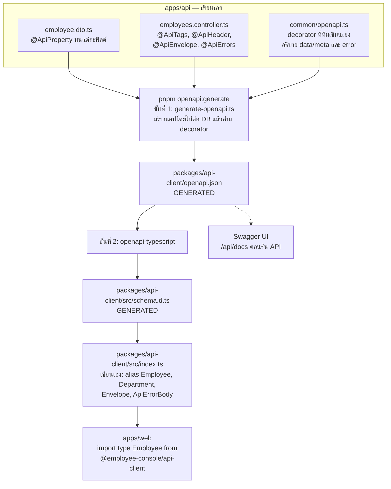
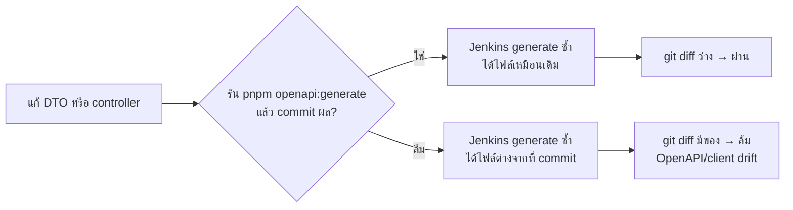

# บท 4 — OpenAPI: สัญญาระหว่าง API กับเว็บ

## ปัญหาที่ OpenAPI แก้

สมมติฝั่ง API เปลี่ยนชื่อฟิลด์จาก `salary` เป็น `monthlySalary` แต่ฝั่งเว็บไม่รู้ เว็บยังส่ง `salary` ไปเหมือนเดิม ผลคือ API ตอบ 400 `UNKNOWN_FIELD` และกว่าจะรู้ก็ตอนผู้ใช้กด Save ไปแล้ว

ถ้ามี **เอกสารกลาง** ที่บอกว่า API รับอะไรและตอบอะไร แล้วฝั่งเว็บสร้าง TypeScript type จากเอกสารนั้น พอ API เปลี่ยน type ของเว็บก็เปลี่ยนตาม และ `pnpm typecheck` จะฟ้องทันทีว่าโค้ดตรงไหนยังใช้ชื่อเก่า

## OpenAPI คืออะไร

**OpenAPI** คือมาตรฐานสำหรับเขียนเอกสาร API เป็นไฟล์ JSON (หรือ YAML) ที่ทั้งคนและโปรแกรมอ่านได้ ในไฟล์บอกครบว่า

- มี path อะไรบ้าง แต่ละ path รับ method อะไร
- ต้องส่ง parameter, header และ body แบบไหน
- ตอบกลับได้กี่แบบ (200, 400, 409 …) และแต่ละแบบมีหน้าตาอย่างไร
- schema ของข้อมูลแต่ละชนิด เช่น `EmployeeDto` มีฟิลด์อะไร ชนิดอะไร บังคับหรือไม่

**Swagger** คือชื่อเดิมของมาตรฐานนี้ และเป็นชื่อชุดเครื่องมือรอบ ๆ มัน เช่น Swagger UI (หน้าเว็บที่แสดงเอกสารและกดลองยิง API ได้) ส่วน `@nestjs/swagger` คือ library ของ Nest ที่อ่าน decorator แล้วสร้างไฟล์ OpenAPI ให้

เปรียบเทียบง่าย ๆ ได้ว่า OpenAPI คือ **เมนูของร้าน** ที่เขียนละเอียดว่าสั่งอะไรได้ ต้องบอกอะไรบ้าง และจะได้อะไรกลับมา

## หน้าตาของ OpenAPI ในโปรเจกต์นี้

ไฟล์อยู่ที่ [packages/api-client/openapi.json](../../packages/api-client/openapi.json) มี 3 path

| Path | Method |
| --- | --- |
| `/api/v1/departments` | `GET` |
| `/api/v1/employees` | `GET`, `POST` |
| `/api/v1/employees/{id}` | `GET`, `PATCH`, `DELETE` |

endpoint ของ health ไม่อยู่ในเอกสาร เพราะ `HealthController` ติดป้าย `@ApiExcludeController()` ไว้

ตัวอย่างส่วนหนึ่ง (ย่อ) ของ `PATCH /api/v1/employees/{id}`

```json
{
  "operationId": "Employees_update",
  "parameters": [
    { "in": "path", "name": "id", "required": true, "schema": { "type": "string" } },
    { "in": "header", "name": "If-Match", "required": true, "description": "Quoted employee version, e.g. \"1\"" }
  ],
  "requestBody": { "content": { "application/json": { "schema": { "$ref": "#/components/schemas/UpdateEmployeeDto" } } } },
  "responses": {
    "200": { "description": "Success", "headers": { "ETag": { ... } } },
    "409": { "description": "VERSION_CONFLICT ..." },
    "428": { "description": "PRECONDITION_REQUIRED ..." }
  }
}
```

## OpenAPI ถูกสร้างจากอะไร — ภาพทั้งเส้นทาง

ในโปรเจกต์นี้ **ไม่มีใครเขียน `openapi.json` เอง** มันถูกสร้างจาก decorator ในโค้ดของ API แล้วไหลต่อไปจนถึงเว็บ



### ตามรอยฟิลด์ `salary` หนึ่งฟิลด์

**1. ใน DTO ของ API** — [employee.dto.ts](../../apps/api/src/employees/employee.dto.ts)

```ts
@ApiProperty({ type: String, example: '62000.00' })
salary: string;
```

**2. ใน openapi.json** — หลังรัน `pnpm openapi:generate`

```json
"salary": { "example": "62000.00", "type": "string" }
```

**3. ใน schema.d.ts** — [schema.d.ts](../../packages/api-client/src/schema.d.ts)

```ts
EmployeeDto: {
  /** @example 62000.00 */
  salary: string;
  // ...
}
```

**4. alias ให้เรียกง่าย** — [index.ts](../../packages/api-client/src/index.ts)

```ts
export type Employee = Schemas['EmployeeDto'];
```

**5. เว็บนำไปใช้** — [queries.ts](../../apps/web/src/lib/queries.ts)

```ts
import type { Department, Employee, EmployeeListMeta } from '@employee-console/api-client';
// ...
api<Employee[], EmployeeListMeta>(`/api/v1/employees?${qs}`, { signal })
```

ถ้าวันหนึ่งเปลี่ยน `salary` ใน DTO แล้วรัน generate โค้ดเว็บที่ใช้ `employee.salary` จะ typecheck ไม่ผ่านทันที

## คำสั่ง `pnpm openapi:generate` ทำอะไรบ้าง

ดูใน [package.json](../../package.json) ที่ root

```text
pnpm --filter @employee-console/api run openapi:generate
  → prisma generate
  → tsc -p tsconfig.scripts.json          (compile สคริปต์ด้วย tsc)
  → node .tmp/scripts/scripts/generate-openapi.js
      → เขียน packages/api-client/openapi.json
pnpm --filter @employee-console/api-client run generate
  → openapi-typescript openapi.json -o src/schema.d.ts
```

สคริปต์ [generate-openapi.ts](../../apps/api/scripts/generate-openapi.ts) ทำสามอย่าง

1. เรียก `createApp()` ตัวเดียวกับที่ใช้รันจริง แต่ให้ config ปลอมที่ไม่มี secret และไม่ต่อฐานข้อมูลจริง
2. เรียก `buildOpenApiDocument()` ให้ `@nestjs/swagger` อ่าน decorator ทั้งหมด
3. **เรียง key ทุกตัว** ก่อนเขียนไฟล์ ผลจึงเหมือนเดิมทุกครั้งถ้าโค้ดไม่เปลี่ยน ทำให้ตรวจ drift ได้ (ดูด้านล่าง)

> **กับดัก**: ทำไมต้อง compile ด้วย `tsc` ก่อน แทนที่จะรันด้วย `tsx` ตรง ๆ? เพราะ `tsx` ใช้ esbuild ซึ่งไม่สร้าง decorator metadata ทำให้ Nest DI หาของไม่เจอ ปัญหานี้เกิดขึ้นจริงระหว่างพัฒนา ([ai-usage.md](../ai-usage.md) ข้อ 2)

## Swagger UI — เอกสารที่กดลองได้

ตอนรัน `pnpm dev` เปิด <http://localhost:3001/api/docs> จะเห็นหน้าเอกสาร API แบบโต้ตอบได้ (ไฟล์ JSON ดิบอยู่ที่ `/api/openapi.json`) ตั้งค่าไว้ใน `createApp()` ของ [bootstrap.ts](../../apps/api/src/bootstrap.ts)

```ts
SwaggerModule.setup('api/docs', app, document, {
  jsonDocumentUrl: 'api/openapi.json',
  raw: ['json'],   // เสิร์ฟเฉพาะ JSON ไม่เปิด /api/docs-yaml
});
```

ใช้ประกอบการอธิบายตอน demo ได้ดี เพราะเห็น endpoint, header ที่บังคับ และ error ที่เป็นไปได้ครบในหน้าเดียว

## Decorator ที่ทีมเขียนเอง (`common/openapi.ts`)

ทุก response ของโปรเจกต์ห่อเป็น `{ data, meta }` และทุก error เป็น `{ error: { code, message, requestId } }` ซึ่ง `@nestjs/swagger` ไม่รู้จักเอง จึงมี helper ใน [common/openapi.ts](../../apps/api/src/common/openapi.ts) (D-42)

| Decorator | ใช้บอกเอกสารว่า |
| --- | --- |
| `@ApiEnvelope(EmployeeDto, { isArray, meta, status, headers })` | response สำเร็จหน้าตาเป็น `{ data: EmployeeDto, meta: ... }` พร้อม header เช่น `ETag`, `Location` |
| `@ApiErrors(400, 404, 409, ...)` | status ที่เป็นไปได้ แต่ละตัวใช้ `ErrorEnvelopeDto` และระบุ error code |
| `@ApiNoContent('Deleted')` | ตอบ 204 ไม่มี body |

## Drift check ใน Jenkins

**Drift** แปลว่า "หลุดจากกัน" คือ `openapi.json` ที่ commit ไว้ไม่ตรงกับโค้ดปัจจุบัน ใน stage `Static checks` ของ [Jenkinsfile](../../Jenkinsfile) มีสองบรรทัดนี้

```sh
pnpm openapi:generate
git diff --exit-code -- packages/api-client || { echo "OpenAPI/client drift: run pnpm openapi:generate and commit"; exit 1; }
```

`git diff --exit-code` คืนค่าผิดพลาดถ้ามีไฟล์เปลี่ยน แปลว่า Jenkins สร้างใหม่แล้วได้ไม่เหมือนที่ commit ไว้ แสดงว่ามีคนแก้ API แต่ลืม generate pipeline จึงหยุดตรงนั้น



## เวิร์กโฟลว์เมื่อแก้ API

1. แก้ controller, DTO หรือ decorator ใน `apps/api`
2. รัน

```bash
pnpm openapi:generate
```

3. ดูว่าอะไรเปลี่ยน

```bash
git diff -- packages/api-client
```

4. ถ้าเพิ่ม DTO ใหม่ที่เว็บต้องใช้ ให้เพิ่ม alias ใน [index.ts](../../packages/api-client/src/index.ts)
5. รัน `pnpm typecheck` ให้เว็บผ่าน แล้ว commit ทั้ง `openapi.json` และ `schema.d.ts` พร้อมโค้ด API

## ข้อห้าม

- ห้ามแก้ `openapi.json` และ `schema.d.ts` ด้วยมือ รอบหน้าที่ generate ก็จะถูกเขียนทับ
- ห้ามนิยาม type ของ response ซ้ำในเว็บ ให้ import จาก `@employee-console/api-client`
- type จาก OpenAPI ใช้ตอน **compile** เท่านั้น ตอนรันจริงไม่ได้ตรวจข้อมูล การตรวจจริงยังเป็นหน้าที่ของ ValidationPipe ฝั่ง API และ zod schema ของฟอร์มฝั่งเว็บ

ต่อไป: [บท 5 — Docker](05-docker.md)
