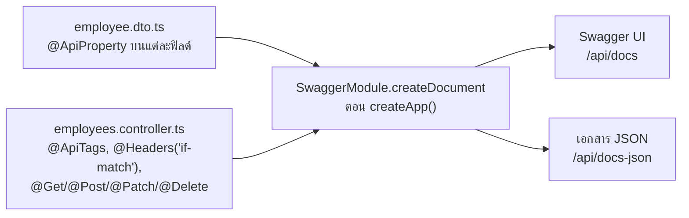

# บท 4 — OpenAPI และ Swagger UI

## OpenAPI คืออะไร

**OpenAPI** คือมาตรฐานสำหรับเขียนเอกสาร API เป็นไฟล์ JSON (หรือ YAML) ที่ทั้งคนและโปรแกรมอ่านได้ ในไฟล์บอกว่า

- มี path อะไรบ้าง แต่ละ path รับ method อะไร
- ต้องส่ง parameter, header และ body แบบไหน
- schema ของข้อมูลแต่ละชนิด เช่น `CreateEmployeeDto` มีฟิลด์อะไร ชนิดอะไร บังคับหรือไม่

**Swagger** คือชื่อเดิมของมาตรฐานนี้ และเป็นชื่อชุดเครื่องมือรอบ ๆ มัน เช่น **Swagger UI** หน้าเว็บที่แสดงเอกสารและกดลองยิง API ได้ ส่วน `@nestjs/swagger` คือ library ของ Nest ที่อ่าน decorator ในโค้ดแล้วสร้างเอกสาร OpenAPI ให้

เปรียบเทียบง่าย ๆ ได้ว่า OpenAPI คือ **เมนูของร้าน** ที่เขียนละเอียดว่าสั่งอะไรได้ และต้องบอกอะไรบ้าง

## ในโปรเจกต์นี้ เอกสารถูกสร้างตอนแอปเริ่ม

ไม่มีใครเขียนไฟล์ OpenAPI เอง และไม่มีไฟล์ที่ commit ไว้ ทุกครั้งที่ API เริ่ม `createApp()` ใน [app.ts](../../apps/api/src/app.ts) จะให้ `@nestjs/swagger` อ่าน decorator แล้วสร้างเอกสารเก็บในหน่วยความจำ

```ts
const openApi = new DocumentBuilder().setTitle('Employee Console API').build();
SwaggerModule.setup('api/docs', app, SwaggerModule.createDocument(app, openApi));
```



เปิดได้สองทาง

- ผ่านเว็บ: <http://localhost:3000/api/docs> (path ขึ้นต้นด้วย `/api` จึงวิ่งผ่าน rewrite ของ Next.js เหมือนคำขออื่น)
- ตรงที่ API: <http://127.0.0.1:3001/api/docs> และไฟล์ JSON ดิบที่ `/api/docs-json` (`/api/docs-yaml` ก็มี เป็นค่า default ของ `SwaggerModule`)

## ในเอกสารมีอะไร

| Path | Method | มาจาก |
| --- | --- | --- |
| `/api/employees` | `GET` | query parameter 7 ตัวจาก `ListEmployeesQuery` (`q`, `departmentId`, `status`, `page`, `pageSize`, `sortBy`, `sortOrder`) พร้อมค่า default และ enum |
| `/api/employees` | `POST` | body `CreateEmployeeDto` |
| `/api/employees/{id}` | `GET`, `PATCH`, `DELETE` | `PATCH` ใช้ body `UpdateEmployeeDto` และทั้ง `PATCH`/`DELETE` มี header `If-Match` บังคับ |

### ตามรอยฟิลด์ `salary` หนึ่งฟิลด์

**1. ใน DTO** — [employee.dto.ts](../../apps/api/src/employees/employee.dto.ts)

```ts
@ApiProperty({ example: '62000.00', description: 'Decimal string, at most 2 decimal places' })
@IsString({ message: 'Salary must be sent as a string, e.g. "65000.00".' })
salary: string;
```

**2. ใน `/api/docs-json`**

```json
"salary": { "type": "string", "example": "62000.00", "description": "Decimal string, at most 2 decimal places" }
```

`@ApiProperty` มีไว้ให้เอกสารอย่างเดียว ส่วนการตรวจจริงเป็นหน้าที่ของ `@IsString`/`@Matches` กับ `ValidationPipe` (บท 2) สองชุดนี้อยู่บนฟิลด์เดียวกัน จึงแก้ไปพร้อมกันได้ง่าย

### สิ่งที่เอกสารไม่ได้บอก

controller ไม่ได้ติดป้ายบอกหน้าตาของ response (เช่น `@ApiOkResponse`) เอกสารจึงบอกแค่ status ที่สำเร็จ (200, 201, 204) ไม่มี schema ของ response และไม่ได้ระบุ error 400/404/409/428 ถ้าอยากรู้หน้าตาจริงให้ดูบท 6 หรือกด "Try it out" ใน Swagger UI กับ `GET`

## Type ฝั่งเว็บเขียนเอง

เว็บไม่ได้ generate type จาก OpenAPI แต่เขียน interface เองใน [api.ts](../../apps/web/src/lib/api.ts) ให้ตรงกับ `Employee` ใน [employees.service.ts](../../apps/api/src/employees/employees.service.ts)

```ts
export interface Employee {
  id: number;
  name: string;
  departmentId: string;
  departmentName: string;
  salary: string;
  joinDate: string;
  isActive: boolean;
  lastUpdatedDate: string;
  version: number;
}
```

เหตุผลคือ API มี resource เดียว 5 endpoint การมีแพ็กเกจ generate type แยก พร้อมคำสั่งและการตรวจว่าไฟล์ตรงกัน เป็นภาระมากกว่าประโยชน์ จึงถูกตัดออกใน D-56

> **กับดัก**: เพราะ type เขียนสองที่ ถ้าเปลี่ยนชื่อฟิลด์ใน API แล้วลืมแก้ `lib/api.ts` `pnpm typecheck` จะ **ไม่** ฟ้อง ต้องแก้ทั้งสองฝั่งพร้อมกัน แล้วรัน `pnpm test:e2e` ให้เบราว์เซอร์จริงยืนยัน ของที่ต้องแก้ให้ตรงกันเองแบบนี้มีอีกสองเรื่อง คือ รายการแผนก (`DEPARTMENT_IDS` ใน DTO, [departments.ts](../../apps/web/src/lib/departments.ts) และไฟล์ seed) กับกฎของฟอร์ม (zod schema ใน [employee-form.tsx](../../apps/web/src/components/employees/employee-form.tsx) เขียนตามกฎใน DTO แต่ API ยังเป็นผู้ตัดสินสุดท้าย)

## ลองเอง

เปิด <http://localhost:3000/api/docs> ในเบราว์เซอร์ กด `GET /api/employees` → **Try it out** → ใส่ `q` เป็น `john` → **Execute**

ดูเอกสาร JSON ดิบ

```bash
curl -s http://127.0.0.1:3001/api/docs-json
```

> **กับดัก**: ในหน้า `PATCH` และ `DELETE` ต้องกรอกช่อง header `if-match` เป็น version ปัจจุบัน เช่น `"1"` (ไม่ใส่ → 428, ไม่ตรง → 409) — "Try it out" แก้ข้อมูลจริงในฐาน dev ถ้าเผลอแก้ คืนได้ด้วย `pnpm db:reset`

ต่อไป: [บท 5 — Docker](05-docker.md)
