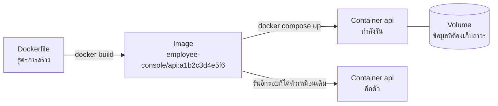
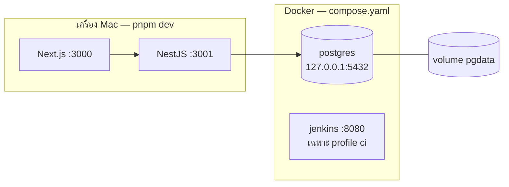
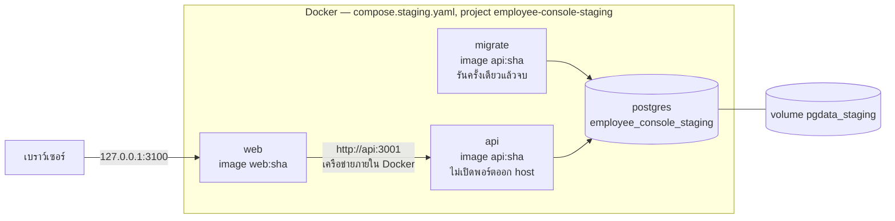
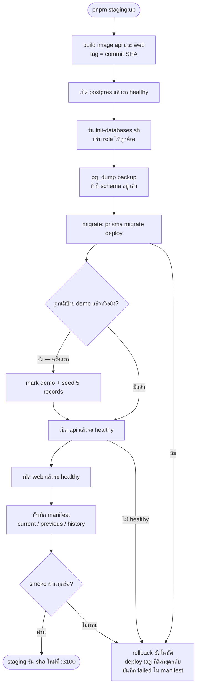

# บท 5 — Docker

ก่อนจะเข้าใจ Jenkins ต้องรู้จัก Docker ก่อน เพราะทั้งฐานข้อมูล, staging และตัว Jenkins เองรันอยู่ใน Docker

## คำศัพท์ 4 คำ

| คำ | เปรียบเทียบ | ในโปรเจกต์นี้ |
| --- | --- | --- |
| **Image** | แม่พิมพ์ หรือกล่องข้าวแช่แข็งที่ปิดฝาแล้ว เปลี่ยนข้างในไม่ได้ | `employee-console/api:<sha>`, `employee-console/web:<sha>`, `postgres:17.11-bookworm` |
| **Container** | ขนมที่อบออกมาจากแม่พิมพ์ หรือข้าวที่อุ่นแล้วกำลังกิน = image ที่กำลังรันอยู่ | container `postgres`, `api`, `web` |
| **Volume** | ตู้เก็บของที่อยู่นอก container ทิ้ง container แล้วของยังอยู่ | `pgdata` (dev), `pgdata_staging` (staging) |
| **Compose** | ใบสั่งงานที่บอกว่าจะเปิด container อะไรบ้าง ต่อกันอย่างไร | [compose.yaml](../../compose.yaml), [compose.staging.yaml](../../compose.staging.yaml) |

ข้อดีที่สำคัญที่สุดคือ **image ที่ผ่าน test แล้วคือตัวเดียวกับที่เอาไป deploy** ไม่มีปัญหา "เครื่องฉันรันได้แต่เครื่องอื่นรันไม่ได้"



## Dev: Docker แค่ฐานข้อมูล

ตอนพัฒนา เว็บและ API รันบนเครื่องโดยตรง (hot reload เร็วกว่า) ส่วน Docker มีแค่ PostgreSQL



- `pnpm dev:up` → เปิด postgres, รอ healthy, ปรับ role ของฐานข้อมูล, apply migration แล้ว seed ครั้งแรก ([scripts/dev-up.mjs](../../scripts/dev-up.mjs))
- `pnpm down` → หยุด container ทั้งหมด **ไม่ลบ volume** ข้อมูลจึงยังอยู่
- Jenkins อยู่ใน `compose.yaml` เหมือนกัน แต่ติด `profiles: [ci]` จึงเปิดเฉพาะตอน `pnpm ci:up`
- ทุกพอร์ต bind ที่ `127.0.0.1` เครื่องอื่นในเครือข่ายเข้าไม่ได้

## Staging: ทุกอย่างอยู่ใน Docker

staging คือการจำลอง production บนเครื่องเรา ใช้ image จริงที่ build จาก commit



- เปิดพอร์ตออกมาแค่ **web :3100** เบราว์เซอร์เข้าถึง API ได้ทาง `/api/*` ของ web เท่านั้น
- `migrate` เป็น service ที่ใช้ image ของ API แต่สั่งให้รัน `prisma migrate deploy` แล้วจบ (ติด `profiles: [tools]` จึงไม่เปิดเองตอน `up`)
- `depends_on` + `healthcheck` คุมลำดับ: postgres ต้อง healthy ก่อน api และ api ต้อง healthy ก่อน web
- ชื่อ project คนละชื่อกับ dev (`employee-console-staging`) container และ volume จึงไม่ชนกัน

## Image ของเรา

| ไฟล์ | สร้าง | จุดที่ควรรู้ |
| --- | --- | --- |
| [api.Dockerfile](../../infra/docker/api.Dockerfile) | `employee-console/api:<sha>` | multi-stage (`base` → `build` → `prod-deps` → `runtime`) image สุดท้ายมีแค่ของที่ต้องใช้รัน, ต้องมี OpenSSL ให้ Prisma, มี `dist-scripts/` ไว้ให้ staging รัน seed |
| [web.Dockerfile](../../infra/docker/web.Dockerfile) | `employee-console/web:<sha>` | ใช้ Next.js `standalone` output, ฝัง `API_INTERNAL_URL=http://api:3001` ตอน build |

**multi-stage build** คือการแบ่ง Dockerfile เป็นหลายช่วง ช่วงแรกติดตั้งเครื่องมือครบเพื่อ build ช่วงสุดท้ายคัดลอกเฉพาะผลลัพธ์ไปใส่ image เล็ก ๆ image ที่ได้จึงเล็กและไม่มีเครื่องมือที่ไม่จำเป็น

> **กับดัก**: `API_INTERNAL_URL` ของเว็บถูก **ฝังตอน build** ไม่ได้อ่านตอนรัน image ที่ build ด้วย `http://api:3001` จึงใช้ได้เฉพาะใน Compose ที่มี service ชื่อ `api` เท่านั้น

> **กับดัก**: Dockerfile ทั้งสองคัดลอก `package.json` ของทุก workspace package ก่อน `pnpm install --frozen-lockfile` ถ้าเพิ่มหรือลบ package ใน monorepo ต้องแก้ Dockerfile ทั้งสองไฟล์ ([infra/AGENTS.md](../../infra/AGENTS.md))

## Image tag = commit SHA

ทุก image ติด tag เป็น commit SHA (12 ตัวแรก) เช่น `employee-console/api:a1b2c3d4e5f6` ไม่ใช้ `latest`

- รู้ทันทีว่า staging รันโค้ดจาก commit ไหน
- rollback ได้ง่าย เพราะ image ของ commit ก่อนหน้ายังอยู่ในเครื่อง
- ถ้า build ตอนแก้ไฟล์ที่ git track อยู่แต่ยังไม่ commit tag จะเป็น `<sha>-dirty` เพื่อไม่ให้อ้างว่าเป็น commit ที่ไม่ตรง (D-30) ไฟล์ใหม่ที่ยังไม่ `git add` ไม่นับ เพราะ `commitTag()` ใน [staging.mjs](../../scripts/staging.mjs) ใช้ `git status --porcelain --untracked-files=no`

## Deploy staging ทำอะไรบ้าง

คำสั่ง `pnpm staging:up` (หรือ Jenkins stage `Deploy staging`) เรียก [scripts/staging.mjs](../../scripts/staging.mjs) ทำตามลำดับนี้



**smoke test** คือการตรวจเร็ว ๆ ว่าระบบ "ยังมีลมหายใจ" หลัง deploy ตรวจ 5 ข้อ

1. `/api/health/live` ตอบ 200
2. `/api/health/ready` ตอบ `ready` (ฐานข้อมูลต่อได้ + migration ครบ)
3. หน้า `/employees` โหลดได้
4. ไฟล์ static (CSS/JS) โหลดได้
5. `/api/v1/employees` ผ่าน web origin ตอบ 200

สถานะการ deploy เก็บที่ `~/.employee-console/staging/` (`manifest.json` และ `backups/`) ใช้ร่วมกันระหว่างคำสั่งในเครื่องกับ Jenkins (D-41)

### Rollback ไม่ย้อน schema

`pnpm staging:rollback` เปลี่ยน image กลับไปเป็น tag ก่อนหน้า แต่ **ไม่ย้อน migration** ซึ่งทำได้เพราะ migration ส่วนใหญ่เป็นแบบ "expand" (เพิ่มอย่างเดียว image เก่ายังใช้ได้) ข้อยกเว้นคือ migration ที่ลบตาราง (`remove_login_and_reports`) ถ้าจะย้อนไป image ที่เก่ากว่านั้นต้อง restore backup ตาม [runbook.md](../runbook.md) หัวข้อ 4

## ลองเอง

ดู container ที่รันอยู่ของ dev

```bash
docker compose ps
```

ดู image ของโปรเจกต์ที่ build ไว้

```bash
docker images employee-console/api
```

ดู container ของ staging (ชื่อขึ้นต้นด้วย `employee-console-staging-`)

```bash
docker ps --filter name=employee-console-staging
```

ตรวจ staging หลัง deploy

```bash
pnpm staging:smoke
```

ต่อไป: [บท 6 — Jenkins และ CI/CD](06-jenkins.md)
