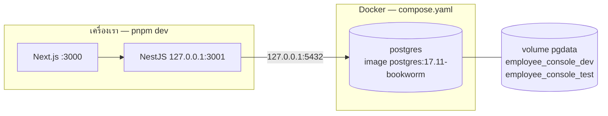

# บท 5 — Docker

ในโปรเจกต์นี้ Docker มีหน้าที่เดียว คือรัน PostgreSQL ให้เหมือนกันทุกเครื่อง โดยไม่ต้องติดตั้ง PostgreSQL ลงเครื่องเอง ส่วนเว็บและ API รันบนเครื่องโดยตรงด้วย `pnpm dev` เพราะ hot reload เร็วกว่า และโปรเจกต์ไม่ได้สร้าง image ของตัวเอง (ตัดออกใน D-56)

## คำศัพท์ 4 คำ

| คำ | เปรียบเทียบ | ในโปรเจกต์นี้ |
| --- | --- | --- |
| **Image** | แม่พิมพ์ หรือกล่องข้าวแช่แข็งที่ปิดฝาแล้ว เปลี่ยนข้างในไม่ได้ | `postgres:17.11-bookworm` image ทางการของ PostgreSQL ที่ดาวน์โหลดมา |
| **Container** | ขนมที่อบออกมาจากแม่พิมพ์ = image ที่กำลังรันอยู่ | `employee-console-postgres-1` |
| **Volume** | ตู้เก็บของที่อยู่นอก container ทิ้ง container แล้วของยังอยู่ | `pgdata` เก็บไฟล์ข้อมูลของ PostgreSQL |
| **Compose** | ใบสั่งงานที่บอกว่าจะเปิด container อะไร ตั้งค่าอย่างไร | [compose.yaml](../../compose.yaml) |



## อ่าน `compose.yaml` ทีละบรรทัด

```yaml
name: employee-console                       # ชื่อ project → container ชื่อ employee-console-postgres-1

services:
  postgres:
    image: postgres:17.11-bookworm             # pin เวอร์ชันชัดเจน ไม่ใช้ latest
    restart: unless-stopped                    # Docker เปิดให้ใหม่เอง ยกเว้นเราสั่งหยุด
    environment:
      POSTGRES_PASSWORD: ${POSTGRES_PASSWORD:-postgres}   # อ่านจาก .env ถ้าไม่มีใช้ postgres
      POSTGRES_DB: employee_console_dev        # สร้างฐาน dev ให้ตอนเปิดครั้งแรก
      TZ: UTC
    ports:
      - "127.0.0.1:${POSTGRES_HOST_PORT:-5432}:5432"      # เปิดเฉพาะเครื่องเรา ไม่เปิดให้ LAN
    volumes:
      - pgdata:/var/lib/postgresql/data        # ข้อมูลอยู่ใน volume ไม่หายเมื่อลบ container
    healthcheck:
      test: ["CMD-SHELL", "pg_isready -U postgres -d postgres"]   # ถามว่ารับการเชื่อมต่อได้หรือยัง
      interval: 5s
      timeout: 3s
      retries: 20

volumes:
  pgdata:
```

- **ports** — รูปแบบคือ `ที่อยู่บนเครื่องเรา:พอร์ตบนเครื่องเรา:พอร์ตใน container` การใส่ `127.0.0.1` นำหน้าทำให้เครื่องอื่นในเครือข่ายต่อเข้ามาไม่ได้
- **healthcheck** — Docker รัน `pg_isready` ทุก 5 วินาที จนกว่าจะตอบว่าพร้อม สถานะจึงเปลี่ยนจาก `starting` เป็น `healthy`
- **`${...}`** — Compose อ่านตัวแปรจากไฟล์ `.env` ที่ root ให้เอง

## คำสั่ง `pnpm` ที่เรียก Docker

ดูใน [package.json](../../package.json) ที่ root

| คำสั่ง | ทำอะไร |
| --- | --- |
| `pnpm dev:up` | `docker compose up -d --wait` → `pnpm db:migrate` → `pnpm db:seed` |
| `pnpm down` | `docker compose down` ลบ container แต่ **ไม่ลบ volume** ข้อมูลจึงยังอยู่ |

`-d` คือรันเบื้องหลัง ส่วน `--wait` คือรอจน container เป็น `healthy` ก่อนค่อยจบคำสั่ง ขั้น migrate ที่ตามมาจึงไม่ไปต่อฐานข้อมูลที่ยังไม่พร้อม

> **กับดัก**: `docker compose down -v` (มี `-v`) จะลบ volume ด้วย ข้อมูลทั้งฐาน dev และฐาน test หายหมด ถ้าแค่อยากได้ข้อมูล 5 records เดิมคืน ใช้ `pnpm db:reset` พอ

> **กับดัก**: `POSTGRES_PASSWORD` ถูกใช้แค่ตอนสร้าง volume ครั้งแรก เปลี่ยนใน `.env` ทีหลังจะไม่มีผลกับ volume เดิม และถ้าเครื่องมี PostgreSQL ตัวอื่นใช้พอร์ต 5432 อยู่ ให้ตั้ง `POSTGRES_HOST_PORT` แล้วแก้พอร์ตใน `DATABASE_URL` และ `TEST_DATABASE_URL` ให้ตรงกัน ([configuration.md](../configuration.md))

## ลองเอง

ดูสถานะ container (ควรเห็น `healthy`)

```bash
docker compose ps
```

ดู log ของ PostgreSQL 20 บรรทัดล่าสุด

```bash
docker compose logs --tail 20 postgres
```

ดู volume ที่เก็บข้อมูล (ชื่อจริงคือชื่อ project นำหน้า)

```bash
docker volume ls --filter name=employee-console_pgdata
```

ต่อไป: [บท 6 — แนวคิดสำคัญของโปรเจกต์](06-key-concepts.md)
