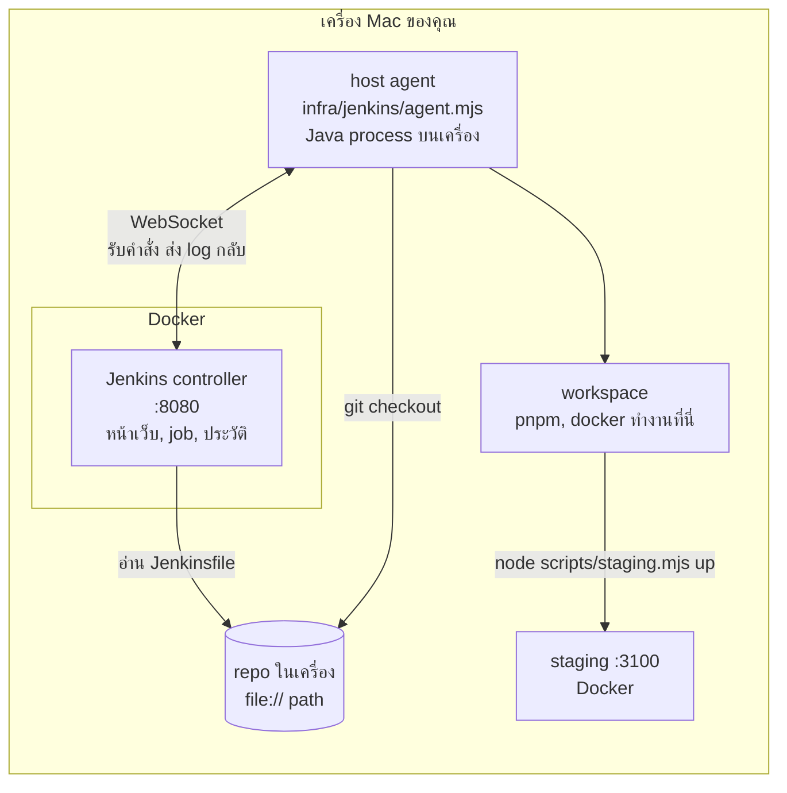
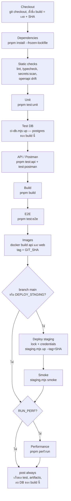
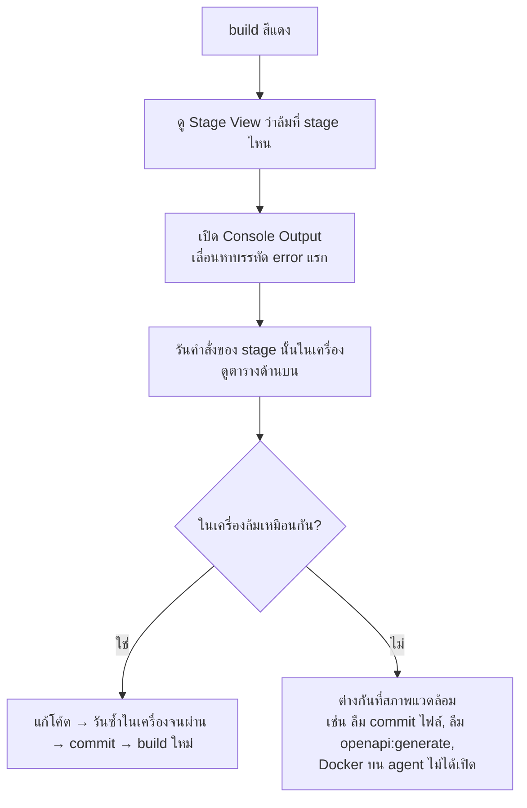

# บท 6 — Jenkins และ CI/CD

## CI/CD คืออะไร

| คำ | ย่อมาจาก | ความหมายง่าย ๆ | ในโปรเจกต์นี้ |
| --- | --- | --- | --- |
| **CI** | Continuous Integration | ทุกครั้งที่มีโค้ดใหม่ ให้เครื่องตรวจอัตโนมัติว่ายังดีอยู่ (lint, typecheck, test, build) | stage `Checkout` ถึง `Images` |
| **CD** | Continuous Delivery / Deployment | โค้ดที่ผ่านการตรวจแล้ว ส่งขึ้น environment ให้อัตโนมัติ | stage `Deploy staging` และ `Smoke` |

เปรียบเทียบกับโรงงาน: CI คือ **สายพานตรวจคุณภาพ** ที่ทุกชิ้นต้องผ่านทุกด่าน ชิ้นไหนตกด่านใดด่านหนึ่งก็ถูกคัดออก ส่วน CD คือ **รถขนส่ง** ที่เอาเฉพาะชิ้นที่ผ่านไปส่งถึงหน้าร้าน

ข้อดีคือความผิดพลาดถูกจับได้เร็วและเหมือนกันทุกครั้ง ไม่ต้องพึ่งความจำว่า "ก่อน deploy ต้องรันอะไรบ้าง"

## Jenkins คืออะไร

**Jenkins** เป็นโปรแกรม automation server แบบ open source มีหน้าเว็บให้ดูผล ทำหน้าที่อ่าน "สูตร" จากไฟล์ [Jenkinsfile](../../Jenkinsfile) แล้วสั่งเครื่องที่ทำงานจริงให้รันทีละขั้น

### คำศัพท์ของ Jenkins

| คำ | ความหมาย | ในโปรเจกต์นี้ |
| --- | --- | --- |
| **Controller** | สมองและหน้าเว็บ เก็บ job, ประวัติ build, ผล test ไม่รัน build เอง | container Jenkins ใน Docker ที่ <http://localhost:8080> (`numExecutors: 0`) |
| **Agent** | เครื่องที่ลงมือรันคำสั่งจริง | `host-agent` = เครื่อง Mac ของเราเอง (มี Node 24, pnpm, Docker) label `employee-console` |
| **Job** | งานหนึ่งงานที่ตั้งค่าไว้ | `employee-console` (pipeline job) |
| **Pipeline** | ชุดขั้นตอนทั้งหมด เขียนเป็นโค้ด | ไฟล์ `Jenkinsfile` |
| **Stage** | ด่านหนึ่งด่านใน pipeline เห็นเป็นช่องในหน้าเว็บ | `Static checks`, `Unit`, `E2E` ฯลฯ |
| **Step** | คำสั่งย่อยใน stage | `sh 'pnpm lint'` |
| **Build** | การรัน pipeline หนึ่งครั้ง มีเลขกำกับ | `#12 a1b2c3d4e5f6` |
| **Workspace** | folder ที่ agent checkout โค้ดมารัน | ภายใต้ `JENKINS_AGENT_WORKDIR` |
| **Artifact** | ไฟล์ผลลัพธ์ที่เก็บไว้กับ build | ผล test, Playwright report, manifest ของ staging |
| **Credentials** | ความลับที่ Jenkins เก็บให้ ไม่ต้องเขียนในโค้ด | `employee-console-staging-env` = ไฟล์ `.env.staging` |
| **Plugin** | ส่วนเสริมของ Jenkins | 78 ตัว pin เวอร์ชันใน [plugins.txt](../../infra/jenkins/plugins.txt) (D-44) |
| **JCasC** | Jenkins Configuration as Code = ตั้งค่า Jenkins ด้วยไฟล์ YAML แทนการคลิก | [casc.yaml](../../infra/jenkins/casc.yaml) |

## Jenkins ของโปรเจกต์นี้ต่อกันอย่างไร



จุดที่ต่างจาก Jenkins ทั่วไป (D-29)

- **ไม่มี Git remote** เช่น GitHub ทั้ง controller และ agent อ่าน repo จาก path ในเครื่อง (`file://...`) ถ้าตั้ง `JENKINS_GIT_URL` ใน `.env` ก็ใช้ remote แทนได้
- **ต้อง commit ก่อนกด build** เพราะ Jenkins checkout จาก commit ไม่ใช่จากไฟล์ที่ยังแก้ค้างอยู่
- agent รันบนเครื่องจริงไม่ใช่ใน container เพราะต้องสั่ง Docker เพื่อ build image และเปิด staging ได้

## อ่าน Jenkinsfile ทีละส่วน

```groovy
pipeline {
  agent { label 'employee-console' }        // ① รันบน agent ที่มี label นี้ = host-agent

  options {
    disableConcurrentBuilds()               // ② ห้ามรันสอง build พร้อมกัน
    timestamps()                            //    ใส่เวลาหน้า log ทุกบรรทัด
    timeout(time: 75, unit: 'MINUTES')      //    เกิน 75 นาทีให้ตัด
    buildDiscarder(logRotator(numToKeepStr: '30'))  // เก็บประวัติ 30 build ล่าสุด
  }

  parameters {                              // ③ ตัวเลือกตอนกด "Build with Parameters"
    booleanParam(name: 'DEPLOY_STAGING', defaultValue: false, ...)
    booleanParam(name: 'RUN_PERF', defaultValue: false, ...)
  }

  environment {                             // ④ env ที่ทุก stage เห็น
    CI = 'true'
    CI_PROJECT = "employee-console-ci-${env.BUILD_NUMBER}"   // ชื่อ Compose project เฉพาะ build นี้
  }

  stages {                                  // ⑤ ด่านต่าง ๆ เรียงตามลำดับ
    stage('Checkout') { ... }
    // ...
  }

  post {                                    // ⑥ ทำเสมอหลังจบ ไม่ว่าผ่านหรือล้ม
    always { ... }
  }
}
```

ภาษาที่ใช้คือ **Groovy** (Declarative Pipeline) ไม่ต้องเรียนลึก เพราะแต่ละ stage แค่เรียกคำสั่ง `pnpm` ที่เรารันในเครื่องได้อยู่แล้ว

## ด่านทั้งหมด



ด่านใดล้ม ด่านถัดไปจะไม่รัน (แต่ `post` ยังรันเสมอ)

| Stage | รันอะไร | จับปัญหาแบบไหน | รันเองในเครื่องได้ด้วย |
| --- | --- | --- | --- |
| Checkout | `checkout scm`, พิมพ์เวอร์ชัน node/pnpm/docker | เครื่องมือบน agent ไม่ครบ | — |
| Dependencies | `pnpm install --frozen-lockfile` | lockfile ไม่ตรงกับ `package.json` | `pnpm install --frozen-lockfile` |
| Static checks | `pnpm lint`, `typecheck`, `secrets:scan`, `openapi:generate` + `git diff --exit-code` | โค้ดผิดรูปแบบ, type ผิด, secret หลุดเข้า repo, ลืม generate OpenAPI (บท 4) | คำสั่งเดียวกัน |
| Unit | `pnpm test:unit` | กฎของฟิลด์, config, การ format ฝั่งเว็บผิด | `pnpm test:unit` |
| Test DB | `node scripts/ci-db.mjs up` | — (เตรียมฐานข้อมูลแยกของ build นี้บนพอร์ตว่าง) | — |
| API / Postman | `pnpm test:api`, `pnpm test:postman` | API ทำงานผิดกับ PostgreSQL จริง, สัญญา status/header/error code เปลี่ยน | ต้อง `pnpm dev:up` ก่อน |
| Build | `pnpm build` | build production ไม่ผ่าน | `pnpm build` |
| E2E | `pnpm test:e2e` | flow ในเบราว์เซอร์พัง เช่น ฟอร์ม, filter, layout มือถือ | ต้อง `pnpm dev:up` ก่อน |
| Images | `docker build` สอง image ติด tag `$GIT_SHA` | Dockerfile พัง | — |
| Deploy staging | `staging.mjs up --tag=$GIT_SHA` ภายใต้ `lock` | migration ล้ม, container ไม่ healthy (rollback อัตโนมัติ) | `pnpm staging:up` |
| Smoke | `staging.mjs smoke` | staging ขึ้นแต่ใช้งานไม่ได้ | `pnpm staging:smoke` |
| Performance | `pnpm perf:run` | ช้ากว่าเป้าหมาย | `pnpm perf:run --label=<ชื่อ>` |

### ส่วนพิเศษใน Jenkinsfile

- **`when { anyOf { ... } }`** — ใส่เงื่อนไขให้ stage รันเฉพาะบางกรณี `Deploy staging` และ `Smoke` รันเมื่อ branch ลงท้ายด้วย `main` หรือเลือก `DEPLOY_STAGING` ไว้
- **`lock('employee-console-staging')`** — จองทรัพยากรชื่อนี้ (ประกาศใน `casc.yaml`) ให้มี deploy staging ได้ทีละอันเท่านั้น
- **`withCredentials([file(...)])`** — ดึงไฟล์ `.env.staging` จากที่เก็บความลับของ Jenkins มาเป็นตัวแปร `STAGING_ENV_FILE` ชั่วคราว ค่าไม่ถูกพิมพ์ลง log
- **`post { always { ... } }`**
  - `junit` อ่านไฟล์ XML ใน `test-results/` แล้วแสดงเป็นตารางผล test ในหน้า build
  - `archiveArtifacts` เก็บ `test-results/**`, `playwright-report/**`, ผล performance และ `.deploy/staging-manifest.json` ให้ดาวน์โหลดจากหน้า build
  - `ci-db.mjs down` ลบ Compose project และ volume **ของ build นี้เท่านั้น** ไม่แตะ dev หรือ staging

## วิธีใช้งาน

1. เปิด Jenkins (controller ใน Docker + agent บนเครื่อง) ต้องมี Java 17 ขึ้นไป

```bash
pnpm ci:up
```

2. เปิด <http://localhost:8080> แล้ว login ด้วยผู้ใช้ `admin` รหัสผ่านคือค่า `JENKINS_ADMIN_PASSWORD` ในไฟล์ `.env` (เปิดดูในไฟล์เอง อย่าคัดลอกไปวางในแชตหรือเอกสาร)
3. commit โค้ดที่ต้องการให้ Jenkins ทดสอบก่อน
4. เข้า job `employee-console` → **Build with Parameters** → เลือก `DEPLOY_STAGING` / `RUN_PERF` ตามต้องการ → **Build**
5. กดเข้า build ที่กำลังรันเพื่อดู **Stage View** (ช่องเขียว = ผ่าน, แดง = ล้ม) และ **Console Output** (log ทั้งหมด)
6. หลังจบดู **Test Result** และ **Build Artifacts** ในหน้า build
7. ปิด Jenkins (ข้อมูล job ยังอยู่ใน volume `jenkins_home`)

```bash
pnpm ci:up --stop
```

`pnpm ci:up` ยังตรวจหลังเปิดว่า JCasC ถูก apply ครบ (job, parameters, node `host-agent`) และ plugin ทั้ง 78 ตัวตรงเวอร์ชันที่ pin ไว้ ถ้าไม่ตรงจะ exit 1

## เมื่อ build ล้ม ทำอย่างไร



ตัวอย่างข้อความ error ที่เจอบ่อย

| ข้อความ | สาเหตุ | แก้ |
| --- | --- | --- |
| `OpenAPI/client drift: run pnpm openapi:generate and commit` | แก้ API แต่ไม่ได้ generate | รัน `pnpm openapi:generate` แล้ว commit `packages/api-client` |
| `ERR_PNPM_OUTDATED_LOCKFILE` | เพิ่ม dependency แต่ไม่ได้ commit `pnpm-lock.yaml` | `pnpm install` แล้ว commit lockfile |
| E2E ผ่านในเครื่องแต่ล้มใน Jenkins | timing หรือข้อมูลค้าง | เปิด `playwright-report` จาก Build Artifacts ดู screenshot/trace |

ประวัติปัญหาจริงที่เคยเจอกับ Jenkins ในโปรเจกต์นี้ (agent หลุด, parameters หาย, migrate ใน image ล้ม) อยู่ใน [ai-usage.md](../ai-usage.md) ข้อ 16–18

## ทำไมเลือกแบบนี้

- **Jenkinsfile เรียกคำสั่ง `pnpm` เดียวกับที่ใช้ในเครื่อง** — ผลใน Jenkins กับในเครื่องจึงตรงกัน และถ้า Jenkins ใช้ไม่ได้ตอน demo ก็ยัง deploy ด้วย `pnpm staging:up` ได้ (สคริปต์เดียวกัน)
- **ทุกอย่าง pin เวอร์ชัน** — Jenkins image, plugin ทุกตัว, Node, pnpm ทำให้ build วันนี้กับเดือนหน้าได้ผลเหมือนกัน
- **ฐานข้อมูลของ CI แยกต่อ build** — test ไม่มีทางไปลบข้อมูล dev หรือ staging

ต่อไป: [บท 7 — แนวคิดสำคัญของโปรเจกต์](07-key-concepts.md)
