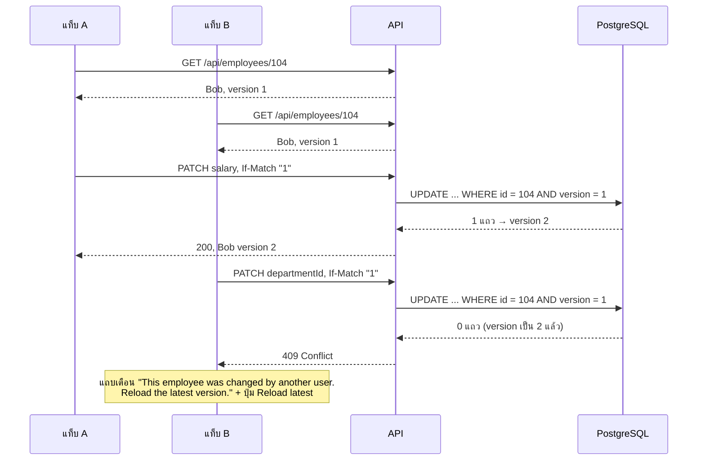
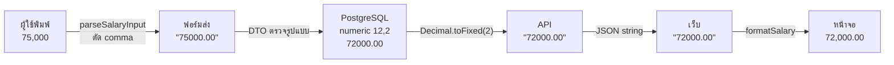

# บท 6 — แนวคิดสำคัญของโปรเจกต์

บทนี้รวมเรื่องที่ทำให้โปรเจกต์นี้ต่างจาก CRUD ทั่วไป และเป็นเรื่องที่มักถูกถามตอนนำเสนอ

## 1. กันการเขียนทับกัน: `version` + `If-Match`

### ปัญหา: lost update

สองคนเปิดหน้า Edit ของ Bob พร้อมกัน คนแรกแก้เงินเดือน คนที่สองแก้แผนก ถ้าระบบไม่ตรวจอะไรเลย คนที่กด Save ทีหลังจะเขียนทับสิ่งที่คนแรกแก้ไว้โดยไม่มีใครรู้ตัว

### วิธีแก้: optimistic concurrency

ทุกแถวมีคอลัมน์ `version` เริ่มที่ 1 และเพิ่มขึ้นทีละ 1 ทุกครั้งที่แก้สำเร็จ

1. ตอนอ่าน API ส่ง `version` มาใน JSON ของพนักงาน เช่น `"version": 1`
2. ตอนแก้หรือลบ client ต้องส่ง version ที่ตัวเองเห็นกลับมาใน header `If-Match: "1"`
3. ถ้าในฐานข้อมูลยังเป็น 1 → แก้ได้ แล้ว version กลายเป็น 2
4. ถ้าในฐานข้อมูลกลายเป็น 2 ไปแล้ว → ตอบ **409** ให้ผู้ใช้โหลดข้อมูลล่าสุดก่อน

เรียกว่า "optimistic" เพราะมองโลกในแง่ดีว่าส่วนใหญ่ไม่ชนกัน จึงไม่ล็อกอะไรไว้ตลอดเวลาที่เปิดฟอร์ม แค่ตรวจตอนบันทึก



กติกาที่ควรจำ

| กรณี | ผล |
| --- | --- |
| `PATCH`/`DELETE` ไม่มี `If-Match` | **428** ระบบบังคับให้ทุก client ตรวจ version เสมอ ไม่ทำงานต่อแบบไม่ตรวจ |
| `If-Match` ไม่ใช่ตัวเลข (เช่น `W/"abc"`) | 400 |
| version ไม่ตรง | **409** และข้อมูลไม่เปลี่ยน |
| ไม่มี ID นี้แล้ว | 404 |

`If-Match` รับทั้ง `"3"` และ `3` (D-23) ส่วน header `ETag` ที่เห็นใน response เป็นของ Express สร้างอัตโนมัติ ไม่ใช่ version (บท 2)

ฝั่งเว็บทำสามอย่างให้ระบบนี้ใช้งานได้จริง

- หน้า Edit ส่ง `version` ของข้อมูลที่แสดงอยู่ในฟอร์มไปใน `If-Match` ผ่าน `useUpdateEmployee` ([queries.ts](../../apps/web/src/lib/queries.ts))
- QueryClient ปิด `refetchOnWindowFocus` ([providers.tsx](../../apps/web/src/app/providers.tsx)) ไม่อย่างนั้นสลับแท็บกลับมาแล้วฟอร์มจะถูกแทนด้วยข้อมูลใหม่ (รวม version ใหม่) ทั้งที่ผู้ใช้กำลังพิมพ์อยู่ และการตรวจจะไม่มีความหมาย
- ได้ 409 → แสดงแถบเตือนพร้อมปุ่ม **Reload latest** กดแล้ว refetch และฟอร์ม reset เป็นค่าล่าสุด ([edit-employee-view.tsx](../../apps/web/src/app/(console)/employees/[id]/edit/edit-employee-view.tsx)) ส่วนกล่องยืนยันการลบ ([delete-employee-dialog.tsx](../../apps/web/src/components/employees/delete-employee-dialog.tsx)) แสดง toast error เมื่อได้ 409 และถ้าได้ 404 จะบอกว่า "This employee was already deleted."

ดูโค้ด: `parseIfMatch` ใน [employees.controller.ts](../../apps/api/src/employees/employees.controller.ts), `update`/`remove` ใน [employees.service.ts](../../apps/api/src/employees/employees.service.ts), integration test "needs If-Match (428) and refuses a stale version (409)" ใน [employees.test.ts](../../apps/api/test/integration/employees.test.ts) และ E2E "two tabs editing the same record" ใน [employee-crud.spec.ts](../../tests/e2e/specs/employee-crud.spec.ts) (AC-16)

## 2. เงินเดือนเป็น string ทุกชั้น

```js
0.1 + 0.2              // 0.30000000000000004
```

`number` ของ JavaScript เป็น floating point เก็บทศนิยมบางค่าได้ไม่ตรง เมื่อเป็นเรื่องเงินจึงไม่ใช้ `number` เลย



- ฐานข้อมูลใช้ `numeric(12,2)` เก็บได้ถึง 9,999,999,999.99 แบบแม่นยำ
- API รับเป็น string ที่ตรงกับ `^\d{1,10}(\.\d{1,2})?$` เท่านั้น ส่ง `75000` (ตัวเลข JSON) จะได้ 400 "Salary must be sent as a string" ส่ง `"65000"` ได้ และฐานข้อมูลเก็บเป็น `65000.00`
- การแสดง `#,##0.00` ทำในเว็บด้วยการจัดการ string ล้วน ([format.ts](../../apps/web/src/lib/format.ts), [salary.ts](../../apps/web/src/lib/salary.ts))
- ช่อง Salary format ตอน blur ไม่ใช่ตอน focus เพราะเคยเกิดบั๊ก `62000.0063000.00` ที่ Playwright จับได้ (D-31)

## 3. วันที่แบบไม่มีเวลา (`YYYY-MM-DD`)

Join Date และ Last Updated Date เป็น "วันที่ล้วน" ไม่มีเวลาและไม่มี timezone

```js
new Date('2023-01-15')                  // = 2023-01-15T00:00:00Z (เที่ยงคืน UTC)
new Date('2023-01-15').toLocaleDateString('en-US', { timeZone: 'America/New_York' })
// "1/14/2023"  ← วันเลื่อนถอยไป 1 วัน
```

โปรเจกต์จึงส่งเป็น string `"2023-01-15"` ตลอดทาง (D-05)

- **API** แปลงคอลัมน์ `date` ที่ Prisma ให้มาเป็น `Date` ด้วย `toISOString().slice(0, 10)` ซึ่งอ่านเป็น UTC เสมอ (บท 3)
- **เว็บ** แสดงผลด้วย `formatDateOnly()` ที่ใช้ regex แยกปี เดือน วัน ไม่สร้าง `Date` เลย ([format.ts](../../apps/web/src/lib/format.ts)) และช่อง Join Date เป็น `<input type="date">` ที่ให้ค่าเป็น `YYYY-MM-DD` อยู่แล้ว
- E2E test เปิดเบราว์เซอร์ในหลาย timezone แล้วตรวจว่าวันที่ไม่เลื่อน (AC-11 ใน [dates-and-layout.spec.ts](../../tests/e2e/specs/dates-and-layout.spec.ts))

**Last Updated Date** ระบบตั้งให้เป็น "วันนี้" ตามปฏิทินของ `Asia/Bangkok` ด้วย `todayInBangkok()` ใน [employees.service.ts](../../apps/api/src/employees/employees.service.ts) ไม่ว่าเครื่อง server จะตั้ง timezone อะไร เช่น ตอน 00:30 ที่กรุงเทพ (ยังเป็นวันก่อนหน้าใน UTC) ระบบจะใช้วันที่ของกรุงเทพ ซึ่งมี integration test ตรวจกรณีนี้ ส่วน timestamp อย่าง `created_at` เก็บเป็น UTC

## 4. รูปแบบ response และ error

response ที่สำเร็จคือข้อมูลตรง ๆ ไม่มีการห่อ

```json
{ "id": 104, "name": "Bob Brown", "departmentId": "engineering", "departmentName": "Engineering",
  "salary": "72000.00", "joinDate": "2022-11-10", "isActive": false, "lastUpdatedDate": "2026-03-01", "version": 1 }
```

หน้า list มีข้อมูลการแบ่งหน้าอยู่ข้างรายการ

```json
{ "items": [ { "id": 101, "...": "..." } ], "page": 1, "pageSize": 20, "total": 5, "totalPages": 1 }
```

error ใช้รูปแบบมาตรฐานของ NestJS

```json
{ "message": ["Salary must be sent as a string, e.g. \"65000.00\"."], "error": "Bad Request", "statusCode": 400 }
```

| Status | `message` | เกิดเมื่อ |
| --- | --- | --- |
| 400 | array ของข้อความ | body หรือ query ผิด, ส่งฟิลด์ที่ไม่รู้จัก (`property id should not exist`) |
| 400 | `Validation failed (numeric string is expected)` | id ใน path ไม่ใช่ตัวเลข |
| 404 | `This employee does not exist or was deleted.` | ไม่มี ID นี้ |
| 409 | `This employee was changed by another user. Reload the latest version.` | version ไม่ตรง |
| 428 | `Send If-Match with the employee version you edited.` | ไม่ส่ง `If-Match` (body นี้ไม่มี key `error`) |

ฝั่งเว็บ `api()` ใน [api.ts](../../apps/web/src/lib/api.ts) แปลงทุก error เป็น `ApiError(status, message)` ถ้า `message` เป็น array ก็ต่อเป็นประโยคเดียว แล้ว `errorMessage()` เลือกข้อความที่จะแสดง: status ต่ำกว่า 500 แสดงข้อความของ error นั้นเอง (ข้อความจาก server หรือ "Could not reach the server..." ที่ `api()` สร้างให้เมื่อเน็ตหลุดซึ่งใช้ status 0) ส่วน 5xx แสดงข้อความกลาง ๆ "The server could not complete the request. Try again."

## 5. กด Save โดยไม่ได้แก้อะไร = ไม่ส่งคำขอ

หน้า Edit ใช้ `changedFields()` เทียบค่าในฟอร์มกับข้อมูลเดิม แล้วส่งเฉพาะฟิลด์ที่เปลี่ยน ถ้าไม่มีอะไรเปลี่ยนเลยจะขึ้น toast "No changes to save." และไม่เรียก API (AC-14) ตัว API เองไม่ได้ตรวจเรื่องนี้ ทุก `PATCH` ที่ผ่านการตรวจจะเพิ่ม version และตั้ง Last Updated Date เป็นวันนี้เสมอ

## 6. ข้อมูลตั้งต้นจาก Excel ต้องไม่ผิด

| จุด | ทำอย่างไร |
| --- | --- |
| Bob Brown มีสถานะ `In Active` (มีช่องว่าง) | seed เทียบ `row.Status === 'Active'` จึงได้ `false` ห้ามใช้ `Boolean("In Active")` เพราะได้ `true` |
| Last Updated Date เดิมของ 5 records | seed เก็บค่าจาก Excel ไม่เปลี่ยนเป็นวันนี้ |
| ID 101–105 | seed ใส่ ID เดิม แล้วตั้ง sequence ให้คนใหม่เริ่มที่ 106 |
| รูปแบบ `65,000.00` | เป็นการแสดงผลเท่านั้น ค่าจริงคือ `"65000.00"` |

ดู [seed.ts](../../apps/api/src/seed.ts) และ unit test [seed.test.ts](../../apps/api/test/unit/seed.test.ts)

## 7. สถานะของหน้า list อยู่ใน URL

ค้นหา กรอง เรียง และเลขหน้าเก็บใน query string เช่น `/employees?q=john&departmentId=engineering&status=inactive&page=2` จึง reload, กด back/forward หรือส่งลิงก์ให้คนอื่นแล้วเห็นผลเดียวกัน (PRD §8.3)

[list-params.ts](../../apps/web/src/lib/list-params.ts) มีสองฟังก์ชันหลัก

- `readListParams()` อ่าน URL ค่าที่ผิด (เช่น `pageSize=999`) จะกลับเป็นค่า default
- `toSearch()` สร้าง `?...` เฉพาะค่าที่ต่างจาก default ใช้ทั้งกับ URL ของหน้าและกับคำขอ `GET /api/employees` เพราะ default ของเว็บกับของ API ตั้งไว้เท่ากัน หน้าแรกจึงเป็นแค่ `/employees`

เปลี่ยนตัวกรองหรือการเรียงเมื่อไรจะกลับไปหน้า 1 เสมอ ([employees-view.tsx](../../apps/web/src/app/(console)/employees/employees-view.tsx))

ต่อไป: [บท 7 — การทดสอบ](07-testing.md)
