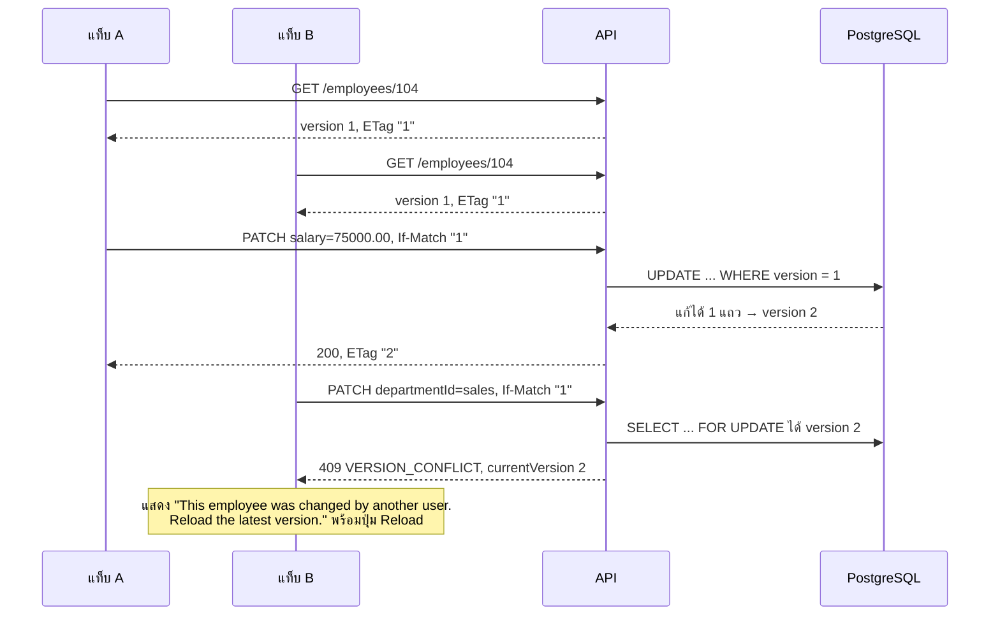
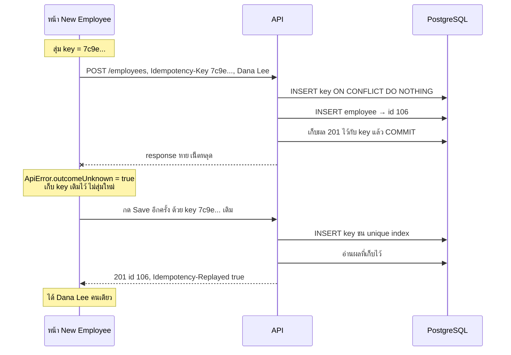
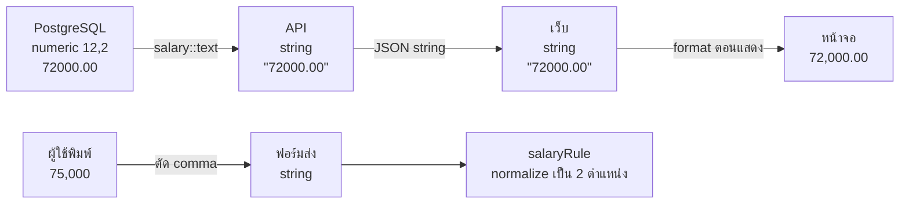

# บท 7 — แนวคิดสำคัญของโปรเจกต์

บทนี้รวมเรื่องที่ทำให้โปรเจกต์นี้ต่างจาก CRUD ทั่วไป และเป็นเรื่องที่มักถูกถามตอนนำเสนอ

## 1. รูปแบบ response: `{ data, meta }` และ `{ error }`

ทุก response ที่สำเร็จมีหน้าตาเดียวกัน

```json
{
  "data": { "id": 104, "name": "Bob Brown", "salary": "72000.00", "version": 1, "...": "..." },
  "meta": { "requestId": "3f1c2a9e-..." }
}
```

หน้า list มีข้อมูลการแบ่งหน้าเพิ่มใน `meta`

```json
{
  "data": [ { "id": 101, "...": "..." } ],
  "meta": { "requestId": "...", "page": 1, "pageSize": 20, "total": 5, "totalPages": 1, "sortBy": "id", "sortOrder": "asc" }
}
```

ทุก error ก็มีหน้าตาเดียวกัน

```json
{
  "error": {
    "code": "VALIDATION_ERROR",
    "message": "Please correct the highlighted fields.",
    "requestId": "...",
    "details": [ { "field": "salary", "code": "DECIMAL_SCALE_EXCEEDED", "message": "Salary must have at most 2 decimal places." } ]
  }
}
```

- `code` เป็นค่าคงที่ให้โปรแกรมอ่าน ส่วน `message` ให้คนอ่าน
- `details` บอก error ระดับฟิลด์ หน้าเว็บนำไปแสดงใต้ช่องที่ผิด
- `requestId` ตรงกับ header `X-Request-Id` และบรรทัดใน log ผู้ใช้แจ้ง ID นี้มา ก็หา log ของคำขอนั้นเจอทันที

### Error code ที่ควรจำ

| Status | Code | เกิดเมื่อ |
| --- | --- | --- |
| 400 | `VALIDATION_ERROR` | body ผิด (ดู `details`) |
| 400 | `INVALID_QUERY` | query string ผิด เช่น `pageSize=1000` |
| 400 | `INVALID_IDEMPOTENCY_KEY` | `Idempotency-Key` ไม่ใช่ UUID |
| 400 | `MALFORMED_JSON` | JSON พัง |
| 404 | `EMPLOYEE_NOT_FOUND` | ไม่มี ID นี้ |
| 409 | `VERSION_CONFLICT` | version ใน `If-Match` ไม่ตรงกับในฐานข้อมูล |
| 409 | `IDEMPOTENCY_CONFLICT` | ใช้ key เดิมกับ body คนละแบบ |
| 413 | `PAYLOAD_TOO_LARGE` | body เกิน 32 KB |
| 415 | `UNSUPPORTED_MEDIA_TYPE` | ไม่ได้ส่งเป็น `application/json` |
| 428 | `PRECONDITION_REQUIRED` | แก้หรือลบโดยไม่ส่ง `If-Match` |
| 429 | `RATE_LIMITED` | ขอถี่เกิน (มี header `Retry-After`) |
| 503 | `DEPENDENCY_UNAVAILABLE` | ฐานข้อมูลใช้ไม่ได้ |

ทั้งหมดอยู่ใน [api-exception.ts](../../apps/api/src/common/api-exception.ts) และ [http-exception.filter.ts](../../apps/api/src/common/http-exception.filter.ts)

## 2. กันการเขียนทับกัน: `version` + `ETag` + `If-Match`

### ปัญหา: lost update

สองคนเปิดหน้า Edit ของ Bob พร้อมกัน คนแรกแก้เงินเดือน คนที่สองแก้แผนก ถ้าระบบไม่ตรวจอะไรเลย คนที่กด Save ทีหลังจะเขียนทับสิ่งที่คนแรกแก้ไว้โดยไม่มีใครรู้ตัว

### วิธีแก้: optimistic concurrency

ทุกแถวมีคอลัมน์ `version` เริ่มที่ 1 และเพิ่มขึ้นทีละ 1 ทุกครั้งที่แก้สำเร็จ

1. ตอนอ่าน API ส่ง version ปัจจุบันกลับใน header `ETag: "1"`
2. ตอนแก้หรือลบ client ต้องส่ง version ที่ตัวเองเห็นกลับมาใน `If-Match: "1"`
3. ถ้าในฐานข้อมูลยังเป็น 1 → แก้ได้ แล้ว version กลายเป็น 2
4. ถ้าในฐานข้อมูลกลายเป็น 2 ไปแล้ว → ตอบ **409** ให้ผู้ใช้โหลดข้อมูลล่าสุดก่อน

เรียกว่า "optimistic" เพราะมองโลกในแง่ดีว่าส่วนใหญ่ไม่ชนกัน จึงไม่ล็อกไว้ตลอดเวลาที่เปิดฟอร์ม แค่ตรวจตอนบันทึก



ถ้าไม่ส่ง `If-Match` เลยจะได้ **428** ไม่ใช่ทำงานต่อแบบไม่ตรวจ ระบบบังคับให้ทุก client ตรวจ version เสมอ (`If-Match` รับทั้ง `"3"` และ `3` — D-23)

ดูโค้ด: `parseIfMatch` ใน [employees.controller.ts](../../apps/api/src/employees/employees.controller.ts), `update` และ `remove` ใน [employees.service.ts](../../apps/api/src/employees/employees.service.ts), test "two tabs editing the same record" ใน [employee-crud.spec.ts](../../tests/e2e/specs/employee-crud.spec.ts) (AC-16)

## 3. กันการสร้างซ้ำ: `Idempotency-Key`

### ปัญหา: ไม่รู้ว่าสร้างไปแล้วหรือยัง

ผู้ใช้กด Save เพื่อสร้าง Dana Lee แล้วเน็ตหลุดพอดี หน้าเว็บไม่ได้คำตอบ ไม่รู้ว่า server สร้างไปแล้วหรือยัง ถ้ากดใหม่แล้ว server สร้างอีกรอบ จะได้ Dana Lee สองคน

### วิธีแก้: ติดเลขกำกับให้ "ความตั้งใจ" หนึ่งครั้ง

**Idempotent** แปลว่า ทำซ้ำกี่ครั้งก็ได้ผลเหมือนทำครั้งเดียว

1. ตอนเปิดฟอร์มสร้าง หน้าเว็บสุ่ม UUID หนึ่งตัวเป็น `Idempotency-Key`
2. ส่ง `POST` พร้อม key นั้น server บันทึก key กับผลลัพธ์ไว้ 24 ชั่วโมง
3. ถ้าส่งซ้ำด้วย key เดิมและ body เดิม server ไม่สร้างใหม่ แต่ **ส่งผลเดิมกลับ** พร้อม header `Idempotency-Replayed: true`
4. ถ้าใช้ key เดิมกับ body คนละแบบ → 409 `IDEMPOTENCY_CONFLICT`



จุดละเอียดที่ควรรู้

- key กับการสร้างพนักงานอยู่ใน **transaction เดียวกัน** ถ้าสร้างล้ม key ก็ไม่ถูกบันทึก (D-21)
- คำขอพร้อมกัน 5 ครั้งด้วย key เดียวได้พนักงาน 1 คน มี integration test พิสูจน์
- ฝั่งเว็บ **เก็บ key เดิมไว้** เมื่อไม่รู้ผล (network error หรือ 5xx) ดู `outcomeUnknown` ใน [api.ts](../../apps/web/src/lib/api.ts) — AI เคยทำพลาดตรงนี้โดยสุ่ม key ใหม่เมื่อได้ 5xx ([ai-usage.md](../ai-usage.md) ข้อ 13)

ดูโค้ด: [idempotency.service.ts](../../apps/api/src/idempotency/idempotency.service.ts), test "lost create response" ใน [employee-crud.spec.ts](../../tests/e2e/specs/employee-crud.spec.ts) (AC-20)

## 4. เงินเดือนเป็น string ทุกชั้น

```js
0.1 + 0.2              // 0.30000000000000004
```

`number` ของ JavaScript เป็น floating point เก็บทศนิยมบางค่าได้ไม่ตรง เมื่อเป็นเรื่องเงินจึงไม่ใช้ `number` เลย



- ฐานข้อมูลใช้ `numeric(12,2)` เก็บได้ถึง 9,999,999,999.99 แบบแม่นยำ
- API ส่งและรับเป็น string ถ้าส่ง `75000` (ตัวเลข) จะได้ 400 `SALARY_TYPE_INVALID`
- การแสดง `#,##0.00` ทำในเว็บเท่านั้น ([format.ts](../../apps/web/src/lib/format.ts), [salary.ts](../../apps/web/src/lib/salary.ts))
- ช่อง Salary format ตอน blur ไม่ใช่ตอน focus เพราะเคยเกิดบั๊ก `62000.0063000.00` ที่ Playwright จับได้ (D-31)

## 5. วันที่แบบไม่มีเวลา (`YYYY-MM-DD`)

Join Date และ Last Updated Date เป็น "วันที่ล้วน" ไม่มีเวลาและไม่มี timezone

```js
new Date('2023-01-15')                  // = 2023-01-15T00:00:00Z (เที่ยงคืน UTC)
new Date('2023-01-15').toLocaleDateString('en-US', { timeZone: 'America/New_York' })
// "1/14/2023"  ← วันเลื่อนถอยไป 1 วัน
```

โปรเจกต์จึงส่งเป็น string `"2023-01-15"` ตลอดทาง ตั้งแต่ฐานข้อมูล (`::text`) ถึงฟอร์ม ไม่แปลงเป็น `Date` เลย (D-05) E2E test ตรวจว่าวันที่ไม่เลื่อนเมื่อเปิดเบราว์เซอร์ในหลาย timezone (AC-11 ใน [dates-and-layout.spec.ts](../../tests/e2e/specs/dates-and-layout.spec.ts))

ส่วน **Last Updated Date** ระบบตั้งให้เป็น "วันนี้" ตามเขตเวลา `Asia/Bangkok` (`APP_TIMEZONE`) ด้วย `businessDate()` ใน [dates.ts](../../apps/api/src/common/dates.ts) ส่วน timestamp อย่าง `created_at` เก็บเป็น UTC

## 6. แก้แต่ไม่เปลี่ยนอะไร = ไม่เขียน (no-op)

ถ้าผู้ใช้กด Save โดยค่าเหมือนเดิมทุกช่อง (หลัง normalize เช่น ตัดช่องว่างแล้ว) API ตอบ 200 พร้อม `meta.changed: false` ไม่เขียนฐานข้อมูล version และ Last Updated Date คงเดิม (PRD §9.4, AC-14)

## 7. ข้อมูลตั้งต้นจาก Excel ต้องไม่ผิด

| จุด | ทำอย่างไร |
| --- | --- |
| Bob Brown มีสถานะ `In Active` (มีช่องว่าง) | seed map เป็น `is_active = false` ห้ามใช้ `Boolean("In Active")` เพราะได้ `true` |
| Last Updated Date เดิมของ 5 records | seed เก็บค่าจาก Excel ไม่เปลี่ยนเป็นวันนี้ |
| ID 101–105 | seed ใส่ ID เดิม แล้วตั้ง sequence ให้คนใหม่เริ่มที่ 106 |
| รูปแบบ `65,000.00` | เป็นการแสดงผลเท่านั้น ค่าจริงคือ `"65000.00"` |

ดู [seed-original.ts](../../apps/api/src/seed/seed-original.ts) และ unit test [seed-mapping.test.ts](../../apps/api/test/unit/seed-mapping.test.ts)

## 8. สถานะของหน้า list อยู่ใน URL

ค้นหา กรอง เรียง และเลขหน้าเก็บใน query string เช่น `/employees?q=john&departmentId=engineering&status=inactive&page=2` จึง reload, กด back/forward หรือส่งลิงก์ให้คนอื่นแล้วเห็นผลเดียวกัน (PRD §8.3) ดู [list-params.ts](../../apps/web/src/lib/list-params.ts)

## 9. Rate limit ต่อ IP

guard นับคำขอต่อ IP ในหน่วยความจำ แบบ fixed window 1 นาที อ่านได้ 300 ครั้ง เขียนได้ 60 ครั้ง เกินแล้วได้ 429 พร้อม `Retry-After` เขียนเองแทน `@nestjs/throttler` เพราะ policy เฉพาะและมี API instance เดียว (D-17) ปิดได้เฉพาะ `APP_ENV=test` (D-36)

## 10. Health check สองแบบ

| Endpoint | ตอบ 200 เมื่อ | ใช้ทำอะไร |
| --- | --- | --- |
| `/api/health/live` | process ยังตอบได้ | บอกว่าแอปไม่ค้าง |
| `/api/health/ready` | ฐานข้อมูลต่อได้ **และ** migration ล่าสุดที่มากับ build ถูก apply แล้ว | Docker healthcheck และ smoke test ใช้ตัดสินว่ารับงานได้หรือยัง |

ดู [health.controller.ts](../../apps/api/src/health/health.controller.ts)

ต่อไป: [บท 8 — การทดสอบ](08-testing.md)
