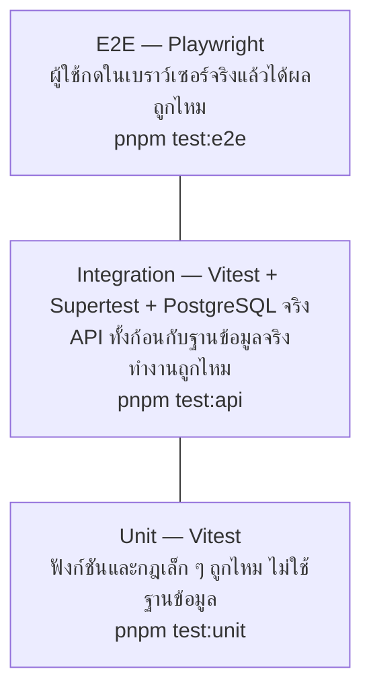
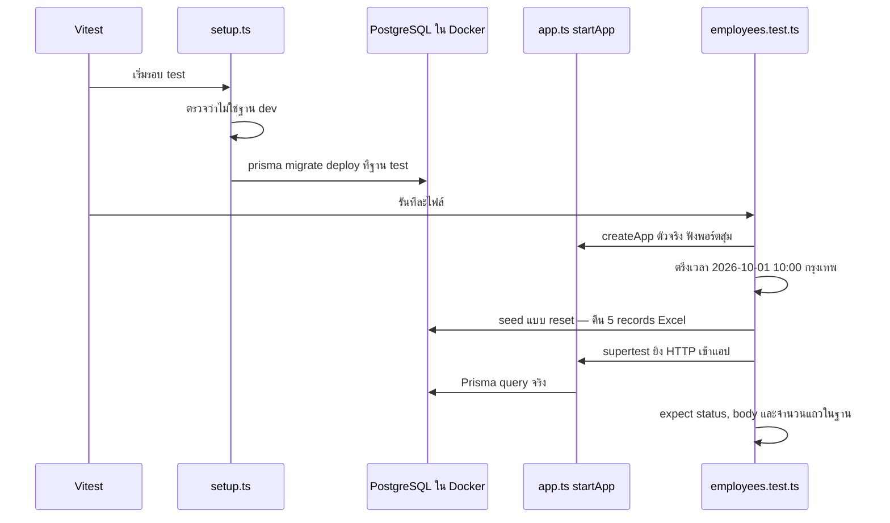
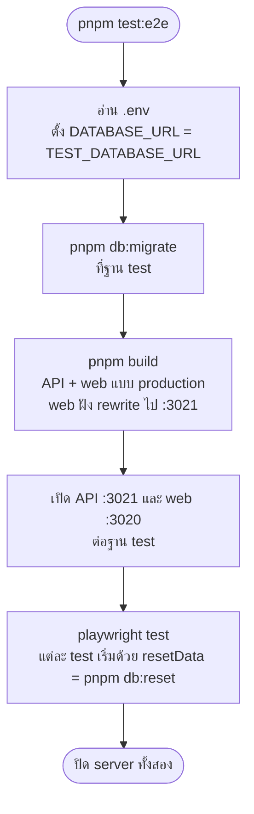

# บท 7 — การทดสอบ

## ภาพรวม: พีระมิดของ test



ยิ่งอยู่ล่าง ยิ่งเร็วและมีจำนวนเยอะ ยิ่งอยู่บน ยิ่งช้าแต่ใกล้ผู้ใช้จริง แต่ละชั้นจับปัญหาคนละแบบ ไม่ได้แทนกัน

| ชั้น | เครื่องมือ | อยู่ที่ | ต้องมี PostgreSQL | ตัวอย่างสิ่งที่ตรวจ |
| --- | --- | --- | --- | --- |
| Unit | Vitest | [apps/api/test/unit](../../apps/api/test/unit), [apps/web/src/lib/format.test.ts](../../apps/web/src/lib/format.test.ts) | ไม่ | DTO ปฏิเสธ salary `"65000.999"`, seed map `In Active` เป็น `false`, `formatSalary("65000.00")` ได้ `"65,000.00"` |
| Integration | Vitest + Supertest | [apps/api/test/integration](../../apps/api/test/integration) | ใช่ | สร้างได้ ID 106 และวันนี้ตามเวลากรุงเทพ, ส่ง `id` มาใน body ได้ 400, แก้พร้อมกัน 3 คำขอผ่านแค่ 1, ค้น `%` ได้ 0 แถว |
| E2E | Playwright | [tests/e2e/specs](../../tests/e2e/specs) | ใช่ | สร้าง → แก้ → ลบ, สองแท็บชนกันได้แถบเตือน, วันที่ไม่เลื่อนในหลาย timezone, จอ 375 px ไม่ล้น |

## Unit test — เร็วที่สุด

ทดสอบโค้ดที่ไม่ต้องใช้ฐานข้อมูลหรือ HTTP เช่น [employee-dto.test.ts](../../apps/api/test/unit/employee-dto.test.ts) เรียก `validate()` ของ class-validator กับ DTO ตรง ๆ จึงลองค่าผิดได้หลายสิบแบบในเวลาไม่กี่วินาที และ [seed.test.ts](../../apps/api/test/unit/seed.test.ts) ตรวจการแปลงแถว Excel

คำสั่งนี้รัน unit test ของทั้ง API และเว็บ

```bash
pnpm test:unit
```

## Integration test — API ทั้งก้อนกับ PostgreSQL จริง

ไม่ใช้ฐานข้อมูลจำลอง เพราะพฤติกรรมสำคัญหลายอย่าง (`UPDATE ... WHERE version` ที่ชนกัน, `numeric`, `date`, `ILIKE`) จำลองให้เหมือนจริงไม่ได้



- [setup.ts](../../apps/api/test/integration/setup.ts) เป็น global setup รันครั้งเดียวก่อนทุกไฟล์ ปฏิเสธถ้า `TEST_DATABASE_URL` ชี้ฐานเดียวกับ `DATABASE_URL` แล้ว migrate ฐาน test
- [app.ts](../../apps/api/test/integration/app.ts) เปลี่ยน `DATABASE_URL` เป็นฐาน test แล้วเปิดแอปด้วย `createApp()` ตัวเดียวกับของจริง
- [employees.test.ts](../../apps/api/test/integration/employees.test.ts) ใช้ `vi.useFakeTimers({ toFake: ['Date'] })` ตรึง "ตอนนี้" ไว้ ผลเรื่อง Last Updated Date จึงเหมือนเดิมทุกวัน (ปลอมแค่ `Date` ส่วน timer อื่นยังเดินจริง) และ `seed(prisma, { reset: true })` ก่อนทุก test ให้ ID ถัดไปเป็น 106 เสมอ
- ใช้ Vitest + SWC (`unplugin-swc` ใน [vitest.config.ts](../../apps/api/vitest.config.ts)) ไม่ใช่ esbuild เพราะ Nest DI ต้องใช้ decorator metadata (D-13)

ต้องเปิด PostgreSQL ไว้ก่อน

```bash
pnpm dev:up
```

```bash
pnpm test:api
```

## E2E test — Playwright

**Playwright** เปิดเบราว์เซอร์จริง (Chromium) แล้วคลิก พิมพ์ และตรวจหน้าจอเหมือนผู้ใช้ runner คือ [tests/e2e/run.mjs](../../tests/e2e/run.mjs)



ตัวอย่าง test ใน [employee-crud.spec.ts](../../tests/e2e/specs/employee-crud.spec.ts)

- `seed data: 5 records with all 7 fields; Bob Brown is In Active (AC-01, AC-03, AC-26)`
- `create → edit → delete journey (AC-04, AC-12, AC-13, AC-17)`
- `saving without changes is a no-op (AC-14)`
- `two tabs editing the same record: the stale tab gets a conflict (AC-16)`

และใน [dates-and-layout.spec.ts](../../tests/e2e/specs/dates-and-layout.spec.ts)

- `dates do not shift in <timezone> (AC-11)`
- `mobile 375px: no page overflow, stacked filters, usable form (AC-35)`
- `keyboard only: focus order, visible focus, checkbox, dialog Escape, submit with Enter (AC-35)`

```bash
pnpm test:e2e
```

รันบาง test ได้ด้วยการส่ง argument ต่อให้ Playwright

```bash
pnpm test:e2e --grep "seed data"
```

เก็บภาพหน้าจอที่ 375 / 1024 / 1440 px ไว้ดูด้วย

```bash
E2E_SCREENSHOT_DIR=./screenshots pnpm test:e2e
```

## รหัส `AC-xx` คืออะไร

`AC` ย่อมาจาก **Acceptance Criteria** คือข้อกำหนดที่ต้องผ่านใน [prd.md](../prd.md) §16 ชื่อ test อ้างรหัสนี้ไว้ ทำให้ตอบได้ว่า "ข้อกำหนดข้อนี้ถูกทดสอบที่ไหน" ด้วยการค้นหา เช่น

```bash
grep -rn "AC-16" apps/api/test tests/e2e/specs
```

## ก่อนบอกว่างานเสร็จ

```bash
pnpm lint && pnpm typecheck && pnpm test:unit && pnpm build
```

- แก้ API → รัน `pnpm test:api` ด้วย
- แก้ UI หรือ flow → รัน `pnpm test:e2e` ด้วย
- แก้ชนิดข้อมูลของ API → แก้ [api.ts](../../apps/web/src/lib/api.ts) ของเว็บให้ตรง (typecheck ไม่จับให้ — บท 4)

> **กับดัก**: อย่ารัน `playwright test` ตรง ๆ ให้ใช้ `pnpm test:e2e` เสมอ เพราะ runner เป็นคน build แอป ตั้ง `DATABASE_URL` เป็นฐาน test และเปิด server บนพอร์ต 3020/3021 ถ้ารันตรง ๆ จะไม่มี server ให้ทดสอบ และ `resetData()` ใน [fixtures.ts](../../tests/e2e/specs/fixtures.ts) จะหยุดทันทีเพราะไม่เห็น `TEST_DATABASE_URL` ที่ runner ส่งให้

> **กับดัก**: `pnpm test:api` กับ `pnpm test:e2e` ใช้ฐาน `employee_console_test` ฐานเดียวกันและ reset ข้อมูลก่อนทุก test อย่ารันสองคำสั่งนี้พร้อมกัน ไม่อย่างนั้นจะลบข้อมูลของกันและกันจน test ล้มแบบสุ่ม

ต่อไป: [บท 8 — แผนที่เอกสาร](08-docs-guide.md)
