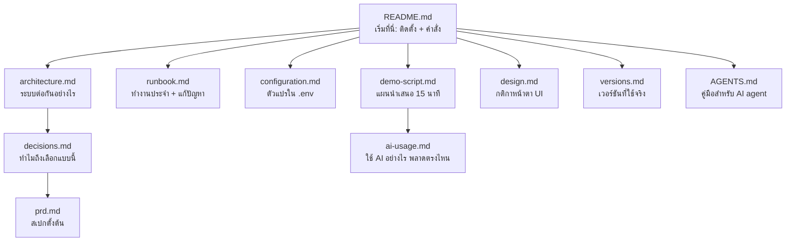

# บท 8 — แผนที่เอกสาร ฉบับอ่านง่าย

เอกสารในโปรเจกต์เขียนให้ "แม่นยำ" มากกว่า "อ่านง่าย" บทนี้สรุปแต่ละไฟล์เป็นภาษาธรรมดา บอกว่าไฟล์นั้นมีไว้ทำอะไร ควรเปิดตอนไหน และใจความสำคัญคืออะไร

## README.md — ประตูหน้าบ้าน

[README.md](../../README.md) บอกว่าโปรเจกต์ทำอะไร ต้องติดตั้งอะไร และมีคำสั่งอะไรบ้าง

- **อ่านเมื่อ**: วันแรกที่เปิดโปรเจกต์ หรือลืมว่าคำสั่งไหนทำอะไร
- **ใจความ**: ต้องมี Node 24, pnpm และ Docker Desktop ขั้นตอนเริ่มคือ `pnpm install` → `cp .env.example .env` → `pnpm dev:up` → `pnpm dev`

## AGENTS.md และ CLAUDE.md — คู่มือสำหรับ AI

[AGENTS.md](../../AGENTS.md) ที่ root และในแต่ละ folder หลัก (เช่น [apps/api](../../apps/api/AGENTS.md), [apps/web](../../apps/web/AGENTS.md)) เขียนให้ AI coding assistant อ่านก่อนแก้โค้ด ส่วน `CLAUDE.md` แค่ import ไฟล์ `AGENTS.md`

- **อ่านเมื่อ**: อยากรู้ "กฎที่อ่านจากโค้ดไม่ออก" เช่น salary ต้องเป็น string, import ต้องลงท้าย `.js`, ห้ามแก้ migration เก่า
- **ใจความ**: คนก็อ่านได้ดีเหมือนกัน เพราะเป็นรายการกับดักที่สั้นที่สุดของแต่ละส่วน

## architecture.md — ระบบต่อกันอย่างไร

[architecture.md](../architecture.md) มีแผนภาพ service, ตารางไฟล์ของ API, endpoint ทั้งหมด, ลำดับขั้นของ request และ data model

- **อ่านเมื่อ**: ต้องอธิบายระบบให้คนอื่นฟัง หรือจะเพิ่ม feature ใหม่
- **ใจความ**: เบราว์เซอร์คุยกับ Next.js ที่เดียว Next.js ส่ง `/api/*` ต่อให้ NestJS ซึ่งเป็น Controller → Service → Prisma และสรุปจุดที่ตั้งใจให้ถูกต้อง (เงิน, วันที่, การแก้ทับกัน, การค้นหา) ซึ่งตรงกับบท 2, 3 และ 6 ของคู่มือนี้

## configuration.md — ตัวแปรใน `.env`

[configuration.md](../configuration.md) อธิบายตัวแปรทั้งหมด

- **อ่านเมื่อ**: ต่อฐานข้อมูลไม่ได้, พอร์ตชน หรือจะเพิ่มตัวแปรใหม่
- **ใจความ**: มีไฟล์เดียวคือ `.env` ที่คัดลอกจาก `.env.example` ตัวหลักคือ `DATABASE_URL` (ฐาน dev) กับ `TEST_DATABASE_URL` (ฐาน test ที่ถูกลบทุกครั้งที่รัน test) ตัวเสริมเช่น `PORT` และ `API_INTERNAL_URL` ซึ่งถูกฝังตอน `next build` เพิ่มตัวแปรใหม่ต้องแก้ไฟล์นี้และ `.env.example` ด้วย

## runbook.md — คู่มือปฏิบัติงาน

[runbook.md](../runbook.md) คือ "ทำอย่างไรเมื่อ..."

- **อ่านเมื่อ**: ตั้งเครื่องครั้งแรก, อยากคืนข้อมูลเป็น 5 records ก่อน demo, รัน test หรือเจอปัญหา
- **ใจความ**: ตั้งเครื่อง → `pnpm dev` → `pnpm db:reset` → คำสั่ง test และตารางปัญหาที่พบบ่อย เช่น พอร์ต 3001 ถูกใช้, ต่อฐานข้อมูลไม่ได้, รหัสผ่านไม่ตรงกับ volume เดิม

## decisions.md — ทำไมถึงเลือกแบบนี้

[decisions.md](../decisions.md) เป็นบันทึกการตัดสินใจ (decision log) แต่ละข้อมีรหัส `D-xx` พร้อมเหตุผล D-01 ถึง D-12 มาจาก PRD ส่วน D-13 ขึ้นไปตัดสินใจระหว่างลงมือทำ กติกาคือ **เพิ่มแถวใหม่เท่านั้น ห้ามแก้แถวเก่า** ถ้าเปลี่ยนใจให้เขียนแถวใหม่ว่าแทนที่ข้อไหน

- **อ่านเมื่อ**: มีคนถามว่า "ทำไมไม่ใช้ X" หรือเห็นโค้ดแปลก ๆ แล้วสงสัย
- **อ่านข้อไหนก่อน**: **D-56** เพราะเป็นข้อที่ทำให้โปรเจกต์หน้าตาเป็นแบบปัจจุบัน และบอกว่าแทนที่ข้อเก่าข้อไหนบ้าง

จัดกลุ่มให้อ่านง่าย

| กลุ่ม | ข้อ | สรุปสั้น ๆ |
| --- | --- | --- |
| ขอบเขต | D-08, D-12, **D-46**, D-52, **D-56** | UI อังกฤษ/เอกสารไทย; ไม่ทำ Redis, K8s; ตัด Login และ AI reports (D-46), ชุด performance test (D-52), แล้วตัด CI/CD, staging และของกันพังที่โจทย์ไม่ได้ขอ (D-56) |
| Stack และเวอร์ชัน | D-01, D-13–D-16, D-47 | Next 16 + Nest 12 + Postgres 17 + Prisma 7; pin เวอร์ชันที่เข้ากันได้จริง; test ใช้ Vitest + SWC |
| ความถูกต้องของข้อมูล | D-04, D-05, D-31, D-32 | เงินเป็น decimal string, วันที่เป็น string, ช่อง Salary format ตอน blur, index แผนก+สถานะ |
| การเขียนพร้อมกันและการลบ | D-06, D-07 (ส่วน `version` + `If-Match`), D-23 | ลบจริงหลังยืนยัน, version + If-Match, รับ `"3"` และ `3` |
| เอกสาร | D-48, D-49 | ลดเนื้อหา PRD ที่ตัดออก และคืนคู่มือ `docs/learn/` |
| ประวัติ (ถูกแทนที่หรือยกเลิก) | D-03, D-09, D-11, D-18, D-24–D-28, D-38–D-40 (ยกเลิกโดย D-46/D-52) และข้อที่ D-56 ระบุว่าแทนที่ เช่น D-10, D-17, D-19, D-20, D-21, D-29, D-30, D-33, D-34, D-41–D-44 | Google OAuth, n8n + Gemini, performance test, Jenkins, staging, rate limit, `@Rule()`, SQL ตรง ๆ, Idempotency-Key ฯลฯ |

## design.md — กติกาหน้าตา UI

[design.md](../design.md) อธิบายว่าทำไม UI หน้าตาเหมือนโปรแกรม ERP/HR ขององค์กร (ตารางแน่น มีเส้นกริดครบ) แทนที่จะเป็น dashboard สำเร็จรูป

- **อ่านเมื่อ**: จะแก้หน้าตาเว็บ
- **ใจความ**
  - สีอยู่ใน `apps/web/src/app/globals.css` เป็นโทนเขียว Chememan สีแดงใช้กับการลบและ error เท่านั้น
  - ฟอนต์ IBM Plex Sans Thai ตระกูลเดียว ตัวเลขใช้ `tabular-nums`
  - ไม่ใช้ของที่ทำให้ดูเป็น template: sidebar ไอคอน, การ์ดลอยมุมโค้ง, badge มีกรอบ, หัวข้อตัวใหญ่, ตัวเลขสรุปตัวโต
  - Accessibility: ทุก input มี label, สถานะไม่พึ่งสีอย่างเดียว, ใช้คีย์บอร์ดได้ครบ

## prd.md — สเปกตั้งต้น

[prd.md](../prd.md) ยาวราว 1,300 บรรทัด เขียนก่อนเริ่มโค้ดเพื่อสั่งงาน AI โค้ดอ้างถึงเป็น `PRD §…` และรหัส `REQ-xx`, `USR-xx`, `AC-xx` หัวไฟล์มีหมายเหตุบอกว่าหัวข้อไหนถูกตัดโดย D-46, D-52 และ D-56

- **อ่านเมื่อ**: อยากรู้ว่าข้อกำหนดเดิมคืออะไร หรือเห็น `PRD §8.3` ในคอมเมนต์แล้วอยากตามไปอ่าน
- **ไม่ต้องอ่านทั้งเล่ม** ใช้ตารางนี้เลือก

| ส่วน | สถานะ | อ่านเพื่อ |
| --- | --- | --- |
| §3–§4 โจทย์และข้อมูล Excel | ใช้อยู่ | รู้ว่าโจทย์ขออะไร และกับดักของข้อมูล (Bob Brown `In Active`, วันที่เดิมต้องคงไว้) |
| §7 Architecture | ใช้อยู่ | ทำไมแยก Next/Nest |
| §8 หน้าจอและ user journey | ใช้อยู่ | หน้า list, create/edit/delete ต้องทำงานอย่างไร |
| §9 Data model และกฎธุรกิจ | ใช้อยู่ | validation, วันเวลา, concurrency, seed |
| §10 API contract | บางส่วน | ใช้ได้เรื่อง endpoint, search/filter/sort และ `If-Match`; envelope, error code, Idempotency-Key และ endpoint departments ถูกตัด (D-56) |
| §11 Authentication | เหลือแค่หัวข้อ (D-46) | — |
| §12 AI report, n8n, Gemini | เหลือแค่หัวข้อ (D-46) | — |
| §13 Environment และคำสั่ง | บางส่วน | `setup`/`doctor` และ health/readiness ถูกตัด (D-56) |
| §14 CI/CD | ประวัติ (D-56) | — |
| §15 Performance | เหลือแค่หัวข้อ (D-52) | — |
| §16 Acceptance criteria | ใช้อยู่ ยกเว้นส่วนที่ผูกกับของที่ตัดออก | รหัส `AC-xx` ที่ test อ้างถึง |

## versions.md — เวอร์ชันที่ใช้จริง

[versions.md](../versions.md) บันทึกเวอร์ชันที่ติดตั้งและรันจริง ไม่ใช่ที่คาดเดา

- **อ่านเมื่อ**: มีคนถามว่าใช้เวอร์ชันอะไร หรือทำไมไม่อัปเกรด
- **ใจความ**: เหตุผลที่ไม่ใช้ `latest` ทุกตัว เช่น TypeScript 5.9.3 (ไม่ใช้ 7 เพราะ `@nestjs/swagger` ยังไม่รองรับ), Prisma 7.10.0 (`latest` เป็น 8.0 RC), ESLint 9 (plugin ของ Next ยังไม่รองรับ 10)

## ai-usage.md — ใช้ AI อย่างไร และ AI พลาดตรงไหน

[ai-usage.md](../ai-usage.md) บันทึกวิธีสั่งงาน AI และปัญหาจริงที่เจอระหว่างพัฒนา พร้อมสาเหตุและวิธีแก้

- **อ่านเมื่อ**: เตรียมตอบคำถามเรื่องการใช้ AI ตอนสัมภาษณ์
- **ใจความ**: ส่ง PRD ให้ AI → ตรวจความเข้ากันของเวอร์ชันก่อน → ทำทีละชิ้นพร้อม test → ให้ test เป็นตัวตัดสิน ไม่ใช่การอ่านโค้ด บางแถวในตารางปัญหาเป็นเรื่องของส่วนที่ตัดออกไปแล้ว ไฟล์ระบุไว้ว่าแถวไหนเป็นประวัติ

## demo-script.md — แผนนำเสนอ 15 นาที

[demo-script.md](../demo-script.md) คือบทนำเสนอ

- **อ่านเมื่อ**: ก่อนวันนำเสนอ
- **ใจความ**: สิ่งที่ต้องเตรียม, ลำดับนำเสนอ (หน้า Employees → CRUD ตามสคริปต์ → เปิดโค้ด → test และการใช้ AI → Q&A), ผลที่ต้องเห็นในแต่ละขั้น, ทางแก้เมื่อมีปัญหาหน้างาน และโจทย์ซ้อม Live Coding ซึ่งบท 2 อธิบายลำดับการแก้ไว้ คำถามที่ควรตอบได้อยู่ในบท 9 พร้อมคำตอบ

ต่อไป: [บท 9 — เตรียมตอบคำถาม](09-qa-prep.md)
