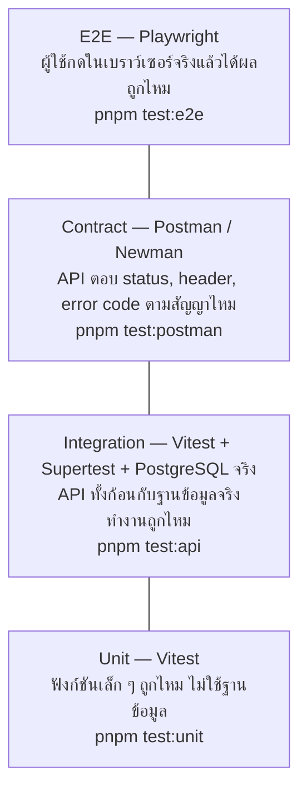
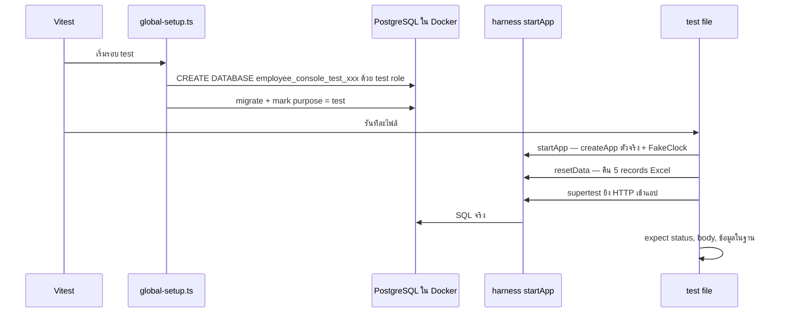

# บท 8 — การทดสอบ

## ภาพรวม: พีระมิดของ test



ยิ่งอยู่ล่าง ยิ่งเร็วและมีจำนวนเยอะ ยิ่งอยู่บน ยิ่งช้าแต่ใกล้ผู้ใช้จริง แต่ละชั้นจับปัญหาคนละแบบ ไม่ได้แทนกัน

| ชั้น | เครื่องมือ | อยู่ที่ | ต้องมี Docker | ตัวอย่างสิ่งที่ตรวจ |
| --- | --- | --- | --- | --- |
| Unit | Vitest | [apps/api/test/unit](../../apps/api/test/unit), `apps/web/src/lib/*.test.ts` | ไม่ | `salaryRule("65000")` ได้ `"65000.00"`, seed map `In Active` เป็น `false`, config ผิดแล้วหยุด |
| Integration | Vitest + Supertest | [apps/api/test/integration](../../apps/api/test/integration) | ใช่ | สร้างได้ ID 106 และวันนี้ตามเวลากรุงเทพ, ส่ง `id` มาใน body โดนปฏิเสธ, 5 คำขอพร้อมกันด้วย key เดียวได้ 1 แถว |
| Contract | Newman (Postman CLI) | [tests/postman](../../tests/postman) | ใช่ | `q=%` ค้นแบบตัวอักษรจริง ไม่ใช่ wildcard, ส่ง salary เป็นตัวเลขได้ `SALARY_TYPE_INVALID` |
| E2E | Playwright | [tests/e2e/specs](../../tests/e2e/specs) | ใช่ | สร้าง → แก้ → ลบ, สองแท็บชนกันได้ 409, วันที่ไม่เลื่อนในหลาย timezone, จอ 375 px ไม่ล้น |

## Unit test — เร็วที่สุด

ทดสอบฟังก์ชันบริสุทธิ์ (pure function) ที่รับค่าแล้วคืนค่า ไม่มีฐานข้อมูล ไม่มี HTTP เพราะกฎของฟิลด์ทุกตัวเขียนเป็น pure function (D-19) จึงทดสอบละเอียดได้ทุกกรณีในเวลาไม่กี่วินาที

```bash
pnpm test:unit
```

## Integration test — API ทั้งก้อนกับ PostgreSQL จริง

ไม่ใช้ฐานข้อมูลจำลอง เพราะพฤติกรรมสำคัญหลายอย่าง (transaction, row lock, unique index, `numeric`, `date`) จำลองไม่ได้



- [global-setup.ts](../../apps/api/test/support/global-setup.ts) สร้างฐานชั่วคราวของรอบนั้น และ `assertTestDatabase` กันไม่ให้รันกับฐาน demo หรือ staging
- [harness.ts](../../apps/api/test/support/harness.ts) เปิดแอปด้วย `createApp()` ตัวเดียวกับของจริง แต่ใส่ `FakeClock` ตรึงเวลาไว้ที่ 2026-10-01 10:00 กรุงเทพ ผลจึงเหมือนเดิมทุกวัน
- ใช้ Vitest + SWC (`unplugin-swc`) ไม่ใช่ esbuild เพราะ Nest DI ต้องใช้ decorator metadata (D-13)

```bash
pnpm dev:up
```

```bash
pnpm test:api
```

## Contract test — Postman / Newman

**Postman** เป็นโปรแกรมยิง API ที่บันทึกชุดคำขอเป็น "collection" ได้ ส่วน **Newman** คือตัวรัน collection นั้นจาก command line ใช้ใน CI ได้

collection ของโปรเจกต์ ([employee-console.postman_collection.json](../../tests/postman/employee-console.postman_collection.json)) แบ่งเป็นกลุ่ม เช่น

- **Health** — live, ready
- **Employees (happy path)** — list, ค้นหา, กรอง, สร้าง Dana Lee, replay ด้วย key เดิม, PATCH ด้วย `If-Match`, no-op
- **Employees (validation & concurrency negatives)** — key ซ้ำแต่ body ต่าง, salary ทศนิยม 3 ตำแหน่ง, ส่ง `id` มาใน body

เปิดไฟล์นี้ในโปรแกรม Postman แล้วเลือก environment `local` ก็กดยิงทีละคำขอเพื่อเรียนรู้ API ได้ ([local.postman_environment.json](../../tests/postman/local.postman_environment.json))

```bash
pnpm test:postman
```

## E2E test — Playwright

**Playwright** เปิดเบราว์เซอร์จริง (Chromium) แล้วคลิก พิมพ์ และตรวจหน้าจอเหมือนผู้ใช้ runner ([scripts/test-e2e.mjs](../../scripts/test-e2e.mjs)) build แอปแบบ production สร้างฐานทดสอบชั่วคราว แล้วเปิด web/API บนพอร์ต 3020/3021

ตัวอย่าง test ใน [employee-crud.spec.ts](../../tests/e2e/specs/employee-crud.spec.ts)

- `seed data: 5 records with all 7 fields; Bob Brown is In Active (AC-01, AC-03, AC-26)`
- `create → edit → delete journey (AC-04, AC-12, AC-13, AC-17)`
- `two tabs editing the same record: the stale tab gets a conflict (AC-16)`
- `lost create response: retry with the same key lands on the same record, no duplicate (AC-20)`

และใน [dates-and-layout.spec.ts](../../tests/e2e/specs/dates-and-layout.spec.ts)

- `dates do not shift in <timezone> (AC-11)`
- `mobile 375px: no page overflow, stacked filters, usable form (AC-35)`
- `keyboard only: focus order, visible focus, checkbox, dialog Escape, submit with Enter (AC-35)`

```bash
pnpm test:e2e
```

เก็บภาพหน้าจอที่ 375 / 1024 / 1440 px ไว้ดูด้วย

```bash
E2E_SCREENSHOT_DIR=./screenshots pnpm test:e2e
```

## รหัส `AC-xx` คืออะไร

`AC` ย่อมาจาก **Acceptance Criteria** คือข้อกำหนดที่ต้องผ่านใน [prd.md](../prd.md) §16 ชื่อ test ทุกชั้นอ้างรหัสนี้ไว้ ทำให้ตอบได้ว่า "ข้อกำหนดข้อนี้ถูกทดสอบที่ไหน" ด้วยการค้นหา เช่น

```bash
grep -rn "AC-16" apps/api/test tests/
```

## ก่อนบอกว่างานเสร็จ

จาก [AGENTS.md](../../AGENTS.md)

```bash
pnpm lint && pnpm typecheck && pnpm test:unit && pnpm build
```

- แก้ API → รัน `pnpm test:api` และ `pnpm openapi:generate` แล้วดูว่า `packages/api-client` ไม่มีอะไรค้าง
- แก้ UI หรือ flow → รัน `pnpm test:e2e`

> **กับดัก**: อย่ารัน `playwright test` หรือ `newman` ตรง ๆ ให้ใช้คำสั่ง `pnpm` เสมอ เพราะ runner เป็นคนสร้างฐานข้อมูลชั่วคราว เปิดแอปบนพอร์ตเฉพาะ และเขียน env ให้ ถ้ารันตรง ๆ อาจไปลบข้อมูลในฐาน dev ([tests/AGENTS.md](../../tests/AGENTS.md))

ต่อไป: [บท 9 — แผนที่เอกสาร](09-docs-guide.md)
