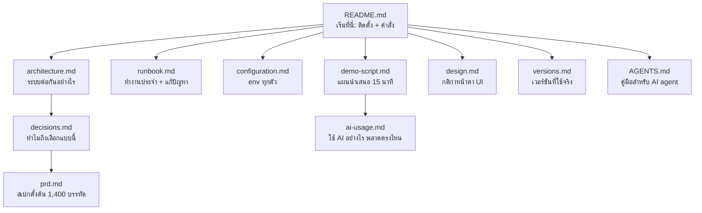

# บท 9 — แผนที่เอกสาร ฉบับอ่านง่าย

เอกสารในโปรเจกต์เขียนให้ "แม่นยำ" มากกว่า "อ่านง่าย" บทนี้สรุปแต่ละไฟล์เป็นภาษาธรรมดา บอกว่าไฟล์นั้นมีไว้ทำอะไร ควรเปิดตอนไหน และใจความสำคัญคืออะไร

## README.md — ประตูหน้าบ้าน

[README.md](../../README.md) บอกว่าโปรเจกต์ทำอะไร ต้องติดตั้งอะไร และมีคำสั่งอะไรบ้าง

- **อ่านเมื่อ**: วันแรกที่เปิดโปรเจกต์ หรือลืมว่าคำสั่งไหนทำอะไร
- **ใจความ**: ต้องมี Node 24, pnpm 12, Docker Desktop (และ Java 17+ ถ้าจะใช้ Jenkins) ขั้นตอนเริ่มคือ `pnpm install` → `pnpm run setup` → `pnpm dev:up` → `pnpm dev` ตาราง "คำสั่งทั้งหมด" คือสารบัญของ `package.json`

## AGENTS.md และ CLAUDE.md — คู่มือสำหรับ AI

[AGENTS.md](../../AGENTS.md) ที่ root และในแต่ละ folder หลัก (`apps/api`, `apps/web`, `packages/api-client`, `tests`, `infra`, `scripts`) เขียนให้ AI coding assistant อ่านก่อนแก้โค้ด ส่วน `CLAUDE.md` แค่ import ไฟล์ `AGENTS.md`

- **อ่านเมื่อ**: อยากรู้ "กฎที่อ่านจากโค้ดไม่ออก" เช่น salary ต้องเป็น string, import ต้องลงท้าย `.js`, ห้ามแก้ migration เก่า
- **ใจความ**: คนก็อ่านได้ดีเหมือนกัน เพราะเป็นรายการกับดักที่สั้นที่สุดของแต่ละส่วน

## architecture.md — ระบบต่อกันอย่างไร

[architecture.md](../architecture.md) มีแผนภาพ service, ตาราง module ของ API, ลำดับขั้นของ request และ data model

- **อ่านเมื่อ**: ต้องอธิบายระบบให้คนอื่นฟัง หรือจะเพิ่ม module ใหม่
- **ใจความ**
  - เบราว์เซอร์คุยกับ Next.js ที่เดียว Next.js ส่ง `/api/*` ต่อให้ NestJS และไม่แตะฐานข้อมูล
  - API แบ่งเป็น module ตามงาน (`employees`, `departments`, `health`, `rate-limit`, `config`, `common`) แต่ละ module มี Controller → Service → Prisma
  - request ผ่าน 6 ขั้น: request ID → security header/ตรวจ JSON → rate limit → validation → service + interceptor → exception filter (ตรงกับภาพในบท 2)
  - ด้านความปลอดภัย: ไม่เปิด CORS, SQL ใช้ parameter ทั้งหมด, log ไม่บันทึก salary หรือ body

## configuration.md — ตัวแปร env ทุกตัว

[configuration.md](../configuration.md) อธิบาย environment variable ทั้งหมดที่ API อ่าน

- **อ่านเมื่อ**: API ไม่ยอม start (`Invalid configuration`) หรือจะเพิ่ม env ใหม่
- **ใจความ**
  - `pnpm run setup` สร้าง `.env` และ `.env.staging` พร้อม secret แบบสุ่มให้เอง ไม่ต้องกรอกอะไร
  - `APP_ENV` (`local`, `staging`, `test`) เป็นตัวคุมว่าคำสั่งอันตรายทำได้หรือไม่
  - `API_INTERNAL_URL` ถูกฝังตอน build เว็บ ถ้าเปลี่ยน `PORT` ต้องเปลี่ยนตัวนี้ด้วย
  - ค่าทุกตัวถูกตรวจด้วย zod ตอน start ผิดแล้วหยุดทันที
  - ห้ามใส่ secret ใน `NEXT_PUBLIC_*` และห้าม commit `.env*` (ยกเว้น `.example`)
- เพิ่ม env ใหม่ต้องแก้สามที่: [app-config.ts](../../apps/api/src/config/app-config.ts), `.env.example` และไฟล์นี้

## runbook.md — คู่มือปฏิบัติงาน

[runbook.md](../runbook.md) คือ "ทำอย่างไรเมื่อ..." มี 6 หัวข้อ

| หัวข้อ | ใช้เมื่อ |
| --- | --- |
| 1–2 ตั้งเครื่อง, Dev | วันแรก, พอร์ตชน |
| 3 Reset ข้อมูล demo | อยากให้ข้อมูลกลับเป็น 5 records ก่อน demo |
| 4 Local staging | deploy, smoke, restart เมื่อแก้ `.env.staging`, rollback, restore backup |
| 5 Jenkins | เปิด Jenkins, login, กด build, อัปเดต plugin |
| 6 ปัญหาที่พบบ่อย | หน้าเว็บ error, API start ไม่ได้, test ล้มเรื่องสิทธิ์ฐานข้อมูล |

ประโยคที่ควรจำ: **rollback ไม่ย้อน schema** เพราะ migration ออกแบบให้ image เก่ายังใช้ได้ ยกเว้น migration ที่ลบตาราง Login/Reports ซึ่งต้อง restore backup

## decisions.md — ทำไมถึงเลือกแบบนี้

[decisions.md](../decisions.md) เป็นบันทึกการตัดสินใจ (decision log) แต่ละข้อมีรหัส `D-xx` พร้อมเหตุผล D-01 ถึง D-12 มาจาก PRD ส่วน D-13 ขึ้นไปตัดสินใจระหว่างลงมือทำ กติกาคือ **เพิ่มแถวใหม่เท่านั้น ห้ามแก้แถวเก่า** ถ้าเปลี่ยนใจให้เขียนแถวใหม่ว่าแทนที่ข้อไหน

- **อ่านเมื่อ**: มีคนถามว่า "ทำไมไม่ใช้ X" หรือเห็นโค้ดแปลก ๆ แล้วสงสัย

จัดกลุ่มให้อ่านง่าย

| กลุ่ม | ข้อ | สรุปสั้น ๆ |
| --- | --- | --- |
| Stack และเวอร์ชัน | D-01, D-13–D-16 | Next 16 + Nest 12 + Postgres 17 + Prisma 7; ไม่ใช้ `latest` ที่เป็น RC หรือยังไม่เข้ากัน; test ใช้ Vitest + SWC |
| ความถูกต้องของข้อมูล | D-02, D-04, D-05, D-19, D-20, D-22, D-31, D-37 | seed ไม่ทับ, เงินเป็น decimal string, วันที่เป็น string, กฎเป็น pure function, SQL ตรง ๆ เพื่อคุมชนิดข้อมูล, ป้ายบอกชนิดฐาน, reset ใน transaction เดียว |
| การเขียนพร้อมกัน | D-06, D-07, D-21, D-23 | ลบจริง + ยืนยันก่อน, version + If-Match, idempotency ใน transaction เดียว |
| ความปลอดภัยและการเดินระบบ | D-17, D-35 (เหตุผลปัจจุบันอยู่ที่ D-50), D-36, D-43, D-45 | rate limit เขียนเอง, trust proxy แค่ hop เดียว, ปิด limiter ได้เฉพาะ test, role ฐานข้อมูลแยก, secret ของ test สุ่มใหม่ทุกครั้ง |
| Delivery และ CI/CD | D-10, D-29, D-30, D-33, D-34, D-41, D-44, D-54 | staging :3100, Jenkins + agent บนเครื่อง, tag = SHA (`-dirty`), readiness ตรวจ migration, `pnpm run setup`, state ของ staging อยู่ใน home, pin plugin ทุกตัว, CI build ครั้งเดียวต่อ run |
| Performance | D-32, D-52 (ยกเลิก D-11) | index แผนก+สถานะ และ trigram index ค้นหาชื่อ อยู่ใน migration แยก; ชุด performance test ถูกตัดออก (D-52) |
| เอกสาร API | D-42, D-53 | OpenAPI อธิบาย envelope และ header ครบ; รายการแผนกมาจาก `DEPARTMENT_IDS` ใน API → enum ใน OpenAPI → `lib/departments.ts` ของเว็บ |
| ขอบเขต | D-08, D-12, **D-46**, D-51, D-55 | UI อังกฤษ/เอกสารไทย; ไม่ทำ Redis, K8s; **D-46 ตัด Login และ AI reports ออก** |
| ยกเลิกแล้วโดย D-46 (อ่านเป็นประวัติ) | D-03, D-09, D-18, D-24–D-28, D-38–D-40 | Google OAuth, session, สิทธิ์ Admin/Viewer, n8n + Gemini |

## design.md — กติกาหน้าตา UI

[design.md](../design.md) อธิบายว่าทำไม UI หน้าตาเหมือนโปรแกรม ERP/HR ขององค์กร (ตารางแน่น มีเส้นกริดครบ) แทนที่จะเป็น dashboard สำเร็จรูป

- **อ่านเมื่อ**: จะแก้หน้าตาเว็บ
- **ใจความ**
  - สีอยู่ใน `apps/web/src/app/globals.css` เป็นโทนเขียว Chememan สีแดงใช้กับการลบและ error เท่านั้น
  - ฟอนต์ IBM Plex Sans Thai ตระกูลเดียว ขนาด 14 px ตาราง 13 px ตัวเลขใช้ `tabular-nums`
  - ไม่ใช้ของที่ทำให้ดูเป็น template: sidebar ไอคอน, การ์ดลอยมุมโค้ง, badge มีกรอบ, หัวข้อตัวใหญ่, gradient
  - Accessibility: ทุก input มี label, สถานะไม่พึ่งสีอย่างเดียว (Active = จุดทึบ, In Active = วงกลวง), ใช้คีย์บอร์ดได้ครบ

## prd.md — สเปกตั้งต้น

[prd.md](../prd.md) ยาวราว 1,400 บรรทัด เขียนก่อนเริ่มโค้ดเพื่อสั่งงาน AI โค้ดอ้างถึงเป็น `PRD §…` และรหัส `REQ-xx`, `USR-xx`, `AC-xx`

- **อ่านเมื่อ**: อยากรู้ว่าข้อกำหนดเดิมคืออะไร หรือเห็น `PRD §9.4` ในคอมเมนต์แล้วอยากตามไปอ่าน
- **ไม่ต้องอ่านทั้งเล่ม** ใช้ตารางนี้เลือก

| ส่วน | สถานะ | อ่านเพื่อ |
| --- | --- | --- |
| §3–§4 โจทย์และข้อมูล Excel | ใช้อยู่ | รู้ว่าโจทย์ขออะไร และกับดักของข้อมูล (Bob Brown `In Active`, วันที่เดิมต้องคงไว้) |
| §7 Architecture | ใช้อยู่ | ทำไมแยก Next/Nest |
| §8 หน้าจอและ user journey | ใช้อยู่ | หน้า list, create/edit/delete ต้องทำงานอย่างไร |
| §9 Data model และกฎธุรกิจ | ใช้อยู่ | validation, วันเวลา, concurrency, seed |
| §10 API contract | ใช้อยู่ (§10.6 เหลือแค่ `DepartmentDto`) | endpoint, error code, idempotency |
| §11 Authentication | เหลือแค่หัวข้อ (D-46) ยกเว้น §11.4 ที่ยังใช้ | §11.4: HTTPS, CORS, rate limit, redact log |
| §12 AI report, n8n, Gemini | เหลือแค่หัวข้อ (D-46) | — |
| §13 Environment และคำสั่ง | ใช้อยู่ (ตัด env ของ auth/AI) | env, health, logging |
| §14 CI/CD | ใช้อยู่ | stage ที่ต้องมีและ rollback policy |
| §15 Performance | เหลือแค่หัวข้อ (D-52) | — |
| §16 Acceptance criteria | ใช้อยู่ ยกเว้น §16.4 (AI, เหลือแค่หัวข้อ) และส่วนสิทธิ์ใน §16.3 | รหัส `AC-xx` ที่ test อ้างถึง |
| §17 แผนสำหรับ AI | ใช้อยู่ | ลำดับงานและข้อปฏิบัติของ AI |

## versions.md — เวอร์ชันที่ใช้จริง

[versions.md](../versions.md) บันทึกเวอร์ชันที่ติดตั้งและรันจริง ไม่ใช่ที่คาดเดา

- **อ่านเมื่อ**: มีคนถามว่าใช้เวอร์ชันอะไร หรือทำไมไม่อัปเกรด
- **ใจความ**: Node 24.21.0, pnpm 12.8.1, TypeScript 5.9.3 (ไม่ใช้ 7 เพราะ `@nestjs/swagger` ยังไม่รองรับ), Prisma 7.10.0 (`latest` เป็น 8.0 RC), ESLint 9 (plugin ของ Next ยังไม่รองรับ 10)

## ai-usage.md — ใช้ AI อย่างไร และ AI พลาดตรงไหน

[ai-usage.md](../ai-usage.md) บันทึกวิธีสั่งงาน AI และปัญหาจริง 21 ข้อที่เจอระหว่างพัฒนา

- **อ่านเมื่อ**: เตรียมตอบคำถามเรื่องการใช้ AI ตอนสัมภาษณ์
- **ใจความ**
  - วิธีทำงาน: ส่ง PRD ทั้งฉบับให้ AI → ตรวจความเข้ากันของเวอร์ชันก่อน → ทำทีละชิ้นพร้อม test → ให้ test เป็นตัวตัดสิน ไม่ใช่การอ่านโค้ด
  - ตัวอย่างที่ AI พลาดแล้ว test จับได้: ช่อง Salary พิมพ์แล้วข้อความต่อท้ายกัน (Playwright จับ), สุ่ม Idempotency-Key ใหม่เมื่อได้ 5xx, เปิด `/api/docs-yaml` โดยไม่ตั้งใจ (reviewer จับ), app role มีสิทธิ์สร้างฐานข้อมูล (reviewer จับ)
  - ข้อ 4, 6, 14, 15 และตัวอย่างใน "สิ่งที่ AI ไม่ได้ทำแทน" เป็นเรื่องของ Login/session/reports ซึ่งถูกตัดออกแล้ว (D-46) อ่านเป็นประวัติ

## demo-script.md — แผนนำเสนอ 15 นาที

[demo-script.md](../demo-script.md) คือบทนำเสนอ

- **อ่านเมื่อ**: ก่อนวันนำเสนอ
- **ใจความ**
  - เตรียมล่วงหน้า: build staging ไว้ก่อน, `pnpm staging:smoke` ต้องผ่าน, reset ให้เหลือ 5 records
  - ลำดับ: เปิดหน้า Employees → ทำ CRUD ตามสคริปต์ → เปิดโค้ด → เล่าเรื่องการใช้ AI → Jenkins (stages, build ครั้งเดียวต่อ run, smoke/rollback) → Q&A
  - มีโจทย์ซ้อม Live Coding สองข้อ (filter Join Date และเพิ่ม validation) ซึ่งบท 2 อธิบายลำดับการแก้ไว้
  - คำถามที่ควรตอบได้ อยู่ในบท 10 พร้อมคำตอบ

## ข้อสังเกต: ร่องรอยของระบบที่ตัดออก

ตอนเขียนคู่มือเคยพบจุดที่ยังพูดถึงระบบที่ตัดออกไปแล้วหรือไม่ตรงกับโค้ด (แถบเมนูใน design.md, ค่า default ของ `TRUST_PROXY`, เหตุผลของ D-35, smoke ข้อ `/internal/...`, ชื่อไฟล์ e2e ที่มีคำว่า admin, mapping 401/403) ตอนนี้แก้ครบแล้วตาม D-50, D-51 และ D-55 ส่วนที่เหลือไว้โดยตั้งใจมีดังนี้

| ที่ | ทำไมยังอยู่ |
| --- | --- |
| [prd.md](../prd.md) หัวข้อ Login/AI reports | เหลือแค่หัวข้อเปล่า เพราะโค้ดและ migration อ้างเลขหัวข้อและรหัส AC อยู่ (D-48) |
| [decisions.md](../decisions.md) แถวที่มีป้าย **ยกเลิก (D-46)** | decision log ห้ามแก้ของเดิม ให้เพิ่มแถวใหม่แทน |
| [ai-usage.md](../ai-usage.md) แถวที่มีป้าย **ประวัติก่อน D-46** | เป็นบันทึกการใช้ AI ระหว่างพัฒนา ไม่ใช่โค้ดที่ยังมีอยู่ |
| migration `20261002000000_perf_indexes` | ชื่อยังมีคำว่า perf แม้ชุด performance test ถูกตัดแล้ว (D-52) แต่ index ยังใช้อยู่ และ migration ที่ apply แล้วเปลี่ยนชื่อไม่ได้ |
| migration `20261001000000_init` | สร้างตาราง `users`, `sessions`, `reports`, `integration_state` และ enum `Role` ไว้ และ migration ที่ apply แล้วห้ามแก้ จึงลบใน `20261003000000_remove_login_and_reports` แทน |

ต่อไป: [บท 10 — เตรียมตอบคำถาม](10-qa-prep.md)
