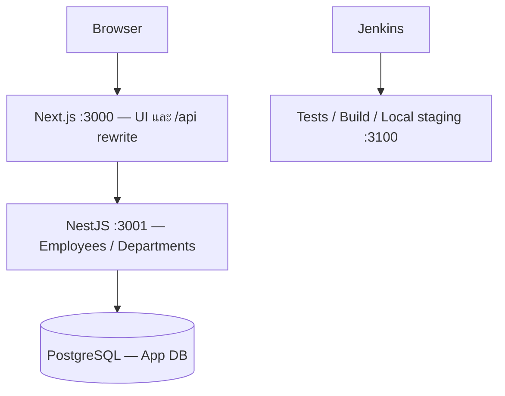

# Employee Console — PRD และ Implementation Specification สำหรับ AI-Augmented Developer Test

จัดทำเมื่อ: 1 ตุลาคม 2026  
ฉบับ: 2.0 — PRD ฉบับตัดสินใจรายละเอียด พร้อม API, Data Model, Acceptance Criteria และ Demo Runbook  
ภาษาอธิบาย: ไทย โดยเก็บข้อความต้นฉบับภาษาอังกฤษและภาษาไทยครบในภาคผนวก  
สถานะ: สเปกสำหรับส่งต่อให้ AI implement; ยังไม่ได้พัฒนาแอปหรืออ้างผลทดสอบระบบ

> **D-46:** ระบบ Login/สิทธิ์ (Admin/Viewer) และ AI reports (n8n + Gemini) ถูกตัดออกจากขอบเขต — §6.5, §10.6 บางส่วน, §11.1–11.3, §11.5, §12, §16.4 และรหัส USR-03, USR-06–08, AC-27–34, M2, M5, D-03, D-09 จึงเหลือแค่หัวข้อ/รหัสพร้อมป้าย “ตัดออกตาม D-46” (คงเลขหัวข้อและรหัสไว้เพราะโค้ดอ้างอยู่) ส่วนที่ยังพูดถึงสองเรื่องนี้ในคำขอเดิม (§1), บริบท JD (§5) และภาคผนวกเป็นประวัติ/ต้นฉบับ ไม่ใช่งานที่ต้องทำ
>
> **D-52:** ชุด performance test (k6, Lighthouse, synthetic seed 10,000 รายการ, `perf:seed`/`perf:run`, `APP_ENV=performance`, Jenkins `RUN_PERF`) ถูกตัดออก — §15, USR-09, AC-56, M6 และ D-11 เหลือแค่หัวข้อ/รหัสพร้อมป้าย “ตัดออกตาม D-52”; index จาก migration `20261002000000_perf_indexes` (trigram บนชื่อ, department+status) ยังอยู่

## 1. วัตถุประสงค์และวิธีใช้เอกสาร

**คำขอของผู้ใช้:** เตรียมเอกสาร Markdown ไฟล์เดียวที่รวมข้อมูลและเอกสารทั้งสามไฟล์อย่างครบถ้วน และอัปเดต stack กับแนวทางที่คุยกัน ได้แก่ Next.js + NestJS + PostgreSQL, Google Login, CI/CD ด้วย Jenkins, Postman, Google AI Studio, n8n, Open WebUI และ performance tuning จากนั้นผู้ใช้มอบหมายให้ผู้จัดทำคิดและตัดสินใจรายละเอียดแทนในรูปแบบ PRD อย่างละเอียด เพื่อส่งต่อให้ AI implement ได้ โดยไม่ต้องกลับมาถามเรื่องการออกแบบที่ตัดสินใจไว้แล้ว

**คำสั่งในเอกสารแนบ:** เป็นโจทย์แบบทดสอบและบริบทการสมัครงานสำหรับอ้างอิง ไม่ใช่คำสั่งให้ AI ที่กำลังรวบรวมเอกสารเริ่มเขียนแอป ติดตั้งเครื่องมือ เผยแพร่ระบบ หรือส่งงานทันที เมื่อจะเริ่มพัฒนา ให้ผู้ใช้ระบุงานรอบถัดไปประกอบเอกสารนี้

เอกสารนี้อ่านได้ด้วยตัวเอง มีทั้งข้อกำหนด ข้อมูล Excel ทุกแถว และข้อความต้นฉบับ ไม่ต้องเปิดไฟล์แนบเดิมเพื่อเข้าใจโจทย์หรือเตรียม seed data อย่างไรก็ตาม Markdown ไม่ได้เก็บรูปแบบหน้าเอกสาร ฟอนต์ หรือโครงสร้างไบนารีของไฟล์ต้นฉบับ

ใช้ป้ายกำกับต่อไปนี้เพื่อป้องกันการสับสน:

| ป้าย | ความหมาย |
| --- | --- |
| **ข้อกำหนดจากโจทย์** | สิ่งที่ระบุใน DOCX หรือชีต `Requirement` ของ XLSX |
| **ขอบเขตเพิ่มเติมจากผู้ใช้** | Stack และฟีเจอร์ที่ผู้ใช้ระบุในการสนทนา ติดตามด้วยรหัส USR-* และแยกจากข้อสอบเดิม |
| **บริบทจาก JD** | คุณสมบัติและความคาดหวังของตำแหน่ง ไม่ถือเป็นฟีเจอร์บังคับของ Test โดยอัตโนมัติ |
| **ข้อมูลต้นฉบับ** | ข้อมูลที่อ่านได้จากไฟล์ โดยไม่เปลี่ยนความหมาย |
| **สเปกที่เลือกใช้ใน PRD** | กฎและแนวทางที่ผู้จัดทำตัดสินใจตามการมอบหมายของผู้ใช้ ใช้เป็น implementation baseline ในส่วน 6–20 ไม่ใช่เกณฑ์เพิ่มเติมจากนายจ้าง |
| **ข้อเสนอแนะจากการสรุปต้นฉบับ** | ส่วน 2–5 ให้บริบทและแนวคิดเดิม; เมื่อมีรายละเอียดเฉพาะในส่วน 6–20 ให้ใช้สเปกนั้น |
| **ข้อมูลภายนอกที่ต้องตั้งค่าจริง** | Credentials, Git remote และวันสัมภาษณ์ ไม่สร้างค่าขึ้นเอง; มีค่าเริ่มต้นด้านเทคนิคและวิธีดำเนินต่อในส่วน 20.2 |

ลำดับการอ่าน: เริ่มส่วน 6 เพื่อเข้าใจขอบเขต → อ่านส่วน 7–12 เพื่อ implement → ส่วน 13–18 สำหรับรัน ทดสอบ ส่งมอบและ demo → ใช้ prompt ส่วน 19 ส่งต่อ AI ส่วน 2–5 และภาคผนวก A–D เป็นแหล่งตรวจสอบกับโจทย์เดิม

| ส่วน | เนื้อหา |
| --- | --- |
| 2–5 | เอกสารต้นทาง ข้อกำหนด REQ-01 ถึง REQ-18 ข้อมูล Excel และบริบท JD |
| 6–7 | ขอบเขตผลิตภัณฑ์ USR-01 ถึง USR-09, personas, stack และ architecture |
| 8–9 | หน้าจอ/UX, schema, validation, วันที่, decimal, concurrency และ seed |
| 10–11 | API contract/DTO/error และ operational safeguards (§11.4) |
| 12 | ตัดออกตาม D-46 |
| 13–15 | Environment/configuration, scripts และ Jenkins/local staging (§15 ตัดออกตาม D-52) |
| 16–18 | 60 acceptance criteria, milestones, deliverables และ demo/runbook |
| 19–20 | Prompt implement, decision register และ inputs ภายนอก |
| 21 | ภาคผนวกต้นฉบับครบทั้งสามไฟล์และค่าตรวจความครบถ้วน |

## 2. แหล่งข้อมูลและขอบเขต

| รหัสแหล่งข้อมูล | ไฟล์ | เนื้อหาที่รวมไว้ |
| --- | --- | --- |
| `JD` | `AI-Augmented Developer JD.pdf` | ข้อความครบ 2 หน้า: ตำแหน่งงาน หน้าที่ คุณสมบัติ ทักษะเสริม และเหตุผลที่ร่วมงาน |
| `EX` | `Exercise Before Interview.docx` | ข้อความครบทั้งภาษาอังกฤษและภาษาไทย รวม 28 ย่อหน้าที่มีเนื้อหา |
| `DATA` | `Test Exam Data.xlsx` → `Example Data` | ช่วง `A1:G6`: หัวตาราง 7 คอลัมน์ และข้อมูล 5 รายการ |
| `FIELD` | `Test Exam Data.xlsx` → `Requirement` | ช่วง `A1:B7`: ข้อกำหนดของแต่ละฟิลด์ 7 รายการ ชีตนี้ไม่มีแถวหัวตารางแยก |
| `USER` | การสนทนาหลังรวมไฟล์ต้นฉบับ | Stack และขอบเขตเพิ่มเติม USR-01 ถึง USR-09 ในส่วน 6.3 และสเปกที่มอบหมายให้ตัดสินใจในส่วน 6–20 |

**ข้อเสนอแนะในการใช้แหล่งข้อมูล:** ใช้ `EX` ร่วมกับ `FIELD` เป็นข้อกำหนดแบบทดสอบ ใช้ `DATA` เป็นข้อมูลตั้งต้น และใช้ `JD` เป็นบริบทประกอบการตัดสินใจ ส่วน 6–20 กำหนดรายละเอียดเพิ่มเติมตามอำนาจที่ผู้ใช้มอบ และต้องไม่ทำให้ข้อกำหนดหลักของโจทย์ตกหล่น หากพบความขัดแย้งที่แก้ไม่ได้ให้รายงานแหล่งที่มาอย่างชัดเจน

## 3. สรุปโจทย์และสิ่งที่ต้องเตรียม

### 3.1 เป้าหมายของ Test — ข้อกำหนดจากโจทย์

สร้าง Web Application สำหรับจัดการข้อมูลจาก Excel ที่แนบมา โดยแสดงความสามารถในการใช้ AI Coding Assistants หรือ Vibe Coding เพื่อออกแบบ พัฒนา และเตรียมระบบให้ใช้งานได้ ผู้สัมภาษณ์ต้องการเห็นวิธีสั่งการ AI เพื่อแก้ปัญหา จัดโครงสร้างโค้ด และจัดการข้อมูล

ข้อมูลตัวอย่างมีลักษณะเป็นข้อมูลพนักงาน โครงการนี้เลือกชื่อ “Employee Console” ตาม PRD ส่วน 6; เป็นชื่อที่ผู้จัดทำเลือก ไม่ใช่ชื่อที่โจทย์กำหนด

### 3.2 ตารางติดตามข้อกำหนด

รหัส `REQ-*` เป็นรหัสที่ผู้จัดทำตั้งขึ้นเพื่อใช้อ้างอิง ไม่ใช่รหัสเดิมจากผู้ว่าจ้าง

| รหัส | ข้อกำหนดจากโจทย์ | แหล่งอ้างอิง | หลักฐานที่ควรแสดงได้ |
| --- | --- | --- | --- |
| REQ-01 | สร้าง Web Application เพื่อจัดการข้อมูลจาก Excel | EX: The Task / รายละเอียดงาน | เปิดแอปและเห็นข้อมูลตั้งต้นจาก DATA |
| REQ-02 | เลือก C# ASP.NET หรือ NodeJS/NestJS | EX: Tech Stack | โค้ดและคำสั่งรันใช้หนึ่งในตัวเลือกที่อนุญาต |
| REQ-03 | แสดงข้อมูลผ่านหน้าจอที่ใช้งานง่าย | EX: Data Listing | ดูข้อมูลจาก Excel ได้อย่างชัดเจน |
| REQ-04 | มีฟังก์ชันค้นหาหรือกรองข้อมูล | EX: Search/Filter | ทดลองค้นหาแล้วรายการเปลี่ยนตามเงื่อนไข |
| REQ-05 | สร้าง อ่าน แก้ไข และลบข้อมูลได้ | EX: CRUD Operations | สาธิตทั้งสี่การทำงานผ่านแอป |
| REQ-06 | ใช้ AI Coding Assistants / Vibe Coding ในการทำงาน | EX: Methodology / วิธีการทำงาน | อธิบายและสาธิตกระบวนการใช้ AI ได้; ฉบับภาษาไทยระบุว่าใช้ในการเขียนโปรแกรมทั้งหมด |
| REQ-07 | ให้ความสำคัญกับ Clean Code, Prompt ที่มีประสิทธิภาพ และโครงสร้างแอปที่ดี | EX: Methodology | อธิบายโครงสร้างและเหตุผลของโค้ดได้ |
| REQ-08 | แอปต้องทำงานได้จริงและพร้อมรันในเครื่องก่อนสัมภาษณ์ | EX: The Run | เริ่มระบบใน Laptop ของผู้สมัครได้ |
| REQ-09 | นำเสนอผลงานภายใน 15 นาที รวม Q&A | EX: The Session | เตรียมการสาธิตและเวลาตอบคำถาม |
| REQ-10 | เตรียมแก้หรือเพิ่มฟีเจอร์สดด้วย AI tools ที่ถนัด | EX: Live Challenge | Environment และโครงสร้างโค้ดพร้อมปรับแก้ |
| REQ-11 | นำ Laptop ส่วนตัวพร้อม AI tools และ Environment ที่ตั้งค่าแล้ว | EX: Requirement | เครื่องพร้อมใช้งานจริงในวันสัมภาษณ์ |
| REQ-12 | ID สร้างโดยระบบอัตโนมัติ | FIELD!A1:B1 | ผู้ใช้ไม่ต้องกำหนด ID สำหรับรายการใหม่ |
| REQ-13 | Name เป็น Free Text input | FIELD!A2:B2 | กรอกชื่อผ่านช่องข้อความ |
| REQ-14 | Department เป็น Dropdown List | FIELD!A3:B3 | เลือกแผนกจากรายการ |
| REQ-15 | Salary เป็นตัวเลขและแสดงรูปแบบ `#,##0.00` | FIELD!A4:B4 | ตัวอย่าง 65000 แสดงเป็น `65,000.00` |
| REQ-16 | Join Date ใช้ Calendar Box Input | FIELD!A5:B5 | เลือกวันที่จากปฏิทินได้ |
| REQ-17 | Status ใช้ Checkbox | FIELD!A6:B6 | เปลี่ยนสถานะผ่าน Checkbox |
| REQ-18 | Last Updated Date ให้ระบบประทับวันที่อัตโนมัติ | FIELD!A7:B7 | วันที่ถูกกำหนดโดยระบบตามเหตุการณ์ที่ตกลงไว้ |

คอลัมน์ “หลักฐานที่ควรแสดงได้” เป็นการแปลงข้อกำหนดให้ตรวจสอบได้ ไม่ใช่การอ้างว่ามีเกณฑ์ให้คะแนนอย่างเป็นทางการ ต้นฉบับไม่ได้ระบุน้ำหนักคะแนน

### 3.3 สิ่งที่ไม่ได้กำหนดเป็นข้อบังคับใน Test

**ต้นฉบับ Test ไม่ระบุ:** Frontend framework, ฐานข้อมูล, ORM, เวอร์ชัน runtime, ช่องทางส่งงาน, deadline, วันสัมภาษณ์, public repository, สไลด์, automated tests และบริการ cloud ที่ต้องใช้

**สถานะล่าสุดจากผู้ใช้:** เลือก Next.js + NestJS + PostgreSQL และขอบเขตเสริมตามส่วน 6 แล้ว จึงไม่ต้องถามให้เลือกระหว่าง C# กับ NodeJS ใหม่ ส่วน Prisma และเครื่องมือเสริมได้รับการเลือกเป็น baseline ภายใต้การมอบหมายให้จัดทำ PRD แล้วในส่วน 7

คำว่า “deploy” ปรากฏในวัตถุประสงค์ แต่เงื่อนไขการนำเสนอที่ระบุชัดคือรันแอปในเครื่องได้ ไม่มีข้อกำหนดชัดเจนให้มี public URL หรือ cloud deployment

การอัปโหลด Excel ผ่านหน้าจอ การ export กลับเป็น Excel ระบบ login/roles, dashboard, pagination, audit log, CI/CD และ LLM chatbot ไม่ได้ถูกระบุเป็นฟีเจอร์บังคับจากนายจ้าง การใช้ AI ช่วยเขียนโค้ดไม่ได้แปลว่าตัวแอปต้องเรียก LLM API อย่างไรก็ตาม ผู้ใช้เพิ่ม CI/CD ไว้ในขอบเขตโครงการนี้แล้ว จึงติดตามแยกใน USR-* โดยไม่แก้ความหมายของต้นฉบับ

## 4. ข้อมูลและข้อกำหนดจาก Excel

### 4.1 หลักการคงข้อมูลต้นฉบับ

ตารางข้อมูลครบทั้งสองชีตอยู่ใน **ภาคผนวก C** พร้อม JSON สำหรับนำไปใช้ตั้งต้นการพัฒนา ข้อมูลมี 5 รายการ รหัส 101–105 และ 7 คอลัมน์ ไม่มีสูตรในเซลล์ที่มีข้อมูล

วันที่ในตาราง Markdown และ JSON แปลงเป็น `YYYY-MM-DD` เพื่อให้อ่านได้ไม่กำกวม โดยคงวัน เดือน และปีตาม Excel เดิม รูปแบบแสดงวันที่ใน Excel คือ `[$-409]d\-mmm\-yy;@` เช่น 15-Jan-23 จึงไม่ได้หมายความว่าค่าในเซลล์เป็นข้อความหรือว่าปีถูกเก็บไว้เพียงสองหลัก

จำนวนเงินต้นฉบับเป็นตัวเลข และใช้รูปแบบ `#,##0.00` ไม่มีข้อมูลระบุสกุลเงิน จึงไม่ควรเติม `THB`, `USD` หรือสัญลักษณ์เงินเป็นข้อเท็จจริง

### 4.2 Data dictionary

ตารางนี้สรุปจากต้นฉบับและแนวคิดประกอบ สำหรับชนิดข้อมูลและกฎที่ตัดสินใจใช้จริงให้ยึดส่วน 9

| ฟิลด์ต้นฉบับ | ลักษณะข้อมูลที่พบ | ข้อกำหนดจริง | ข้อเสนอแนะสำหรับพัฒนา |
| --- | --- | --- | --- |
| ID | จำนวนเต็ม 101–105 | System auto generated | ใช้ตัวสร้าง ID ของฐานข้อมูลหรือกลไกที่ไม่ซ้ำ; เก็บ ID เดิมตอน seed และตั้งตัวสร้าง ID ไม่ให้ชน |
| Name | ข้อความชื่อบุคคล | Free Text input | ช่องข้อความ; trim ช่องว่างหัวท้าย; เสนอให้ห้ามค่าว่างโดยบันทึกว่าเป็น validation เพิ่มเติม |
| Department | Engineering, Marketing, Sales, HR | Dropdown List | ใช้สี่ค่านี้เป็นตัวเลือกเริ่มต้น; ยังไม่มี master list จากนายจ้าง |
| Salary | ตัวเลข 45000–72000 | Numbering with format #,##0.00 | เก็บเป็น decimal หรือ representation ที่ควบคุมทศนิยมได้; แยกค่าจริงจากข้อความแสดงผล |
| Join Date | วันที่ ไม่มีเวลาธุรกิจระบุ | Calendar Box Input | เก็บเป็น date-only และใช้ Date Picker; อย่าให้ timezone ทำให้วันเลื่อน |
| Status | `Active` 4 รายการ และ `In Active` 1 รายการ | Checkbox | เสนอ mapping: ติ๊ก = Active, ไม่ติ๊ก = In Active; ต้องระบุว่าเป็นการตีความ |
| Last Updated Date | วันที่เดิมของแต่ละรายการ | System auto stamped date | ให้ server กำหนดเมื่อบันทึกสำเร็จ; ผู้ใช้เห็นแบบอ่านอย่างเดียว; รายละเอียดเหตุการณ์ดูส่วน 9.4 |

### 4.3 จุดสำคัญที่ AI ต้องไม่ทำข้อมูลผิด

1. Bob Brown (ID 104) มีค่า Status เป็น **`In Active`** ซึ่งมีช่องว่าง ต้องเก็บต้นฉบับนี้ไว้ในการนำเข้า หากภายในใช้ `false` หรือ `inactive` ต้องอธิบาย mapping ให้ชัดเจน
2. อย่าใช้ `Boolean(statusString)` ตรง ๆ เพราะทั้ง `Active` และ `In Active` เป็นข้อความที่ไม่ว่างและจะถูกตีความเป็น true ในบางภาษา
3. คง ID และวันที่แก้ไขเดิมของทั้ง 5 รายการตอนนำเข้าข้อมูลตั้งต้น แยกการ import/seed ออกจากการสร้างข้อมูลใหม่ตามปกติ
4. `Last Updated Date` ในไฟล์เป็นข้อมูลตั้งต้น ไม่ควรถูกแทนทั้งหมดด้วยวันที่ที่เปิดแอปหรือวันที่ปัจจุบันโดยอัตโนมัติ
5. รูปแบบ `65,000.00` เป็นรูปแบบแสดงผล ค่า Salary ที่ใช้คำนวณควรเป็นตัวเลขที่ไม่ปน comma หรือสัญลักษณ์เงิน
6. ชีต `Requirement` เริ่มข้อกำหนดที่แถว 1 โดยตรง การอ่านแบบถือว่าแถวแรกเป็น header จะทำให้ข้อกำหนด ID หายไป

### 4.4 ค่าตรวจสอบข้อมูลตั้งต้น — คำนวณจาก DATA ไม่ใช่ฟีเจอร์บังคับ

| รายการตรวจสอบ | ค่าที่ควรได้ |
| --- | --- |
| จำนวนรายการ | 5 |
| จำนวนฟิลด์ต่อรายการ | 7 |
| ID ตามลำดับเดิม | 101, 102, 103, 104, 105 |
| จำนวนแผนกไม่ซ้ำ | 4 |
| จำนวน Active / In Active | 4 / 1 |
| ผลรวม Salary | 290,000.00 |
| Join Date ต่ำสุด / สูงสุด | 2022-11-10 / 2024-06-01 |
| Last Updated Date ต่ำสุด / สูงสุด | 2025-12-05 / 2026-04-20 |

## 5. บริบทจาก Job Description

ส่วนนี้สรุปเพื่อช่วยเตรียมการนำเสนอ รายละเอียดต้นฉบับครบทุกข้ออยู่ในภาคผนวก A

| ประเด็น | บริบทจาก JD |
| --- | --- |
| ตำแหน่ง | Full-Stack AI-Augmented Developer |
| แนวทางทำงาน | Orchestrate AI ไม่ใช่เพียงเขียนโค้ด ใช้ AI coding assistants เพื่อ prototype, build, deploy และแก้ user pain points |
| ตัวอย่าง AI tools | Claude Code, Claude Cowork, GitHub Copilot, Cursor |
| หน้าที่หลัก | AI-driven development และ refactoring; frontend/backend; system/database design; SDLC และ CI/CD; ทำงานข้ามทีม; debug, optimize และ support |
| Technical stack | C# .NET, Node.js/NestJS และ Python |
| ฐานข้อมูล | SQL Server และ PostgreSQL |
| เครื่องมือ | Visual Studio / VS Code, Postman, GitLab, Jenkins |
| คุณสมบัติ | ปริญญาตรีหรือโท Computer Engineering, Computer Science, IT หรือสาขาที่เกี่ยวข้อง; อายุไม่เกิน 30 ปี; ความสามารถใช้ AI coding agents; พื้นฐาน architecture, data structures, algorithms และ secure coding |
| ทักษะเสริม | Google AI Studio, n8n, Open Web UI; การเชื่อม LLM APIs เช่น OpenAI/Anthropic; UI/UX; browser/backend performance tuning |
| สภาพแวดล้อมการทำงานที่ระบุ | เน้น AI-human collaboration, มีโอกาสปรับวิธีพัฒนาภายใน และให้คุณค่ากับประสิทธิภาพ ความคิดสร้างสรรค์ และการแก้ปัญหาซับซ้อน |

**ความต่างภายใน JD ที่ควรเก็บไว้:** บรรทัดต้นเอกสารเขียน “At least 1-2 Years of Experience in Web Development” แต่หัวข้อ Required Qualifications เขียน “Minimum 2+ years of experience in professional web development.” เอกสารนี้เก็บทั้งสองข้อความไว้โดยไม่สรุปแทนว่าเกณฑ์ที่แน่นอนคือข้อใด

**ข้อเสนอแนะ:** ใช้บริบท JD เตรียมอธิบายการเลือก stack, การออกแบบข้อมูล, คุณภาพโค้ด, การตรวจงานที่ AI สร้าง และการแก้ปัญหาจริง แต่ไม่ต้องนำทุกเทคโนโลยีใน JD มาใส่ใน Test โดยเฉพาะ Python ไม่ได้เป็นตัวเลือกหลักที่โจทย์ Test ระบุไว้

## 6. Product Requirements Document — ขอบเขตและการตัดสินใจ

### 6.1 อำนาจในการตัดสินใจและวิธีอ่าน

ผู้ใช้มอบหมายให้ผู้จัดทำตัดสินใจรายละเอียดแทนเพื่อให้ AI นำไป implement ได้ ดังนั้นส่วน 6–20 เป็น **สเปกที่เลือกใช้สำหรับโครงการนี้** ไม่ใช่เพียงรายการทางเลือก และไม่ใช่ข้อกำหนดที่นายจ้างเขียนเพิ่ม การเปลี่ยนสเปกภายหลังให้บันทึกเหตุผลใน decision log ไม่ถามผู้ใช้ซ้ำเรื่องที่ตัดสินใจไว้แล้ว

ใช้ส่วน 3 และภาคผนวกเป็นหลักฐานโจทย์เดิม ใช้ส่วน 6–20 สำหรับรายละเอียดการทำงาน ช่องว่างทางเทคนิคเล็กน้อยให้ AI เลือกวิธีที่สอดคล้องกับสเปกและบันทึกไว้ ข้อมูลภายนอก เช่น credentials ไม่ให้แต่งขึ้น การร่าง PRD ครั้งนี้ยังไม่ได้ implement หรืออนุญาตให้เผยแพร่ระบบสู่สาธารณะ

### 6.2 เป้าหมายผลิตภัณฑ์

ชื่อโครงการ: **Employee Console** — เว็บจัดการข้อมูลพนักงาน

ผลลัพธ์ที่ต้องการ:

1. ผู้ใช้ตรวจ ค้นหา เพิ่ม แก้ไข และลบข้อมูลตาม Excel ได้โดยไม่แก้ไฟล์ด้วยมือ
2. ผู้สมัครอธิบายการออกแบบ วิธีใช้ AI และผลตรวจสอบได้ รวมทั้งแก้ฟีเจอร์เล็ก ๆ สดได้
3. ระบบตั้งขึ้นใหม่ในเครื่องได้จาก README และ seed ที่เชื่อถือได้
4. มีหลักฐานว่า CI/CD ทำงานจริงตามที่กล่าวอ้าง

### 6.3 ขอบเขตจากผู้ใช้และสถานะเป้าหมาย

| รหัส | สิ่งที่ผู้ใช้เลือก | ผลงานที่ต้องมีในฉบับสมบูรณ์ |
| --- | --- | --- |
| USR-01 | Next.js + NestJS | UI ใน Next.js และ API/business logic ใน NestJS |
| USR-02 | PostgreSQL | Persistent storage, migrations, seed และ reset ที่แยกจากการรันปกติ |
| USR-03 | Google Login | ตัดออกตาม D-46 |
| USR-04 | Postman | Collection/environment template และผล Newman ที่รันได้ |
| USR-05 | CI/CD + Jenkins | Jenkinsfile, pipeline ที่รันจริง และ deploy ไป local staging |
| USR-06 | Google AI Studio | ตัดออกตาม D-46 |
| USR-07 | n8n | ตัดออกตาม D-46 |
| USR-08 | Open WebUI | ตัดออกตาม D-46 |
| USR-09 | Performance tuning | ตัดออกตาม D-52 |

### 6.4 ระดับความสำคัญ

| ระดับ | สิ่งที่ต้องทำ | ความหมาย |
| --- | --- | --- |
| P0 — Core | ข้อมูลเดิม, CRUD, search/filter, input 7 ฟิลด์, validation, tests หลัก และ local startup | ต้องผ่านก่อนเริ่ม polishing งานเสริม |
| P1 — Delivery | Docker, OpenAPI/Postman และ Jenkins/local staging | ต้องมีเพื่อถือว่าขอบเขตโครงการฉบับสมบูรณ์ครบ |
| P2 — AI workspace | ตัดออกตาม D-46 | — |

P0/P1/P2 เป็นลำดับงาน ไม่ใช่การยกเลิกฟีเจอร์ หากหมดเวลาหรือ credentials ยังไม่พร้อม ให้รายงานสิ่งที่ผ่านและค้างแยกกัน ห้ามบอกว่าโครงการเสร็จทั้งหมดเมื่อ USR-* ยังไม่ครบ

ไม่รวมในรุ่นนี้: ระบบเงินเดือนจริง, การจ่ายเงิน, attendance, multi-tenant, employee self-service, bulk import/export, สร้างแผนกผ่าน UI, password login, user-management UI, AI แก้ข้อมูล, chatbot ในหน้าพนักงาน, microservices, Kubernetes, vector database หรือ public cloud deployment

### 6.5 Personas และสิทธิ์ที่เลือก

ตัดออกตาม D-46 — ไม่มี role ทุกคนที่เข้าเว็บได้ใช้งานเต็มสิทธิ์ ไม่มี tenant และข้อมูลพนักงานเป็นชุดกลางร่วมกัน

## 7. Architecture และเทคโนโลยีที่เลือก

### 7.1 Baseline ทางเทคนิค

| ส่วน | การตัดสินใจ |
| --- | --- |
| Runtime | Node.js 24 LTS โดยเลือก patch ที่รองรับ tooling ทั้งหมดและไม่ต่ำกว่า 24.15; pin ในไฟล์ runtime และ Docker |
| Package manager | pnpm รุ่น stable ที่เข้ากับ Node 24; pin exact version ใน packageManager และ commit lockfile |
| Frontend | Next.js 16 App Router + TypeScript strict; ใช้ React รุ่นที่ Next.js รองรับ |
| UI | Tailwind CSS + shadcn/ui; light theme; ใช้ component เท่าที่จำเป็น |
| Forms/client state | React Hook Form + Zod; TanStack Query สำหรับ server state; URL เก็บ search/filter/page |
| Backend | NestJS 12 + Express adapter + TypeScript; ESM/NodeNext ให้สอดคล้องกับ dependencies |
| Database | PostgreSQL 17; timezone ของ connection เป็น UTC |
| ORM | Prisma ORM 7 และ pg adapter; ใช้ migrations ไม่ใช้ db push เป็น release workflow |
| API validation | Nest ValidationPipe + DTO validation; whitelist และ reject unknown properties; ไม่เปลี่ยน string เป็น boolean อัตโนมัติ |
| Tests | Jest/Supertest ฝั่ง API, Playwright ฝั่ง browser และ Newman สำหรับ Postman |
| Tool services | Jenkins LTS; pin version/digest หลังทดสอบจริง ไม่ใช้ floating latest ใน delivery |

เวอร์ชันข้างต้นเป็น baseline ของ PRD ไม่ใช่ผลติดตั้งจริง ให้ทำ compatibility spike ก่อนสร้างฟีเจอร์ หาก release ที่ระบุหาไม่ได้หรือไม่เข้ากัน ให้เลือก stable ที่รองรับใกล้เคียงที่สุด บันทึก version/reason และ smoke test โดยไม่ถามผู้ใช้เรื่อง patch version ต้องได้ lockfile และไฟล์ `docs/versions.md` ที่ระบุสิ่งที่รันจริง

พื้นฐานที่ตรวจจากเอกสาร: Next.js ใช้ App Router; Nest รุ่นใหม่มีข้อกำหนด ESM/runtime; Prisma 7 รองรับ Node 24 จึงเลือก runtime/module strategy ร่วมกัน [Next.js installation](https://nextjs.org/docs/app/getting-started/installation), [Nest migration guide](https://docs.nestjs.com/migration-guide), [Prisma requirements](https://www.prisma.io/docs/orm/reference/system-requirements)

### 7.2 Service boundaries



- Browser เรียก `/api/v1/*` บน origin ของ Next.js; rewrite/proxy ไป NestJS คง path
- Next.js ไม่เชื่อม PostgreSQL และไม่ทำ CRUD ผ่าน Server Actions อีกชุด
- NestJS ตรวจ input และ concurrency จากทุก caller
- UI อ่านข้อมูลผ่าน TanStack Query; API response ข้อมูลผู้ใช้เป็น `Cache-Control: no-store`; ไม่มี shared cache ของ Salary
- โมดูล API: Employees, Departments, Health, Config
- ใช้ Controller → Service → Prisma; ไม่ต้องทำ generic repository หรือแยก microservices
- Prisma migrations รวม index/constraint ที่ Prisma schema แสดงไม่ได้ผ่าน SQL migration

### 7.3 โครงสร้าง repository

```text
apps/web/                      # Next.js
apps/api/src/                  # Nest modules
apps/api/prisma/               # schema, migrations, seed
packages/api-client/           # Types/client ที่ generate จาก OpenAPI
tests/e2e/                     # Playwright
postman/                       # collection + environment templates
infra/                        # Dockerfiles, Compose, Jenkins agent setup
scripts/                      # doctor, bootstrap, reset, smoke, deploy
docs/                         # architecture, decisions, evidence, runbook
compose.yaml
compose.staging.yaml
Jenkinsfile
pnpm-workspace.yaml
pnpm-lock.yaml
.env.example
README.md
```

## 8. User journeys และหน้าจอ

### 8.1 UI conventions

UI ใช้ภาษาอังกฤษเพื่อสอดคล้องกับ field ต้นฉบับ; README และ demo notes ใช้ภาษาไทย ไม่มี language switch ในรุ่นนี้ ใช้วันที่ `dd MMM yyyy` และปี ค.ศ.; API ใช้ ISO dates เงินแสดง `#,##0.00` โดยไม่มีสกุลเงิน

Desktop เป็นหลัก รองรับความกว้าง 375 px ถึง 1440 px: filter/form เรียงแนวตั้งบนมือถือ ตารางเลื่อนแนวนอนได้ มี label ทุก input, focus ที่เห็นได้, ใช้คีย์บอร์ดได้ และไม่สื่อสถานะด้วยสีอย่างเดียว แผนกเป็น select, Status เป็น checkbox, Join Date เป็น calendar/date input ที่กรอกด้วยคีย์บอร์ดได้

### 8.2 Routes และสิ่งที่ต้องเห็น

| Route | ผู้ใช้ | รายละเอียด |
| --- | --- | --- |
| `/` | ทุกคน | Redirect ไป `/employees` |
| `/employees` | ทุกคน | ตาราง, search, Department/Status filters, clear filters, pagination, summary จำนวนตรงเงื่อนไข |
| `/employees/new` | ทุกคน | ฟอร์มสร้าง ไม่มี input ให้แก้ ID หรือ Last Updated Date |
| `/employees/[id]` | ทุกคน | รายละเอียด; มี Edit/Delete |
| `/employees/[id]/edit` | ทุกคน | ฟอร์มที่โหลดค่าล่าสุด มี ID/Last Updated Date แบบ read-only และ Cancel/Save |

Sidebar/navbar มี Employees; ไม่ฝัง Jenkins ในหน้าแอปหรือแสดง internal URL

### 8.3 หน้ารายการพนักงาน

ลำดับคอลัมน์: ID, Name, Department, Salary, Join Date, Status, Last Updated Date, Actions; แสดง Status เป็น `Active` หรือ `In Active` ตามต้นฉบับ

- เริ่มต้น sort `id asc`, page 1, pageSize 20; ตัวเลือกขนาดหน้า 10/20/50
- Search ชื่ออย่างเดียว แบบ contains ไม่สนตัวพิมพ์ trim หัวท้าย; debounce 300 ms
- Department: All/Engineering/Marketing/Sales/HR; Status: All/Active/In Active
- Search และ filters ทำงานร่วมกันด้วย AND; เปลี่ยนเงื่อนไข/sort/pageSize แล้วกลับ page 1
- เก็บสถานะใน URL; reload/back/forward ต้องคืนเงื่อนไขได้
- ใช้ stable secondary sort ด้วย ID ascending เมื่อค่าฟิลด์หลักเท่ากัน
- แสดงจำนวนผลลัพธ์ที่ผ่าน filter และช่วงรายการที่แสดง; ตัวเลขนี้ไม่ใช่ผล AI
- หลังแก้ไข refresh query/detail; ถ้ารายการไม่เข้า filter ใหม่ ให้หายจากผลตามจริงพร้อม success toast
- หลังลบรายการสุดท้ายของหน้า ให้ย้อนหน้าที่มีข้อมูลและโหลดใหม่
- ขณะ refetch แสดงข้อมูลเก่าพร้อม loading indicator โดยไม่เปิด mutation ซ้ำ; latest request ชนะคำตอบเก่า

### 8.4 Create/Edit/Delete journeys

**Create:** ผู้ใช้เปิดฟอร์ม → กรอก Name, Department, Salary, Join Date, Active checkbox → ตรวจ client → Save → server ตรวจซ้ำ → สร้างรายการ → toast และไปหน้ารายละเอียด ID ใหม่ ไม่ให้ double click สร้างซ้ำด้วย pending state และ idempotency key

ค่าเริ่มต้นฟอร์ม: Name/Department/Salary/Join Date ว่าง, Status ติ๊ก Active; ID/Last Updated Date แสดง “Assigned on save” เมื่อสร้าง ไม่ใช้วันที่วันนี้เป็น Join Date อัตโนมัติ

**Edit:** โหลดรายการพร้อม version → แก้ข้อมูล → Save → ถ้าเปลี่ยนจริงเพิ่ม version และวันที่แก้ไข; ถ้าค่าเดิมทุกฟิลด์หลัง normalize ไม่เขียน DB และไม่เปลี่ยนวันที่ กรณี version เก่าให้แสดง conflict พร้อมปุ่ม Reload latest ห้ามเขียนทับงานคนอื่นเงียบ ๆ

เมื่อออกจากฟอร์มที่มี unsaved changes ให้ยืนยันการทิ้งข้อมูลใน navigation ที่แอปควบคุมและใช้ browser beforeunload เมื่อรองรับ ไม่อ้างว่าป้องกันได้ทุกกรณีบนมือถือ

**Delete:** modal ระบุชื่อและ ID พร้อมคำว่า “This action cannot be undone.” → ยืนยัน → hard delete เฉพาะ record นั้น → กลับรายการ ไม่มี bulk delete และไม่มี recycle bin ในรุ่นนี้ In Active เป็นสถานะการทำงาน ไม่ใช่ soft delete

### 8.5 Common states และข้อความตัวอย่าง

| เหตุการณ์ | พฤติกรรม/ข้อความ |
| --- | --- |
| โหลดครั้งแรก | Skeleton ที่คง layout |
| ไม่มีข้อมูลทั้งหมด | “No employees yet.” และ Add employee |
| ไม่พบตาม filter | “No matching employees.” พร้อม Clear filters |
| Save สำเร็จ | “Employee created.” / “Employee updated.” |
| Save แบบ no-op | “No changes to save.” |
| Validation | Error ใต้ช่องและ focus ช่องแรกที่ผิด; ค่าที่กรอกไม่หาย |
| Not found | หน้า record unavailable พร้อม Back to employees |
| Conflict | “This employee was changed by another user. Reload the latest version.” |
| Network/5xx | ข้อความลองใหม่และ request ID; ไม่แสดง stack trace; mutation timeout ต้องตรวจผลก่อนส่งใหม่ |

## 9. Data model และกฎธุรกิจที่ตัดสินใจแล้ว

### 9.1 Employee schema

ใช้ SQL snake_case และ API camelCase Prisma map ชื่อให้ตรงกัน Fields `version`, `created_at`, `updated_at` เป็นข้อมูลภายในที่เพิ่มสำหรับระบบ ไม่ใช่คอลัมน์ Excel

| SQL / API | Type | Constraints / behavior |
| --- | --- | --- |
| `id` / `id` | integer identity | PK; server generated; seed 101–105; sequence ปรับตาม max ID ไม่ใช้ max+1 ใน request |
| `name` / `name` | varchar(100) | NOT NULL; trim/NFC; 1–100 Unicode code points; ไม่ห้ามชื่อซ้ำหรืออักษรไทย |
| `department_id` / `departmentId` | varchar(20) FK | NOT NULL; ต้องอยู่ใน departments |
| `salary` / `salary` | numeric(12,2) | NOT NULL; 0 ถึง 9,999,999,999.99; API เป็น decimal string |
| `join_date` / `joinDate` | date | NOT NULL; 1900-01-01 ถึง 2100-12-31; อนุญาตวันอนาคตในช่วงนี้ |
| `is_active` / `isActive` | boolean | NOT NULL; true = Active, false = In Active; default true |
| `last_updated_date` / `lastUpdatedDate` | date | NOT NULL; date ธุรกิจตาม Asia/Bangkok; system managed |
| `version` / `version` | integer | NOT NULL default 1; ใช้ optimistic concurrency; เพิ่มเมื่อข้อมูลเปลี่ยนจริง |
| `created_at` / ไม่แสดงใน Employee DTO | timestamptz | เวลา insert ของระบบ UTC; seed เป็นเวลานำเข้า ไม่แต่งว่าเป็น Join Date |
| `updated_at` / ไม่แสดงใน Employee DTO | timestamptz | เวลาที่เปลี่ยนข้อมูลในระบบ UTC; ไม่ใช้แทนวันที่ต้นฉบับ |

Salary เก็บด้วย exact decimal และ serialize เป็น string เช่น `"65000.00"` เพื่อไม่เสีย precision ระหว่าง JSON/JavaScript; seed JSON ภาคผนวกเป็น source representation จึงยังเป็น number ต้องแปลงอย่างชัดเจนก่อน insert [PostgreSQL numeric types](https://www.postgresql.org/docs/17/datatype-numeric.html), [Prisma special types](https://www.prisma.io/docs/orm/prisma-client/special-fields-and-types)

### 9.2 Departments และตารางประกอบ

| departmentId | ชื่อแสดงผล | sortOrder |
| --- | --- | --- |
| engineering | Engineering | 1 |
| marketing | Marketing | 2 |
| sales | Sales | 3 |
| hr | HR | 4 |

ไม่มี UI/API เพิ่มหรือแก้แผนกในรุ่นนี้ FK ป้องกันค่าที่ไม่มีจริง

| Table | Fields สำคัญ / constraints |
| --- | --- |
| departments | id PK, name unique, sort_order; seed คงที่ 4 ค่า |
| idempotency_keys | scope, key UUID, request_hash, response_status/body, created_at, expires_at; unique(scope, key); keys เก็บ 24 ชั่วโมง |

Foreign-key policy: employees.department_id เป็น RESTRICT

### 9.3 Validation และ normalization

| Field | รับได้ | ปฏิเสธ |
| --- | --- | --- |
| Name | Unicode letters, spaces, punctuation ตามชื่อจริง; trim หัวท้ายและ normalize NFC | ว่าง/whitespace ล้วน, control characters, CR/LF, เกิน 100 code points |
| Department | ID หนึ่งใน 4 ค่า | ค่าว่าง, label แทน ID, ID ไม่รู้จัก |
| Salary API | String ตัวเลขฐานสิบไม่ติดลบ มี 0–2 ทศนิยม; normalize เป็น 2 หลัก | JSON number, comma, currency, exponent, NaN, ค่าติดลบ, ทศนิยมเกิน 2 หรือเกิน max |
| Salary UI | กรอกเลขและจุด; blur แสดง comma/2 หลัก; แปลงค่าที่จัดรูปแบบกลับเป็น canonical string ก่อนส่ง | `65000.999` ต้องแจ้ง error ไม่ปัดเงียบ ๆ |
| Join Date | ISO YYYY-MM-DD และเป็นวันจริงในช่วงที่กำหนด | วันที่อย่าง 2026-02-30, datetime แทน date, รูปแบบกำกวม |
| isActive | JSON boolean true/false | `"false"`, 0, 1 หรือ null |
| Automatic fields | อ่านได้ตาม DTO | ส่ง id, lastUpdatedDate, timestamps หรือ role มาใน employee mutation |

POST ต้องมีทั้ง 5 ฟิลด์ธุรกิจ; frontend ส่ง isActive=true ให้ชัดเจน PATCH รับ subset ของ 5 ฟิลด์และต้องมีอย่างน้อยหนึ่งฟิลด์ ห้าม unknown fields หรือ null ทุกฟิลด์ ความยาว input ใช้กฎเดียวกัน client/server แต่ server เป็นผู้ตัดสิน

### 9.4 วันเวลา การเปลี่ยนข้อมูล และ concurrency

- date-only เก็บ/รับ/คืนเป็นวันเดิม ไม่แปลงผ่าน timezone ของ browser จนวันเลื่อน
- เวลา events เป็น UTC ISO timestamp; UI แสดง Asia/Bangkok
- Create employee: lastUpdatedDate = วันปัจจุบัน Asia/Bangkok, version=1
- Update ที่ข้อมูลเปลี่ยนจริง: lastUpdatedDate=วันนี้, updatedAt=now, version+1 ใน transaction เดียว
- Update แบบ no-op: คืน record เดิมพร้อม `meta.changed=false`; ไม่เพิ่ม version/วันที่
- Read/Search/Cancel/Failed validation ไม่เปลี่ยนข้อมูล
- PATCH/DELETE ต้องส่ง `If-Match: "<version>"`; server compare-and-update/delete แบบ atomic
- ไม่มี If-Match ตอบ 428; version เก่าตอบ 409; ไม่พบ ID ตอบ 404
- ลบแล้ว ID ไม่ถูกนำกลับมาใช้โดยปกติ; reset demo เป็นคำสั่งเฉพาะที่สร้างชุดใหม่อย่างตั้งใจ

### 9.5 Seed และ reset

- `db:seed` เติมแผนกและ employees ที่ยังไม่มีตาม ID เท่านั้น ไม่อัปเดต record ที่มีอยู่ ไม่รันทุก server startup
- map Status แบบ explicit: Active→true, In Active→false; เก็บชื่อและวันที่ตามภาคผนวก C ทุกค่า
- lastUpdatedDate ต้องคงเดิม: 101=2026-01-10, 102=2025-12-05, 103=2026-02-14, 104=2026-03-01, 105=2026-04-20
- หลัง seed ปรับ sequence ไม่น้อยกว่าค่าเดิมและ max ID; fresh fixture สร้างรายต่อไปเป็น 106
- `demo:reset --confirm-reset` ใช้ได้เฉพาะ APP_ENV=local/staging และ database ที่ทำเครื่องหมายว่า demo; reset employees/idempotency เท่านั้น
- Test ใช้ฐานแยก ห้ามใช้ reset กับ database หลักโดยตรวจชื่อ/marker ก่อน
- ค่าตรวจรับ fresh seed: 5 records, 4 Active/1 In Active, 4 departments และ salary sum 290000.00

## 10. API contract

### 10.1 Conventions

- Public API base: `/api/v1`
- JSON camelCase, Content-Type application/json; request body สูงสุด 32 KB
- Salary เป็น string ทศนิยมสองตำแหน่ง; date-only เป็น YYYY-MM-DD; timestamps เป็น UTC ISO 8601
- Server สร้าง UUID request ID ทุก request และคืน `X-Request-Id`; ไม่เชื่อ header จาก caller ที่ไม่ใช่ trusted proxy
- POST/PATCH/DELETE ตรวจ origin ตามที่ตั้งค่า
- ทุก endpoint ที่รับ body ใช้ reject unknown fields
- Success envelope: `{ "data": ..., "meta": { "requestId": "..." } }`; list เพิ่ม pagination ใน meta
- Error envelope ตามตัวอย่าง; field error มี path/code/message; ไม่คืน query, stack trace, token หรือข้อมูลเงินเดือนใน error
- 204 ไม่มี body แต่มี request ID header; health เป็นข้อยกเว้นของ JSON envelope ตามตาราง

### 10.2 Endpoint inventory

| Method/path | ผู้มีสิทธิ์ | Input หลัก | ผลสำเร็จ |
| --- | --- | --- | --- |
| GET `/api/v1/departments` | Public | ไม่มี | 200 array 4 departments ตาม sortOrder |
| GET `/api/v1/employees` | Public | Query ตาม 10.3 | 200 list + pagination |
| GET `/api/v1/employees/:id` | Public | Positive integer ID | 200 Employee DTO; ETag เป็น version |
| POST `/api/v1/employees` | Public | Create body + Idempotency-Key UUID | 201 DTO + Location + ETag |
| PATCH `/api/v1/employees/:id` | Public | Partial body + If-Match | 200 DTO + ETag + meta.changed |
| DELETE `/api/v1/employees/:id` | Public | If-Match; ไม่มี body | 204 |
| GET `/api/docs` และ `/api/openapi.json` | Public | ไม่มี | Swagger UI และ OpenAPI document |
| GET `/api/health/live` | Public | ไม่มี | 200 `{ "status": "ok" }` เมื่อ process ยังตอบได้ |
| GET `/api/health/ready` | Public | ไม่มี | 200 ready หรือ 503 not_ready โดยไม่เปิดเผยรายละเอียดระบบ |

ไม่เผยแพร่พอร์ต NestJS ต่อสาธารณะ

### 10.3 Search/filter/sort/pagination

| Query | Default | Rules |
| --- | --- | --- |
| q | empty | Name contains แบบ case-insensitive; trim; ≤100 code points; %, _ และ backslash เป็น literal ที่ escape ก่อน LIKE |
| departmentId | none | engineering/marketing/sales/hr เท่านั้น |
| status | all | all/active/inactive; map inactive ไป isActive=false และ UI label In Active |
| page | 1 | Integer 1–1,000,000 |
| pageSize | 20 | Integer 1–100; UI เลือก 10/20/50 |
| sortBy | id | id/name/department/joinDate/isActive/lastUpdatedDate/salary |
| sortOrder | asc | asc/desc เท่านั้น |

ไม่รับ query key ที่ไม่รู้จัก ใช้ AND รวมเงื่อนไข และ escape search โดยไม่ต่อ input ลง SQL โดยตรง sort columns ใช้ whitelist; department sort ตาม label; name sort ตาม lower(name) ด้วย DB collation ที่บันทึกไว้ (เลือก C เพื่อผลคงที่) ตามด้วย id asc ถ้า primary sort ไม่ใช่ id

ไม่มี filter min/max Salary ในรุ่นนี้

Query count และ page data ใช้ transaction snapshot เดียวกันเมื่อจำเป็นให้ meta ตรงข้อมูล; หน้าเกิน totalPages คืน data=[] และ total เดิม; total=0 ให้ totalPages=0 ไม่สร้างหน้าเทียม

### 10.4 ตัวอย่าง Employee API

สร้างพนักงาน — header `Idempotency-Key: <UUID>`:

```json
{
  "name": "Dana Lee",
  "departmentId": "engineering",
  "salary": "62000.00",
  "joinDate": "2026-09-01",
  "isActive": true
}
```

ผล 201 ด้านล่างเป็น **ตัวอย่าง contract** บน fixture ที่ reset ใหม่และ clock วันที่ 2026-10-01 เท่านั้น Runtime ต้องใช้ค่าจริง ไม่ hard-code วันที่หรือ ID:

```json
{
  "data": {
    "id": 106,
    "name": "Dana Lee",
    "departmentId": "engineering",
    "departmentName": "Engineering",
    "salary": "62000.00",
    "joinDate": "2026-09-01",
    "isActive": true,
    "lastUpdatedDate": "2026-10-01",
    "version": 1
  },
  "meta": { "requestId": "8b89d615-599f-44b9-8026-7e605c5d88b1" }
}
```

แก้ไข: PATCH `/api/v1/employees/106`, header `If-Match: "1"`:

```json
{ "salary": "63000.00", "isActive": false }
```

ผลใช้ DTO เดิมโดย salary=63000.00, isActive=false, version=2 และ meta.changed=true; no-op ให้ changed=false/version เดิม

ผล list ที่กรอง seed Engineering, pageSize=1:

```json
{
  "data": [
    {
      "id": 101,
      "name": "John Doe",
      "departmentId": "engineering",
      "departmentName": "Engineering",
      "salary": "65000.00",
      "joinDate": "2023-01-15",
      "isActive": true,
      "lastUpdatedDate": "2026-01-10",
      "version": 1
    }
  ],
  "meta": {
    "requestId": "8b89d615-599f-44b9-8026-7e605c5d88b1",
    "page": 1,
    "pageSize": 1,
    "total": 2,
    "totalPages": 2,
    "sortBy": "id",
    "sortOrder": "asc"
  }
}
```

### 10.5 Errors และ idempotency

```json
{
  "error": {
    "code": "VALIDATION_ERROR",
    "message": "Please correct the highlighted fields.",
    "details": [
      {
        "field": "salary",
        "code": "DECIMAL_SCALE_EXCEEDED",
        "message": "Salary must have at most 2 decimal places."
      }
    ],
    "requestId": "8b89d615-599f-44b9-8026-7e605c5d88b1"
  }
}
```

| HTTP | Code ตัวอย่าง | ใช้เมื่อ |
| --- | --- | --- |
| 400 | VALIDATION_ERROR / INVALID_QUERY / INVALID_IDEMPOTENCY_KEY | Input ไม่ตรง contract; ไม่มี key ที่ POST บังคับ |
| 404 | EMPLOYEE_NOT_FOUND | ไม่มีรายการ |
| 409 | VERSION_CONFLICT / IDEMPOTENCY_CONFLICT | ชนกับ state ปัจจุบัน |
| 428 | PRECONDITION_REQUIRED | PATCH/DELETE ไม่มี If-Match |
| 429 | RATE_LIMITED | เกิน policy; มี Retry-After |
| 503 | DEPENDENCY_UNAVAILABLE | บริการที่ operation นั้นต้องใช้ยังไม่พร้อม |
| 500 | INTERNAL_ERROR | ความผิดพลาดที่ไม่ได้คาดไว้; คืนข้อความทั่วไปและ request ID |

POST employees ต้องมี Idempotency-Key UUID ที่ client สร้างหนึ่งครั้งต่อ intent และเก็บใน memory จนรู้ผลสำเร็จ/ล้มเหลว ห้ามสร้าง key ใหม่เพียงเพราะ network timeout

- Scope key ต่อ endpoint; normalized payload เดิมและ key เดิมคืน status/body เดิมพร้อม `Idempotency-Replayed: true` และไม่สร้างซ้ำ
- Key เดิมแต่ payload ต่างตอบ 409; record และ idempotency response บันทึก transaction เดียวกัน
- สองคำขอพร้อมกัน key เดียวต้อง serialize ผ่าน unique constraint/transaction และคืนผลเดียว ไม่สร้างสองแถว
- อายุ key 24 ชั่วโมง; expiry cleanup; ไม่รับประกัน replay หลังหมดอายุ ให้ UI refresh ตรวจรายการก่อนเริ่ม intent ใหม่
- PATCH ไม่ใช้ key เพราะ version ป้องกันการทำซ้ำ; ถ้า response หายให้ GET ตรวจผลก่อนเสนอแก้อีกครั้ง
- DELETE ซ้ำเมื่อ record ถูกลบแล้วตอบ 404 และ UI ถือว่ารายการไม่อยู่แล้วได้

### 10.6 DTO ของ departments

ส่วน session, reports และ integration ตัดออกตาม D-46

```ts
type DateOnly = string; // YYYY-MM-DD
type Timestamp = string; // UTC ISO 8601
interface DepartmentDto { id: string; name: string; sortOrder: number }
```

## 11. Authentication, authorization และ security behavior

### 11.1 Google OIDC flow

ตัดออกตาม D-46

### 11.2 Session policy

ตัดออกตาม D-46

### 11.3 Authorization matrix

ตัดออกตาม D-46

### 11.4 Operational safeguards ที่ต้อง implement

- ใช้ HTTPS เมื่อออกจาก loopback; proxy trust จำกัดตาม topology ไม่เปิด trust proxy แบบไม่จำกัด
- CORS ปิดสำหรับ origin อื่น; browser ใช้ same-origin proxy
- Origin ถ้ามีต้องตรง PUBLIC_APP_ORIGIN
- ใช้ parameterized queries และ whitelist sort; render ชื่อเป็น text ไม่ใช้ raw HTML
- API read limit 300 requests/minute, writes 60/minute ต่อ client IP
- หนึ่ง API instance ในรุ่นนี้จึงใช้ in-process throttler ได้; ไม่อ้างว่า limiter รองรับหลาย instance
- Redact Cookie, Authorization, secrets, salary และ form bodies ใน logs
- เก็บ secrets ผ่าน environment/credentials store ไม่ลง git หรือ NEXT_PUBLIC_*

### 11.5 Authentication สำหรับ automated tests

ตัดออกตาม D-46

## 12. AI report, n8n, Google AI Studio และ Open WebUI

### 12.1 ข้อมูลรายงานและข้อจำกัด

ตัดออกตาม D-46

### 12.2 การสร้างงานและป้องกันซ้ำ

ตัดออกตาม D-46

### 12.3 Queue/worker state machine

ตัดออกตาม D-46

### 12.4 n8n workflows ที่ต้องส่งมอบ

ตัดออกตาม D-46

### 12.5 Gemini request และ output contract

ตัดออกตาม D-46

### 12.6 Google AI Studio และการประเมิน

ตัดออกตาม D-46

### 12.7 Open WebUI ที่เลือกทำ

ตัดออกตาม D-46

## 13. Local environment, configuration และการเดินระบบ

### 13.1 สภาพแวดล้อมที่เลือก

ปลายทางส่งมอบเริ่มต้นคือ **local staging บน Laptop** ไม่ต้องซื้อ cloud หรือมี public URL รัน production build ใน Docker และแยกจาก dev ด้วย Compose project/database/volume/cookie name

| Environment | Web origin | API host port | Database | วัตถุประสงค์ |
| --- | --- | --- | --- | --- |
| local dev | http://localhost:3000 | localhost:3001 | employee_console_dev | พัฒนาและ Live Coding |
| local staging | http://localhost:3100 | ไม่ publish host port | employee_console_staging | Production build สำหรับ demo และ CD |
| test | localhost port ที่ test runner จัดสรร | ภายใน test network | employee_console_test_<run> | Automated checks |

พอร์ตเครื่องมือเมื่อเปิด profile: Jenkins 8080; bind 127.0.0.1 บน host ไม่เปิด LAN โดย default Profile core มี web/api/postgres; ci มี Jenkins

PostgreSQL อาจใช้ instance เดียวในเครื่องแต่แยก database และ DB role ของแอป, test/staging; การรัน core ไม่ต้องรอ Jenkins

### 13.2 Environment variables

ค่าลับในตารางเป็นชื่อที่จะต้องตั้ง ไม่ใช่ secret จริง `config:bootstrap` สร้าง random secrets สำหรับ local ลงไฟล์ที่ gitignore และไม่พิมพ์ค่าออก console

| Variable | Default/ตัวอย่างที่ไม่ใช่ค่าลับ | ผู้ใช้ค่า/พฤติกรรม |
| --- | --- | --- |
| APP_ENV | local | local/staging/test; คุม runtime guards |
| NODE_ENV | development สำหรับ dev; production สำหรับ staged build | ไม่ใช้แทน APP_ENV |
| APP_TIMEZONE | Asia/Bangkok | กฎ lastUpdatedDate และ UI |
| PUBLIC_APP_ORIGIN | http://localhost:3000 | ต้องตรง origin ของ environment |
| API_INTERNAL_URL | http://api:3001 ใน Compose | Next rewrite; local process ใช้ http://localhost:3001 |
| PORT | 3001 | Nest listener ภายใน container |
| DATABASE_URL | postgresql://<user>:<password>@postgres:5432/employee_console_dev | API/Prisma; generated local config |
| JENKINS_GIT_URL | existing repository URL เมื่อมี | ค่า external; ไม่สร้าง remote/public repo โดยอัตโนมัติ |
| GIT_CREDENTIAL_ID | Jenkins credential reference เมื่อจำเป็น | ไม่ใช้ raw PAT ใน Jenkinsfile |
| LOG_LEVEL | info | JSON logs; debug ไม่พิมพ์ secrets/body |

กำหนดเวลาและ limit จาก PRD เป็น typed config พร้อม defaults; validate startup ไม่กระจาย magic numbers ทั่ว code ตัวอย่าง .env ต้องมีคำอธิบายและไม่มีค่าลับจริง

### 13.3 คำสั่งที่ implementation ต้องจัดให้

รายการด้านล่างคือ **script contract ที่ต้องสร้าง** ยังไม่ใช่คำสั่งที่มีอยู่แล้วในเอกสาร PRD นี้ แต่ละคำสั่งต้อง documented และทดสอบได้

| Command | ผลที่ต้องได้ |
| --- | --- |
| `pnpm run setup` | ตรวจ versions/ports, สร้าง local env ที่ขาดแบบไม่ทับค่าเดิม และแสดงค่าภายนอกที่ต้องเติมโดยไม่เปิดเผย secret; ใช้ run ชัดเจนเพื่อไม่ชนคำสั่ง setup ของ pnpm เอง |
| `pnpm dev:up` | เปิด PostgreSQL แล้ว migrations/seed ตาม flow ครั้งแรก; เริ่ม dev web/api หรือบอกคำสั่งถัดไปอย่างชัดเจน |
| `pnpm dev` | รัน Next/Nest hot reload; ไม่ reset ฐานหรือ seed ซ้ำเอง |
| `pnpm db:migrate` | Apply committed migrations ให้ database ที่กำหนด |
| `pnpm db:seed` | เติมข้อมูลต้นฉบับแบบไม่ทับ record ที่มีอยู่ |
| `pnpm demo:reset --confirm-reset` | Reset เฉพาะข้อมูล demo ตาม 9.5 พร้อม guard |
| `pnpm test:unit` | Unit tests กฎ normalization, mapping, date |
| `pnpm test:api` | Supertest/integration บน PostgreSQL จริงแยกฐาน |
| `pnpm test:postman` | Newman พร้อม env ชั่วคราว |
| `pnpm test:e2e` | Playwright เส้นทางหลัก |
| `pnpm lint` / `pnpm typecheck` / `pnpm build` | ตรวจและ build ทั้ง web/api |
| `pnpm openapi:generate` | สร้าง spec และ client types; ตรวจ drift ใน CI |
| `pnpm staging:up` | Build/เริ่ม core production containers ที่ 3100; apply migrations ก่อนพร้อมใช้งาน |
| `pnpm staging:smoke` | Health และ route checks |
| `pnpm doctor` | ตรวจ process/DB/config presence โดยไม่แสดง secret |
| `pnpm down` | หยุดบริการของ project โดยไม่ลบ volumes |

### 13.4 Health, logging และ recovery

- Liveness ตรวจ process; readiness ตรวจ DB และ schema version ที่ app ต้องใช้
- JSON logs fields: timestamp, level, appEnv, service, requestId, method, routeTemplate, status, durationMs, errorCode
- ปิด verbose query logging ใน demo; ปิดการเก็บ raw provider response โดย default
- Core DB ล่ม: API คืน 503 ที่อ่านได้และ UI ให้ retry; ไม่แสดงข้อมูลสำเร็จจาก mutation ที่ไม่ได้ commit
- Restart app ไม่ลบ employee data
- เก็บ backup staging ก่อน migration ที่มีความเสี่ยงในโฟลเดอร์ที่ gitignore; จัดคำสั่ง restore แบบ explicit พร้อมตรวจ DB เป้าหมายและหยุด writes ก่อน restore
- Shutdown สุภาพ: หยุดรับ request ใหม่ ปิด DB pool; ให้ Docker health ตรวจ ready ก่อน routing

## 14. CI/CD และ Jenkins implementation specification

### 14.1 Delivery ที่เลือก

ใช้ Git repository เดียว Jenkins LTS controller ใน local profile และ **agent เฉพาะงานบนเครื่องที่มี Node/pnpm/Docker พร้อม** ให้ agent รัน pipeline ไม่รันงานด้วย controller โดยตรง เก็บ credentials ใน Jenkins และไม่ฝังใน pipeline

ปลายทาง CD คือ Compose project `employee-console-staging` บนเครื่องเดียวกัน port 3100 จึงไม่ต้องมี cloud/registry: build images ติด tag commit SHA บน Docker daemon ของ agent แล้ว deploy ด้วย tag นั้น ถ้า agent อยู่คนละเครื่องต้องเพิ่ม registry และ document เป็นการเปลี่ยน architecture ห้ามแอบสลับใช้ latest

Git remote ใช้ existing remote เมื่อมี ถ้าไม่มี URL/credential ให้ทำโค้ด/ทดสอบ local ต่อและเตรียม Jenkinsfile/คู่มือ job ไม่สร้าง repository สาธารณะเองและไม่อ้างว่า Jenkins รันผ่านจนมี build log จริง

### 14.2 Pipeline stages และ gates

| Stage | สิ่งที่ทำ | เมื่อไม่ผ่าน |
| --- | --- | --- |
| Checkout | checkout commit ที่ระบุ, บันทึก SHA/runtime | หยุด |
| Dependencies | install --frozen-lockfile, ตรวจ tool versions | หยุด ไม่แก้ lockfile เงียบ ๆ |
| Static checks | lint/typecheck/OpenAPI client drift | หยุด |
| Unit | กฎ business tests | หยุด |
| Test DB | Compose project เฉพาะ build, migrate, fixture seed | หยุดและเก็บ log |
| API/Postman | integration tests + Newman | หยุด |
| Build | Next production build และ Nest artifact | หยุด |
| E2E | Run built app กับ test DB; Playwright | หยุด เก็บ trace เมื่อ fail |
| Images | multi-stageimages tag commit SHA, ไม่ฝัง.env | หยุด |
| Deploy staging | default branch หรือ manual deploy parameter ที่อนุญาต; migrate/เปลี่ยน containers | ถ้าล้มไม่ทำเครื่องหมายสำเร็จ |
| Smoke | health, static assets, DB schema readiness | revert app images เมื่อทำได้และแจ้งผล |
| Evidence/cleanup | JUnit/Newman/Playwright reports, manifest, logs; ลบเฉพาะ CI resources | cleanup ต้องไม่ลบ staging volume |

Branch checks ทำ CI เท่านั้น; default branch/main ทำ localstagingCD หลัง gates ผ่าน ระบุ branch จริงจาก repo ห้ามสร้างการเผยแพร่ภายนอก ทุก deploy serialize ด้วย Jenkins lock/disableConcurrentBuilds เพื่อไม่ให้ migrations ชนกัน

Test project ชื่อ `employee-console-ci-<buildNumber>` และ database แยก; finally cleanup ด้วย project นั้นเท่านั้น ห้าม global Docker prune หรือ down-v ของ demo/staging

### 14.3 Migration และ rollback policy

- Production-like deploy ใช้ apply committed migrations ไม่มี dbpush/automatic reset
- รุ่นแรกสร้าง schema; การเปลี่ยนต่อมาเลือก expand-compatible migration ให้ image เก่ารันกับ schema ใหม่ได้ในช่วง rollback
- หาก new app smoke fail ให้กลับ image ก่อนหน้าโดยไม่ย้อน migration แบบเดาสุ่ม; schema rollback ใช้แผน restore เมื่อจำเป็น ไม่อ้างว่าเปลี่ยน image ย้อน schema ได้
- Seed ต้นฉบับทำเฉพาะ first bootstrap/explicit command ไม่ seed ทุก deployment
- เก็บ previous/current image SHA และ deployment timestamp ใน manifest ที่ไม่มี secret

### 14.4 หลักฐานและ coverage

ส่งมอบ Jenkinsfile, setup guide, build หนึ่งครั้งที่ผ่านจริง, test reports และ SHA ที่ deploy Postman collection ต้องอ่าน API contract เดียวกับแอป โดยมี assertion ผลและ negative cases ไม่ใช่เพียงรายการ requests

Jenkins รองรับ pipeline as code และ Newman ใช้รัน collection ใน CI ได้ [Jenkins Pipeline](https://www.jenkins.io/doc/book/pipeline/), [Postman Newman](https://learning.postman.com/docs/reference/newman-cli/command-line-integration-with-newman)

## 15. Performance specification

### 15.1 ชุดข้อมูลและวิธีวัด

ตัดออกตาม D-52

### 15.2 เป้าหมายเริ่มต้นที่เลือกสำหรับโครงการ

ตัดออกตาม D-52

### 15.3 สิ่งที่จะปรับและหลักฐาน

ตัดออกตาม D-52 — index ที่เลือกจากรอบวัดเดิมยังอยู่ใน migration `20261002000000_perf_indexes`: trigram GIN บน `lower(name)` สำหรับค้นหาชื่อแบบ contains และ `(department_id, is_active)` สำหรับ filter แผนก+สถานะ

## 16. Acceptance criteria และแผนทดสอบ

### 16.1 วิธีใช้เกณฑ์

รหัส AC-* เป็นเกณฑ์ตรวจรับที่กำหนดใน PRD ภายใต้การมอบหมายของผู้ใช้ ไม่ใช่ rubric ทางการจากนายจ้าง ให้แต่ละรายการมีผล PASS/FAIL/BLOCKED/NOT RUN พร้อมชื่อ test หรือหลักฐาน ห้ามตีความ checkbox ในเอกสารว่าได้ทดสอบแล้ว

Unit tests ใช้กับกฎที่แยกได้; integration ใช้ PostgreSQL จริง; browser tests ใช้ built app ไม่จำเป็นต้องไล่ coverage 100% แต่ต้องครอบคลุมพฤติกรรมสำคัญในตาราง

### 16.2 Core data และ CRUD

| AC | Given / When | Then | แหล่ง/วิธีตรวจ |
| --- | --- | --- | --- |
| AC-01 | Fresh DB → migrate+seed | มี 5records ID 101–105, departments 4, Active 4/In Active 1, Salary รวม 290000.00 | REQ-01/03; integration |
| AC-02 | Seed ซ้ำหลังแก้ชื่อ 101 | ไม่เพิ่มแถวและไม่ทับชื่อ/วันที่ที่แก้ | REQ-01; integration |
| AC-03 | เปิด employee 101–105 | ค่าทั้ง 7 ฟิลด์ตรงภาคผนวก รวม Last Updated Date เดิม | REQ-03; API+E2E |
| AC-04 | Create ข้อมูลถูกต้องบน fresh fixture | 201, ID 106, version 1, today Bangkok, persisted หลัง restart | REQ-05/12/18; integration |
| AC-05 | POST พร้อม id หรือ lastUpdatedDate | 400, ไม่มีแถวเพิ่ม | REQ-12/18; API |
| AC-06 | ชื่อไทย/อังกฤษ/เครื่องหมายตามชื่อ, trim | บันทึกชื่อ normalize ถูกต้อง; whitespace ล้วน/control/101codepoints ปฏิเสธ | REQ-13; unit+API |
| AC-07 | Department ไม่รู้จักหรือส่ง label | 400; UI มี dropdown 4 ค่าและ placeholder | REQ-14; API+E2E |
| AC-08 | Salary 65000,0,ค่าสูงสุดในรูป string | เก็บ exact decimal และแสดง 65,000.00/0.00/max สองทศนิยม | REQ-15; unit+API |
| AC-09 | Salary ติดลบ/ทศนิยม 3 หลัก/number/exponent | 400; ไม่ปัดหรือแปลงเงียบ ๆ | REQ-15; API |
| AC-10 | วันที่จริง/leapday/วันที่ผิด/นอกช่วง | รับเฉพาะ ISO วันที่จริงในช่วง; future date ในช่วงรับได้ | REQ-16; unit+API |
| AC-11 | Browser timezone UTC/Bangkok/อีก timezone | Join Date และวันต้นฉบับไม่เลื่อน | REQ-16/18; E2E |
| AC-12 | Checkbox ของ Bob Brown จาก false→true | UI และ API เปลี่ยนเป็น Active; ส่ง string false ถูกปฏิเสธ | REQ-17; API+E2E |
| AC-13 | PATCH เปลี่ยนค่าจริงพร้อม version ปัจจุบัน | version+1, updatedAt เปลี่ยน, lastUpdatedDate=วัน Bangkok | REQ-05/18; integration |
| AC-14 | PATCH ค่าทั้งหมดเท่าเดิมหลัง normalize | changed=false; version/วันที่/timestamps ไม่เปลี่ยน | กฎ 9.4; integration |
| AC-15 | GET/search/cancel/validation fail | ไม่มี field เปลี่ยนใน DB | REQ-18; integration |
| AC-16 | PATCH/DELETE ไม่มี If-Match หรือ version เก่า | 428/409 ตามกรณี; ไม่ทับการแก้อีกคน | กฎ 9.4; concurrent integration |
| AC-17 | ยืนยันลบหนึ่งรายการ | 204, row หาย, GET ตอบ 404, รายการอื่นคงเดิม; ID ไม่ reuse | REQ-05; API+E2E |
| AC-18 | Cancel Delete หรือ Cancel Edit | ไม่เปลี่ยนข้อมูล; ฟอร์ม dirty มีการยืนยันก่อนทิ้ง | REQ-05; E2E |
| AC-19 | สอง POST พร้อม key/payload เดียวกัน | สร้างเพียงหนึ่งแถวและ replay ผลเดิม; key เดิม payload ต่าง 409 | กฎ 10.5; concurrency test |
| AC-20 | DB commit สำเร็จแต่ client ไม่ได้ response | Retry key เดิมไม่สร้างซ้ำ; UI ตรวจผลและไป record เดิม | กฎ 10.5; fault test |

### 16.3 Listing, UX และสิทธิ์

| AC | Given / When | Then | แหล่ง/วิธีตรวจ |
| --- | --- | --- | --- |
| AC-21 | ค้น john บน seed | พบ John Doe; JOHN ได้ผลเหมือนกัน | REQ-04; API |
| AC-22 | Engineering + inactive | พบ Bob Brown หนึ่งราย; ล้าง filter กลับเห็น 5 | REQ-04; API+E2E |
| AC-23 | Search มี%/_ หรือ SQL-like ข้อความ | ตีความ literal ไม่กลายเป็น wildcard/SQL | กฎ 10.3; API |
| AC-24 | Sort/เปลี่ยนหน้า/reload/back | ลำดับ stable, query URL คงอยู่, filter เปลี่ยนกลับ page1 | REQ-03/04; E2E |
| AC-25 | ไม่พบผล/page เกิน/ลบแถวสุดท้ายของหน้า | empty/total ถูกต้องและ UI กลับหน้าที่มีข้อมูลได้ | REQ-03; API+E2E |
| AC-26 | อ่านรายการ/detail | มี Salary และ CRUD actions ครบ | REQ-03/05; API+E2E |
| AC-27 | ตัดออกตาม D-46 | — | — |
| AC-28 | ตัดออกตาม D-46 | — | — |
| AC-29 | ตัดออกตาม D-46 | — | — |
| AC-30 | ตัดออกตาม D-46 | — | — |
| AC-31 | ตัดออกตาม D-46 | — | — |
| AC-32 | ตัดออกตาม D-46 | — | — |
| AC-33 | ตัดออกตาม D-46 | — | — |
| AC-34 | ตัดออกตาม D-46 | — | — |
| AC-35 | Desktop/mobile 375px/keyboard | form ใช้งานได้, labels/focus ชัด, table ไม่ทำ page แตก, errors ไม่พึ่งสี | UX ส่วน 8; E2E+manual |

### 16.4 AI workflow และ failure modes

AC-36 ถึง AC-50 ตัดออกตาม D-46 (ไม่ใช้รหัสเหล่านี้ซ้ำ)

### 16.5 Delivery, performance และ traceability

| AC | Given / When | Then | แหล่ง |
| --- | --- | --- | --- |
| AC-51 | เครื่องที่มี prerequisites ทำตาม README | setup/migrate/seed/start สำเร็จและเปิด local demo ได้ | REQ-08/11 |
| AC-52 | เปิด/ปิด core โดยไม่เปิด tools profiles | Employees ไม่ขึ้นกับ Jenkins | USR-01/02 |
| AC-53 | รัน Postman/Newman บน test env | positive/negative assertions ผ่าน, ไม่มี secrets ใน export | USR-04 |
| AC-54 | Jenkins รัน commit จริง | gates ผ่าน,เก็บ artifacts,images ตรง SHA และ staging ready | USR-05 |
| AC-55 | CI ล้ม/cleanup/rollback exercise | ไม่ deploy build เสีย, ไม่ลบ staging data,previous image กู้ได้เมื่อ schema compatible | USR-05 |
| AC-56 | ตัดออกตาม D-52 | — | — |
| AC-57 | ตรวจ logs/env/repository | ไม่มี secrets/Salary; placeholders ระบุชัด | กฎ 11/13 |
| AC-58 | ผู้สมัครซ้อม demo | ≤15 นาทีรวม Q&A และอธิบายโค้ดที่ AI ทำได้ | REQ-06/07/09/10 |
| AC-59 | ตรวจไฟล์ส่งมอบทั้งหมด | README,PRD,migrations,seed,OpenAPI,collections,evidence ครบ | USR-* |
| AC-60 | รายงานสถานะงาน | แยก PASS/FAIL/BLOCKED/NOT RUN และไม่ใช้ mock แทน live verification | ความถูกต้องของหลักฐาน |

### 16.6 Release gates

**Core-ready:** AC01–35 และ 51–52 ผ่าน (ไม่นับรหัสที่ตัดออก); REQ ทุกข้อที่เป็นตัวระบบครบ

**Full-scope-ready:** Core-ready + AC51–60 ผ่านตามวิธีตรวจ (ไม่นับรหัสที่ตัดออก) โดยมีหลักฐานจริงของ Jenkins ถ้าขาด credentials หรือเครื่องมือใดให้ใช้สถานะ implementation-ready/external-verification-pending สำหรับส่วนนั้น ไม่เรียก full-scope-ready

Coverage report ใช้ช่วยหาจุดตกหล่น แต่ไม่แทน functional acceptance ไม่เขียน test ที่ยืนยัน implementation ตัวเองโดยไม่ตรวจผลที่ผู้ใช้ได้รับ

## 17. แผน implementation สำหรับ AI

### 17.1 ลำดับงานที่ต้องทำ

| Milestone | งาน | Exit criteria |
| --- | --- | --- |
| M0 — Bootstrap | ตรวจ repo เดิม, versions, Node/ESM/Prisma compatibility; สร้าง workspace, Compose core, config validation และ decision log | build web/api, DB connection, smoke ผ่าน; เวอร์ชันจริง pin แล้ว |
| M1 — Data/API | schema/migrations/departments/seed; employee CRUD/validation/version/idempotency/search; OpenAPI แรก | AC01–25 ในระดับ API ผ่านและ source fixture ตรง |
| M2 — Auth | ตัดออกตาม D-46 | — |
| M3 — UI | หน้าจอทั้งหมดของ Employees, URL state, pending/error/empty, responsive | CRUD journey ผ่าน Playwright; AC35 ผ่าน |
| M4 — Delivery | Postman/Newman, Dockerproductionbuild, Jenkinsfile/local staging, README/runbook | CI ผ่านจริงเมื่อ remote พร้อม; staging smoke/rollback มีหลักฐาน |
| M5 — Reports | ตัดออกตาม D-46 | — |
| M6 — Performance/workspace | ตัดออกตาม D-46 และ D-52 | — |
| M7 — Final audit/demo | ตรวจทุก REQ/USR/AC, clean startup, docs,15minrehearsal | สถานะ release ตาม 16.6 พร้อม evidence |

เพิ่ม tests พร้อมพฤติกรรมแต่ละส่วน ไม่รอเขียนทั้งหมดท้ายงาน งานที่ไม่ขึ้นกับ credentials ทำต่อได้โดยไม่รอผู้ใช้

### 17.2 ข้อปฏิบัติสำหรับ AI coding assistant

- ใช้ assistant ที่รับงานนี้เป็นตัวหลัก; ค่าเริ่มต้นสำหรับการเตรียมสัมภาษณ์คือ Codex ไม่ต้องซื้อหรือย้ายเครื่องมือเพื่อทำ PRD นี้
- ก่อน edit อ่าน AGENTS/README และตรวจ working tree ไม่เขียนทับงานเดิมโดยไม่เข้าใจ
- ทำ vertical slice ทีละพฤติกรรม อธิบายสิ่งที่เปลี่ยน เหตุผล และวิธีตรวจให้ผู้สมัครเรียนรู้ไปด้วย
- แยก contract/schema จาก UI เพื่อให้ Live Coding เพิ่ม filter หรือ validation ได้ง่าย
- เก็บ prompt ที่มีประโยชน์และการแก้ข้อผิดพลาดจริง ไม่สร้างเรื่องว่าพบ bug ที่ไม่ได้พบ
- หลังเปลี่ยนส่วนสำคัญรัน checks ที่สัมพันธ์กัน; ไม่อ้างว่าทดสอบจริงหากเพียงอ่านโค้ด
- ไม่เปลี่ยน scope/stack เพื่อความสะดวกโดยเงียบ; routine patch version และรายละเอียด code เลือกเองพร้อมบันทึกได้
- ไม่มี credentials ให้ทำ adapter,config template และ mocks แล้วทำส่วนอื่นต่อ ขอเฉพาะค่า external เมื่อถึงขั้นจำเป็นจริง ไม่ถามซ้ำเรื่อง schema/UI ที่ PRD เลือกแล้ว

### 17.3 Deliverable manifest

| Deliverable | เนื้อหาที่ต้องมี |
| --- | --- |
| Source code | Next.js/NestJS, typed config, modules และ DTO ตาม contract |
| Database | Prisma schema, SQL migrations, seed original, guarded reset |
| API | OpenAPI spec+docs, generated client, Postman collection/env templates |
| Automated tests | unit/integration/E2E/concurrency/failure fixtures และ reports |
| Infrastructure | Dockerfiles/Compose profiles, Jenkinsfile, localstagingdeploy/smoke/rollback guide |
| Documentation | README, architecture diagram, decisions, versions, configuration, runbook, demo script |
| Evidence | commit SHA, test results, pipeline build |

`docs/acceptance.md` ต้อง map REQ/USR/AC → code/test/evidence → status และรายการ known limitations ที่ยังมี ไม่มี checkbox ที่ถูกติ๊กไว้ล่วงหน้าจากการสร้างไฟล์เอกสารเพียงอย่างเดียว

## 18. Demo runbook และการเตรียมสัมภาษณ์

### 18.1 เตรียมเครื่องก่อนวันสัมภาษณ์

1. ติดตั้ง prerequisites ตาม versions ที่ pin และ build images/dependencies ให้เสร็จก่อน ไม่ดาวน์โหลดใหญ่ระหว่าง demo
2. เปิด localstaging3100, health ready, migrate และ reset demo อย่างตั้งใจให้กลับ 5records ก่อนซ้อม
3. เปิด Jenkins build ล่าสุดที่บันทึกไว้
4. ทดสอบ AI coding assistant พร้อมบัญชี/เครือข่ายและเปิด repo ที่ถูกต้อง
5. เตรียม README, architecture, seed และ acceptance status ไว้เข้าถึงง่าย

### 18.2 แผนนำเสนอ 15 นาทีรวม Q&A

| เวลา | สิ่งที่สาธิต/เล่า |
| --- | --- |
| 0–1 นาที | ปัญหา ขอบเขต และการแยกข้อสอบเดิมจากส่วนที่เพิ่ม |
| 1–5 นาที | seed 5 records, search/filter, สร้าง Dana Lee, แก้ Status/Salary และลบตัวอย่าง |
| 5–7 นาที | Next/Nest/Postgres, schema, date/decimal และ concurrency หนึ่งตัวอย่าง |
| 7–9 นาที | วิธีสั่ง AI coding assistant/ตรวจงาน |
| 9–11 นาที | Jenkins build |
| 11–15 นาที | Q&A และเปิดโค้ดตามคำถาม |

ส่วน Live Coding ต้นฉบับไม่ได้ระบุชัดว่าอยู่ใน 15 นาทีเดียวกัน ต้องเตรียมพร้อมแต่ไม่แต่งเวลาสัมภาษณ์เพิ่ม

### 18.3 Script สำหรับ CRUD demo

| ขั้น | ผลที่คาด |
| --- | --- |
| เปิด fresh seed | เห็น 5records และ 7businessfields; Bob Brown เป็น In Active |
| ค้น john | เห็น John Doe |
| ล้างแล้วเลือก Engineering+In Active | เห็น Bob Brown |
| สร้าง Dana Lee ตามตัวอย่าง API | fresh seed ได้ ID 106; date วันนี้จากระบบ |
| แก้ Salary เป็น 63000.00/Status false | แสดง 63,000.00/In Active; version เพิ่ม |
| เปิด 2 แท็บแล้วแก้ record เดียวกัน | แท็บเก่ารับ conflict ไม่ทับค่าใหม่ |
| ลบ Dana Lee | กลับ 5records เดิม; ID sequence ไม่จำเป็นกลับ 105 |

หลังซ้อมต้องใช้ reset demo เฉพาะเมื่ออยากได้ fixture/ID 106 ซ้ำ ไม่แสร้งว่าการลบทำให้ sequence กลับอัตโนมัติ

### 18.4 แผนเมื่อมีปัญหาหน้างาน

| ปัญหา | การตอบสนองที่เลือก |
| --- | --- |
| Jenkins ไม่เปิด | ใช้ build log/artifact ที่เก็บจริงพร้อม commit SHA; ไม่เรียกว่ารันสด |
| Database ไม่พร้อม | ใช้ doctor/logs แก้ connection; restore เฉพาะ demo เมื่อจำเป็นและระบุว่า reset/restore |
| AI coding tool หมด quota/เชื่อมต่อไม่ได้ | อธิบายสถานะจริง ใช้โค้ดและบันทึก prompt ที่เตรียมไว้; ไม่มีการอ้างว่า AI กำลังรัน |
| เวลาน้อย | แสดง P0 ก่อน ตามด้วยหลักฐาน 1–2 จุด; ระบุงาน P1 ที่ยังไม่เสร็จ |

### 18.5 Live Coding rehearsal

เลือกซ้อมสองแบบ: เพิ่ม filter Join Date ช่วงเริ่ม/จบ และเพิ่ม validation อีกหนึ่งข้อพร้อม error UI อย่าทำล่วงหน้าทุกฟีเจอร์จนโค้ดบวม ให้ซ้อม flow อ่านโจทย์ → ระบุ contract ที่เปลี่ยน → prompt AI → inspect diff → run targeted test → demo

คำถามที่ควรตอบได้: ทำไม Next และ Nest แยกกัน, ทำไมเงินเป็น decimalstring, ทำไม seed ไม่ stamp วันที่ใหม่, ป้องกัน lost update อย่างไร, ใช้หลักฐานใดตัดสินใจเพิ่ม index และพบข้อผิดพลาดอะไรจาก AI จริง

## 19. Prompt สำหรับส่งต่อ AI implement

ข้อความด้านล่างเป็น prompt ให้ผู้ใช้ส่งพร้อม Markdown ฉบับนี้ในงานรอบถัดไป ไม่ใช่คำสั่งให้การจัดทำ PRD รอบปัจจุบันเริ่ม implementation

```text
ฉันต้องการให้คุณ implement Employee Console ตาม PRD Markdown ที่แนบทั้งหมด
ผู้ใช้ได้มอบหมายให้เลือกแนวทางไว้แล้ว ให้ใช้สเปกส่วน 6–20 เป็นค่าเริ่มต้นที่ตัดสินใจแล้ว
ไม่ต้องถามซ้ำว่าจะใช้ stack อะไร หรือเลือก schema แบบใด

ขอบเขต:
1. ทำ REQ-01 ถึง REQ-18 และ USR-01 ถึง USR-09 ตาม PRD (ยกเว้นรหัสที่ตัดออก)
2. ใช้ Next.js + NestJS + TypeScript + PostgreSQL + Prisma
3. ทำหน้าจอ กฎข้อมูล API contract idempotency และ concurrency ตามส่วน 8–11
4. เก็บต้นฉบับ Excel ทั้ง 5records และวันที่เดิมตามภาคผนวก C
   Salary ใน API เป็น decimalstring
5. ทำ Postman/Newman, OpenAPI, Docker Compose, Jenkins/local staging
   และ meaningful tests
6. ทำ README, migrations/seed/reset,
   decision log, evidence และ demo runbook

วิธีทำงาน:
- ตรวจ repo/environment และ instructions ก่อนแก้ไฟล์ แล้วดำเนินงานตาม M0–M7
- หาก package patch หรือ library compatibility เปลี่ยน ให้เลือก stable ที่รองรับ
  บันทึกเหตุผลและผล smoke test ไม่ต้องถามฉันเรื่องรายละเอียดปลีกย่อย
- ทำงานต่อในส่วนที่ไม่ต้องใช้ credentials ระหว่างรอค่าภายนอกที่จำเป็น
- ห้ามแต่ง credentials, repo URL หรือผลทดสอบ
- Mock/test fixtures ใช้เฉพาะ environment ที่ PRD อนุญาต ไม่ใช้เป็นหลักฐานว่า
  Jenkins จริงผ่านแล้ว
- ใช้ API จริงสำหรับทุกช่องทาง
- บันทึกผลแต่ละ AC เป็น PASS/FAIL/BLOCKED/NOT RUN พร้อมหลักฐาน
- อธิบายโค้ดและการตัดสินใจเป็นภาษาไทยให้ฉันเข้าใจพอสำหรับ Live Coding
- อย่าเพิ่ม feature นอก scope หรือส่งข้อมูล/เผยแพร่ระบบสาธารณะโดยไม่มีคำขอ
- การ deploy ใน scope นี้คือ local staging เท่านั้น

เริ่มจากสรุปแผนสั้น ๆ และลงมือ M0 ได้ทันที ทำต่อจนขอบเขตครบหรือมีข้อจำกัดจริง
เมื่อจบรายงานสิ่งที่ทำแล้ว วิธีรัน ผลตรวจจริง สิ่งที่ยังขาด และสถานะ release ตาม 16.6
อย่าหยุดเพียงสร้าง scaffold หรือเสนอแผน และอย่าอ้างว่า full-scope-ready หากยังมีงานค้าง
```

## 20. Decision register, external inputs และแหล่งอ้างอิง

### 20.1 การตัดสินใจที่ปิดแล้ว

| Decision | ค่าที่ใช้ | เหตุผล |
| --- | --- | --- |
| D-01 Stack | Next/Nest/PostgreSQL; TypeScript/Prisma | ตรงผู้ใช้และแยกหน้าที่ชัด |
| D-02 Storage | Relational DB+durable volumes; seed แบบไม่ทับ | ข้อมูล CRUD คงอยู่และ demo ทำซ้ำได้ |
| D-03 Auth | ตัดออกตาม D-46 | — |
| D-04 Salary | numeric(12,2), JSON string | ค่าทศนิยมแน่นอน |
| D-05 Time | date-only สำหรับ business dates, UTC timestamp, Bangkokbusinessday | คงข้อมูล Excel และไม่เลื่อนวัน |
| D-06 Delete | Hard delete พร้อมยืนยัน | ตรง CRUD และอธิบายง่าย |
| D-07 Concurrency | version+If-Match, create idempotency | ป้องกัน lost update และ duplicate create |
| D-08 UI | English UI, Thai docs, light responsive | สอดคล้องชื่อ field และการเตรียมสัมภาษณ์ |
| D-09 Reports | ตัดออกตาม D-46 | — |
| D-10 Delivery | localstaging3100, Jenkins agent, image SHA | ทำ CD ได้โดยไม่ต้องซื้อ cloud |
| D-11 Performance | ตัดออกตาม D-52 | — |
| D-12 Future work | ไม่มี Redis/K8s/RAG/multi-tenant ในรุ่นนี้ | ลดภาระที่ไม่ช่วยโจทย์ |

ค่าเหล่านี้เป็นสเปกที่ผู้จัดทำเลือกตามอำนาจที่ผู้ใช้มอบ ไม่ต้องขออนุมัติซ้ำเพื่อเริ่มทำตาม PRD ในรอบ implementation ที่ผู้ใช้สั่ง

### 20.2 สิ่งที่เลือกแทนไม่ได้เพราะเป็นข้อมูลภายนอก

| External input | ค่าเริ่มต้น/การดำเนินต่อเมื่อยังไม่มี |
| --- | --- |
| Git remote/credential สำหรับ Jenkins SCM | ใช้ remote เดิมถ้ามี; เตรียม pipeline/local checks; ไม่สร้าง remote สาธารณะเอง |
| วันสัมภาษณ์/เวลาที่มี | ใช้ milestone priority ไม่แต่ง deadline; core ก่อนงานเสริม |

รายการนี้ไม่ใช่คำถามให้หยุดออกแบบ เป็น configuration checklist สำหรับตอนติดตั้งจริง ผู้ใช้ใส่ secrets ใน environment/credential store โดยตรง ไม่ต้องส่งค่าลับลงเอกสารหรือ commit

### 20.3 เอกสารทางการเพิ่มเติม

แหล่งอ้างอิงในแต่ละส่วนใช้ยืนยันความสามารถ/ข้อจำกัดเครื่องมือ ส่วนกฎธุรกิจและ targets เป็นการออกแบบของ PRD เอง ไม่ได้มาจาก vendor หรือนายจ้าง

- [Next.js Backend for Frontend](https://nextjs.org/docs/app/guides/backend-for-frontend)
- [NestJS validation](https://docs.nestjs.com/techniques/validation) และ [OpenAPI](https://docs.nestjs.com/openapi/introduction)
- [Prisma Migrate](https://www.prisma.io/docs/orm/migrations/how-migrations-work)
- [Docker Compose](https://docs.docker.com/compose/intro/features-uses/)
- [Playwright](https://playwright.dev/docs/intro)

## 21. ภาคผนวกต้นฉบับและการตรวจความครบถ้วน

ภาคผนวก A–D เก็บเนื้อหาต้นฉบับและข้อมูล Excel ทั้งหมดเพื่อใช้ตรวจย้อนกลับ สเปก PRD ด้านบนเติมรายละเอียดการทำงานและไม่แก้ถ้อยคำข้อสอบ นายจ้างไม่ได้เป็นผู้กำหนด API หรือกฎที่เพิ่มใน PRD


### ภาคผนวก A — AI-Augmented Developer JD.pdf

**ข้อมูลต้นฉบับ:** ข้อความครบทั้ง 2 หน้า เก็บภาษาและถ้อยคำตามที่สกัดจาก PDF โดยตัดช่องว่างท้ายบรรทัดและบรรทัดว่างท้ายหน้าเท่านั้น ไม่ใช่คำสั่งของผู้ใช้ในรอบนี้


#### JD — หน้า 1

```text
Job Title: Full-Stack AI-Augmented Developer
At least 1-2 Years of Experience in Web Development
We are seeking a highly skilled and forward-thinking Full-Stack Developer to join our dynamic team. In
this role, you won't just write code; you will orchestrate it. We are looking for a developer who excels at
"Vibe Coding" leveraging advanced AI coding assistants like Claude Code, Claude Cowork, GitHub
Copilot, and Cursor to rapidly prototype, build, and deploy high-quality software. You will be responsible
for the entire software development lifecycle, from system architecture and database design to final
deployment, ensuring our solutions effectively solve user pain points.
Key Responsibilities
• AI-Driven Development: Lead the implementation of AI-augmented workflows. Use tools like
Claude Code/Cowork and Cursor to accelerate development cycles, refactor legacy code, and
maintain high code quality.
• Full-Stack Engineering: Build, maintain, and optimize robust frontend and backend services
using C# .NET, Node.js, NestJS, and Python.
• System Design: Design and manage scalable database architectures using both SQL Server
and PostgreSQL.
• Lifecycle Management: Manage the full software development lifecycle (SDLC) using modern
CI/CD pipelines (GitLab, Jenkins).
• Collaboration: Work closely with cross-functional teams to translate business requirements into
technical solutions that address critical user pain points.
• Problem Solving: Debug, optimize, and support applications in a fast-paced environment.
Required Qualifications
• Bachelor’s or Master’s degree in Computer Engineering, Computer Science, IT, or a related field.
• Not exceeding 30 years old.
• Minimum 2+ years of experience in professional web development.
• AI-Powered Coding Proficiency: Expert-level ability to use AI coding agents (Claude Code,
Claude Cowork, Cursor, GitHub Copilot). You must be able to direct and orchestrate AI assistants
using natural language to produce clean, production-ready code.
• Technical Stack: Strong hands-on experience with C# .NET, NodeJS/NestJS, and Python.
• Tooling Mastery: Proficient with Visual Studio / VS Code, Postman, and CI/CD tools like GitLab
and Jenkins.
• Database Expertise: Proven ability to design and manage relational databases (SQL Server and
PostgreSQL).
• Fundamentals: Deep understanding of software architecture, data structures, algorithms, and
secure coding practices.
```


#### JD — หน้า 2

```text
Nice-to-Have (Bonus Skills)
• AI Application Development: Experience building or integrating AI-powered features using Google
AI Studio, n8n, or Open Web UI.
• AI API Integration: Experience developing applications that consume LLM APIs (OpenAI,
Anthropic, etc.) to deliver intelligent user experiences.
• UI/UX: Knowledge of frontend design principles for modern web applications.
• Performance Tuning: Familiarity with browser tuning and backend performance optimization
techniques.
Why Join Us?
• Work at the cutting edge of software development, where AI-human collaboration is at the core of
our culture.
• Opportunity to influence our internal development practices and adopt the latest industry tools.
• A collaborative environment that values efficiency, creativity, and the ability to solve complex
problems using modern technology.
```


### ภาคผนวก B — Exercise Before Interview.docx

**ข้อมูลต้นฉบับ:** เก็บข้อความทุกย่อหน้าที่มีเนื้อหาตามลำดับเดิม ทั้งภาษาอังกฤษและภาษาไทย แปลงเลขรายการและ bullet อัตโนมัติของ Word เป็นอักขระอ่านได้ และตัดช่องว่างท้ายย่อหน้า ไม่มีการแปลแทนหรือตัดเนื้อหาที่ซ้ำกันระหว่างสองภาษา


```text
Exercise Before Interview
Objective:
To demonstrate your ability to leverage AI-coding assistants (Vibe Coding) to rapidly design, build, and deploy a functional web application. We want to see how you orchestrate AI to solve problems, structure code, and manage data.

The Task:
Create a Web Application that manages the data provided in the attached Excel file.
1. Tech Stack: You may choose either C# ASP.NET or NodeJS/NestJS.
2. Core Features:
  • Data Listing: Display data from the Excel file in a user-friendly interface.
  • Search/Filter: Implement a search function to filter data.
  • CRUD Operations: Implement Create, Read, Update, and Delete functions to manage the data.
3. Methodology: Use Vibe Coding (e.g., Claude Code, Cursor, Copilot) to complete the assignment. We value clean code, efficient AI prompting, and a well-structured application.

Submission & Presentation:
• The Run: Please ensure your application is fully functional and ready to run locally before the interview.
• The Session: During the interview, you will have 15 minutes to present your project including Q&A
• Live Challenge: Be prepared for a short "Live Coding Session" where you will be asked to modify or add a feature to your app on the spot using your preferred AI tools while interviewing.
• Requirement: Please bring your own laptop with your preferred AI coding tools (Cursor, VS Code, etc.) and environment fully configured.

แบบทดสอบก่อนการสัมภาษณ์
วัตถุประสงค์:
เพื่อทดสอบความสามารถของคุณในการใช้เครื่องมือ AI Coding Assistants (Vibe Coding) ในการออกแบบ พัฒนา และติดตั้ง Web Application อย่างรวดเร็วและมีประสิทธิภาพ เราต้องการเห็นวิธีการที่คุณสั่งการ (Orchestrate) AI เพื่อแก้ปัญหา จัดโครงสร้างโค้ด และจัดการข้อมูล
รายละเอียดงาน:
สร้าง Web Application เพื่อจัดการข้อมูลจากไฟล์ Excel ที่แนบมาให้
1. Tech Stack: คุณสามารถเลือกใช้ C# ASP.NET หรือ NodeJS/NestJS ก็ได้
2. ฟังก์ชันการทำงานหลัก:
  • Data Listing: แสดงผลข้อมูลจากไฟล์ Excel ผ่านหน้า Interface ที่ใช้งานง่าย
  • Search/Filter: มีฟังก์ชันค้นหาหรือกรองข้อมูล
  • CRUD Operations: สามารถสร้าง (Create) อ่าน (Read) แก้ไข (Update) และลบ (Delete) ข้อมูลได้
3. วิธีการทำงาน: ใช้ Vibe Coding (เช่น Claude Code, Cursor, Copilot) ในการเขียนโปรแกรมทั้งหมด เราให้ความสำคัญกับโค้ดที่สะอาด (Clean Code), การเขียน Prompt ที่มีประสิทธิภาพ และโครงสร้างของ Application ที่ดี
การส่งงานและการนำเสนอ:
• การทดสอบระบบ (The Run): โปรดตรวจสอบให้แน่ใจว่า Application ของคุณทำงานได้จริงและสามารถ Run ในเครื่องของคุณได้ก่อนวันสัมภาษณ์
• ช่วงการนำเสนอ: ในวันสัมภาษณ์ คุณจะมีเวลา 15 นาที ในการนำเสนอผลงานของคุณ (รวมถามตอบ)
• Live Challenge: เตรียมตัวสำหรับการ "เขียนโค้ดสด (Live Coding Session)" สั้นๆ ในระหว่างการสัมภาษณ์ โดยคุณจะได้รับโจทย์ให้ปรับแก้หรือเพิ่มฟีเจอร์ลงในโปรแกรมของคุณ โดยใช้เครื่องมือ AI ที่คุณถนัดต่อหน้าผู้สัมภาษณ์
• สิ่งที่ต้องเตรียม: โปรดนำ Laptop ส่วนตัวของคุณมาเอง โดยติดตั้งเครื่องมือ AI Coding (เช่น Cursor, VS Code, ฯลฯ) และตั้งค่า Environment ต่างๆ ให้พร้อมสำหรับการทำงานจริง
```


### ภาคผนวก C — Test Exam Data.xlsx

**ข้อมูลต้นฉบับ:** มี 2 ชีตตามลำดับด้านล่าง ทั้งสองชีตมองเห็นได้ ไม่มีแถว/คอลัมน์ที่ซ่อน ไม่มี merged cells, comments หรือ hyperlinks วันที่แปลงเป็น ISO `YYYY-MM-DD` โดยไม่เปลี่ยนวันจริง ส่วน Salary ในตารางแสดงตาม `#,##0.00`


#### C.1 ชีต Example Data — ข้อมูลครบทุกเซลล์ที่มีค่า

ตำแหน่งต้นฉบับ: `A1:G6` โดยแถว 1 เป็น header และแถว 2–6 เป็นข้อมูล คอลัมน์ “แถว Excel” ด้านล่างเพิ่มเพื่อใช้อ้างอิง ไม่ใช่ฟิลด์ธุรกิจ


| แถว Excel | ID | Name | Department | Salary | Join Date | Status | Last Updated Date |
| --- | --- | --- | --- | --- | --- | --- | --- |
| 2 | 101 | John Doe | Engineering | 65,000.00 | 2023-01-15 | Active | 2026-01-10 |
| 3 | 102 | Jane Smith | Marketing | 58,000.00 | 2023-03-22 | Active | 2025-12-05 |
| 4 | 103 | Alice Wong | Sales | 45,000.00 | 2024-06-01 | Active | 2026-02-14 |
| 5 | 104 | Bob Brown | Engineering | 72,000.00 | 2022-11-10 | In Active | 2026-03-01 |
| 6 | 105 | Charlie Day | HR | 50,000.00 | 2024-02-19 | Active | 2026-04-20 |


#### C.2 ชีต Requirement — ข้อกำหนดครบทั้ง 7 แถว

ตำแหน่งต้นฉบับ: `A1:B7` ไม่มี header ในไฟล์ Excel ชื่อคอลัมน์ของตาราง Markdown นี้เพิ่มขึ้นเพื่อช่วยอ่าน ส่วนค่าฟิลด์และข้อความข้อกำหนดคงเดิม


| แถว Excel | คอลัมน์ A: ฟิลด์ | คอลัมน์ B: ข้อกำหนดต้นฉบับ |
| --- | --- | --- |
| 1 | ID | System auto generated |
| 2 | Name | Free Text input |
| 3 | Department | Dropdown List |
| 4 | Salary | Numbering with format #,##0.00 |
| 5 | Join Date | Calendar Box Input |
| 6 | Status | Checkbox |
| 7 | Last Updated Date | System auto stamped date |


#### C.3 JSON สำหรับนำไปใช้เป็นข้อมูลตั้งต้น

JSON นี้เป็น representation เพิ่มเติมจากชีต `Example Data` ใช้ชื่อคอลัมน์เดิมเป็น key Salary และ ID เป็น JSON number, วันที่เป็น ISO string และ Status เป็นข้อความต้นฉบับ การแปลงเป็นชื่อฟิลด์ภายในหรือ boolean เป็นขั้นตอนพัฒนาภายหลัง ข้อมูลนี้ยังไม่ใช่ application schema ที่ผู้ใช้เลือกแล้ว

```json
[
  {
    "ID": 101,
    "Name": "John Doe",
    "Department": "Engineering",
    "Salary": 65000,
    "Join Date": "2023-01-15",
    "Status": "Active",
    "Last Updated Date": "2026-01-10"
  },
  {
    "ID": 102,
    "Name": "Jane Smith",
    "Department": "Marketing",
    "Salary": 58000,
    "Join Date": "2023-03-22",
    "Status": "Active",
    "Last Updated Date": "2025-12-05"
  },
  {
    "ID": 103,
    "Name": "Alice Wong",
    "Department": "Sales",
    "Salary": 45000,
    "Join Date": "2024-06-01",
    "Status": "Active",
    "Last Updated Date": "2026-02-14"
  },
  {
    "ID": 104,
    "Name": "Bob Brown",
    "Department": "Engineering",
    "Salary": 72000,
    "Join Date": "2022-11-10",
    "Status": "In Active",
    "Last Updated Date": "2026-03-01"
  },
  {
    "ID": 105,
    "Name": "Charlie Day",
    "Department": "HR",
    "Salary": 50000,
    "Join Date": "2024-02-19",
    "Status": "Active",
    "Last Updated Date": "2026-04-20"
  }
]
```


#### C.4 รายละเอียดรูปแบบและชนิดข้อมูล

| ตำแหน่ง | รายละเอียดจาก Excel |
| --- | --- |
| Example Data!A2:A6 | ID เป็นตัวเลขจำนวนเต็ม |
| Example Data!B2:C6 และ F2:F6 | Name, Department และ Status เป็นข้อความ |
| Example Data!D1:D6 | Number format: `#,##0.00` (รวมเซลล์ชื่อหัวตาราง D1) |
| Example Data!E1:E6 และ G1:G6 | Number format: `[$-409]d\-mmm\-yy;@` (รวมเซลล์หัวตาราง) |
| Example Data!E2:E6 และ G2:G6 | อ่านเป็นวันที่โดยมีเวลา 00:00:00; ไม่มี timezone ระบุในเซลล์ |
| Requirement!A4 | Number format: `#,##0.00` แต่ค่าจริงของเซลล์คือข้อความ `Salary` |
| Requirement!A5 และ A7 | Number format: `[$-409]d\-mmm\-yy;@` แต่ค่าจริงคือข้อความชื่อฟิลด์ |
| เซลล์ที่เหลือในช่วงข้อมูลทั้งสองชีต | Number format: `General` |
| ทั้ง workbook | ไม่มีสูตรในเซลล์ที่มีข้อมูล และไม่มี defined names |


### ภาคผนวก D — บันทึกแหล่งที่มาและการตรวจความครบถ้วน

ค่าต่อไปนี้ใช้ระบุไฟล์ต้นฉบับที่นำมารวม ไม่ใช่ข้อกำหนดของ Test

| ไฟล์ต้นฉบับ | ขนาด (bytes) | SHA-256 |
| --- | --- | --- |

| AI-Augmented Developer JD.pdf | 101009 | `49d18329548157dcfcb8d59577739a56624a5d3a17972c595070ec18d4de24fe` |

| Exercise Before Interview.docx | 18500 | `7250944d520c8c5c62854b613af01039e0bee6a0ca33be7872c9f21ee289226b` |

| Test Exam Data.xlsx | 11813 | `39602a16768a42c44fbb2b4db91884a6647a6f7e57a9502da46a7ba19dbdc7fe` |


ผลการตรวจโครงสร้างต้นฉบับและเอกสารรวม:

- PDF: ครบ 2 หน้า ไม่พบภาพฝัง, annotations หรือไฟล์แนบใน PDF; ข้อความทุกหน้าถูกรวมไว้ในภาคผนวก A
- DOCX: ครบ 28 ย่อหน้าที่มีข้อความ รวมรายการภาษาไทยและภาษาอังกฤษ; ไม่พบตาราง ภาพ header/footer ที่มีข้อความ text box หรือ tracked insertions/deletions
- XLSX: ครบ 2 ชีต, 7 หัวคอลัมน์ข้อมูล, 5 แถวข้อมูล และ 7 แถวข้อกำหนด รวม 56 เซลล์ที่มีค่า; ไม่มีสูตรหรือเซลล์ข้อมูลซ่อนที่ต้องถอดเพิ่มเติม
- ตรวจ JSON เทียบกับ Excel รายฟิลด์และรายรายการ รวมทั้งวันที่และ Status
- ตรวจจำนวนข้อมูล จำนวนสถานะ แผนก ผลรวม Salary และช่วงวันที่กับต้นฉบับ
- ไม่มีการแก้ไขไฟล์ต้นฉบับ และไม่ได้เริ่มพัฒนา Test ในการจัดทำเอกสารนี้

ขอบเขตการแปลง: รวมเนื้อหาที่อ่านได้และข้อมูลสำหรับทำ Test พร้อมรูปแบบตัวเลข/วันที่ที่เกี่ยวข้อง ไม่จำลองฟอนต์ สี ระยะขอบ page layout หรือ metadata ภายใน Office ที่ไม่ใช่เนื้อหาโจทย์ คำแนะนำ แผนงาน checklist และ prompts ที่เพิ่มขึ้นถูกแยกจากต้นฉบับอย่างชัดเจน
